# Domain 4 — Finance & Billing Lifecycle (Stage 0 Discovery)

**Branch:** `domain-4-long-lived` (created from current HEAD; remote branch `domain-3b-long-lived` was not present locally at setup time).

**Scope:** Read-only discovery. No application code was modified except this file.

**Date:** 2026-05-24

---

## File Inventory

Files below matched one or more search terms: `billing` / `Billing`, `schedule` / `Schedule` (billing context: `billingSchedule`, `deliverySchedule`, `buildBillingSchedule`, `computeSchedule`, `BillingSchedule`, `scheduleHeaders`), `invoice` / `Invoice`, `finance` / `Finance`, `mp_fixedfee`, `mp_production`, `computeSchedule`, `billingMonth` / `billing_month`.

**`xero` / `Xero`:** No matches anywhere in the repository (see [Xero Export](#xero-export)).

### `app/`

- `app/api/campaigns/[mba_number]/billing-schedule/route.ts`
- `app/api/campaigns/[mba_number]/route.ts`
- `app/api/finance/accrual/route.ts`
- `app/api/finance/billing/[id]/route.ts`
- `app/api/finance/billing/line-items/[id]/route.ts`
- `app/api/finance/billing/line-items/route.ts`
- `app/api/finance/billing/route.ts`
- `app/api/finance/data/route.ts`
- `app/api/finance/edits/publish/route.ts`
- `app/api/finance/edits/route.ts`
- `app/api/finance/forecast/route.ts`
- `app/api/finance/forecast/snapshots/[id]/lines/route.ts`
- `app/api/finance/forecast/snapshots/route.ts`
- `app/api/finance/forecast/snapshots/variance/route.ts`
- `app/api/finance/hub-schedule-ytd/route.ts`
- `app/api/finance/payables/route.ts`
- `app/api/finance/publishers/route.ts`
- `app/api/finance/receivables/aa-media-plan/route.ts`
- `app/api/finance/saved-views/route.ts`
- `app/api/finance/sow/route.ts`
- `app/api/mba/generate/route.ts`
- `app/api/mediaplans/[id]/route.ts`
- `app/api/mediaplans/mba/[mba_number]/route.ts`
- `app/api/mediaplans/route.ts`
- `app/api/mediaplans/versions/[id]/billing-schedule/route.ts`
- `app/api/scopes-of-work/[id]/route.ts`
- `app/api/scopes-of-work/route.ts`
- `app/dashboard/[slug]/[mba_number]/components/CampaignActions.tsx`
- `app/dashboard/[slug]/[mba_number]/components/CampaignDetailContent.tsx`
- `app/dashboard/[slug]/[mba_number]/components/CampaignPageAssembly.tsx`
- `app/dashboard/[slug]/[mba_number]/page.tsx`
- `app/finance/FinanceHubPageClient.tsx`
- `app/finance/forecast/snapshots/variance/FinanceForecastVariancePageClient.tsx`
- `app/finance/forecast/snapshots/variance/page.tsx`
- `app/finance/page.tsx`
- `app/mediaplans/[id]/edit/page.tsx`
- `app/mediaplans/[id]/page.tsx`
- `app/mediaplans/create/page.tsx`
- `app/mediaplans/mba/[mba_number]/edit/page.tsx`
- `app/mediaplans/page.tsx`
- `app/publishers/[publisherId]/PublisherDetailClient.tsx`
- `app/publishers/PublishersPageClient.tsx`
- `app/scopes-of-work/[id]/edit/page.tsx`
- `app/scopes-of-work/create/page.tsx`

### `components/`

- `components/AddClientForm.tsx`
- `components/AddPublisherForm.tsx`
- `components/AppSidebar.tsx`
- `components/billing/AlterBillingDialog.tsx`
- `components/billing/BillingSchedule.tsx`
- `components/billing/EditableLineItemMonthInput.tsx`
- `components/client-hub/ClientFinanceExcelExportDialog.tsx`
- `components/client-hub/UpcomingBillingSection.tsx`
- `components/dashboard/campaign/CampaignSummaryRow.tsx`
- `components/dashboard/DashboardOverview.tsx`
- `components/dashboard/HeroBanner.tsx`
- `components/dashboard/modals/ClientFinanceSlideOver.tsx`
- `components/dashboard/templates.ts`
- `components/EditClientForm.tsx`
- `components/EditPublisherForm.tsx`
- `components/finance/EditableFinanceGrid.tsx`
- `components/finance/FinanceFilterToolbar.tsx`
- `components/finance/hub/FinanceHubPayablesSection.tsx`
- `components/finance/hub/panels/FinanceAccrualPanel.tsx`
- `components/finance/hub/panels/FinanceForecastPanel.tsx`
- `components/finance/hub/panels/FinanceOverviewPanel.tsx`
- `components/finance/hub/panels/FinancePayablesPanel.tsx`
- `components/finance/hub/panels/FinanceReceivablesPanel.tsx`
- `components/finance/InlineEditCell.tsx`
- `components/finance/PayablesDeliveryLinesTable.tsx`
- `components/finance/tabs/AccrualTab.tsx`
- `components/finance/tabs/ForecastTab.tsx`
- `components/finance/tabs/OverviewTab.tsx`
- `components/finance/tabs/PayablesTab.tsx`
- `components/finance/tabs/ReceivablesTab.tsx`
- `components/finance/usePayablesHideClientPaid.ts`
- `components/layout/panel.examples.tsx`
- `components/media-containers/*` — many channel containers and expert grids (billing bursts, `client_pays_for_media`, `ExpertGridBillingHeaderLabel.tsx`, etc.)
- `components/mediaplans/FloatingSectionNav.tsx`
- `components/pacing/PacingMappingsPageClient.tsx`

### `lib/`

- `lib/api.ts`
- `lib/api/dashboard/client.ts`
- `lib/api/dashboard/finance.ts`
- `lib/api/dashboard/global.ts`
- `lib/api/dashboard/publisher.ts`
- `lib/api/dashboard/shared.ts`
- `lib/api/dashboard.ts`
- `lib/billing.ts`
- `lib/billing/buildBillingSchedule.ts`
- `lib/billing/computeSchedule.ts`
- `lib/billing/exportBillingScheduleExcel.ts`
- `lib/billing/generateBillingLineItems.ts`
- `lib/billing/mediaTypeHeaders.ts`
- `lib/billing/parsePersistedBillingScheduleToMonths.ts`
- `lib/billing/prepareBillingMonthsForLineItemExport.ts`
- `lib/billing/resetFromAutoReference.ts`
- `lib/billing/scheduleHeaders.ts`
- `lib/billing/syncLineItemAmountAcrossMonthRows.ts`
- `lib/billing/types.ts`
- `lib/finance/*` — accrual, API client, derive* records, export, forecast, filters, hub Excel, payables, xanoFinanceApi, useFinanceStore, etc.
- `lib/generateBillingSchedulePDF.ts`
- `lib/generateMBA.ts`
- `lib/generateMediaPlan.ts`
- `lib/generateScopeOfWork.ts`
- `lib/mediaplan/advertisingAssociatesExcel.ts`
- `lib/mediaplan/burstAmounts.ts`
- `lib/mediaplan/partialMba.ts`
- `lib/openai.ts`
- `lib/rbac.ts`
- `lib/spend/billingScheduleExpectedToDate.ts`
- `lib/spend/expectedSpend.ts`
- `lib/spend/monthlyPlanCalendar.ts`
- `lib/spend/resolveCampaignExpectedSpend.ts`
- `lib/types/dashboard.ts`
- `lib/types/financeBilling.ts`
- `lib/types/financeForecast.ts`
- `lib/types/financeForecastVariance.ts`
- `lib/types/financePublisherGroup.ts`
- `lib/types/mediaPlan.ts`
- `lib/types/publisher.ts`
- `lib/validations/client.ts`
- `lib/validations/publisher.ts`
- `lib/xano/ava.ts`

### `types/`

- `types/billing.ts`

### `tests/`

- `tests/finance/buildFinanceForecastDataset.test.ts`
- `tests/finance/fixtures/realisticMediaPlanVersion.ts`
- `tests/finance/varianceEngine.test.ts`
- `tests/lib/advertisingAssociatesExcel.test.ts`
- `tests/lib/expertModeSwitch.test.ts`
- `tests/lib/upcomingBillingAggregate.test.ts`
- `lib/finance/__tests__/filterBillingRecords.test.ts`

### `scripts/`

- `scripts/backfill-delivery-schedule-client-paid.ts`

### `docs/` and repo-root audits

- `AUDIT.md`
- `CLIENT_PAYS_FOR_MEDIA_AUDIT.md`
- `docs/finance-forecast-snapshots-xano.md`
- `XANO_SCRIPT_REFERENCE.md`
- `VERIFICATION_REPORT_mp_client_name.md`
- `STAGE-1A-PR.md`, `STAGE-1A-SMOKE.md`
- `README.md`
- `package.json`
- `src/data/learning/terms.json`

---

## Data Model

### Xano tables (from in-repo references only)

Full Xano DDL for billing is **not** checked into this repository. Below is what the codebase explicitly references.

#### `media_plan_versions` (primary billing persistence for campaigns)

Documented POST input in `XANO_SCRIPT_REFERENCE.md` (excerpt — not guaranteed complete vs production Xano):

```xano
input {
  media_plan_master_id: integer
  version_number: integer
  mba_number: string
  campaign_name: string
  campaign_status: string
  campaign_start_date: datetime
  campaign_end_date: datetime
  brand: string
  client_name: string          // maps to mp_client_name in DB
  client_contact: string
  po_number: string
  mp_campaignbudget: number
  fixed_fee: boolean
  mp_television: boolean
  // ... mp_* channel booleans ...
  billingSchedule: json
  created_at: integer
}
```

**Additional fields used by the app but not in that script snippet:**

| Field | Usage in app |
|--------|----------------|
| `billingSchedule` / `billing_schedule` | JSON array of month objects (see `buildBillingScheduleJSON`) — **authoritative saved billing** |
| `deliverySchedule` / `delivery_schedule` | Parallel JSON for delivery/pacing/payables derivation |
| `mp_production` | Boolean — production section / line items |
| `fixed_fee` | Boolean — fixed-fee billing (`mp_fixedfee` in UI) |
| `mp_client_name` | Client name on version row |

**Relationships:** `media_plan_master_id` → `media_plan_master`; channel line items live in separate `media_plan_*` tables keyed by MBA/version (fetched per media type on edit).

**`billingSchedule` JSON shape (in-app):** Built by `lib/billing/buildBillingSchedule.ts` → array of `{ monthYear, feeTotal, adservingTechFees, production, mediaTypes: [{ mediaType, lineItems: [{ lineItemId, header1, header2, amount, clientPaysForMedia? }] }] }`.

#### Per-channel line item tables (`media_plan_*`)

Example from `app/api/media_plans/television/route.ts`:

```ts
client_pays_for_media: boolean;
```

Same pattern appears on other `app/api/media_plans/*/route.ts` handlers. This is the **source** flag for client-paid media at line-item level (UI: `clientPaysForMedia`).

#### `finance_billing_records` / `finance_billing_line_items` / `finance_edits`

Paths in `lib/finance/xanoFinanceApi.ts`:

- `finance_billing_records`
- `finance_billing_line_items`
- `finance_edits`
- `finance_edits/publish`
- `finance_saved_views`

**Important:** `GET /api/finance/billing` comment states receivables are **derived live** from `media_plan_versions.billingSchedule` and do **not** read/write `finance_billing_records` for the hub rebuild. PATCH on `finance_billing_records/{id}` still exists for legacy/grid edits.

TypeScript view of persisted finance rows (`lib/types/financeBilling.ts`):

```ts
export type BillingType = "media" | "sow" | "retainer" | "payable"

export type BillingStatus =
  | "draft" | "booked" | "approved" | "invoiced" | "paid"
  | "cancelled" | "expected" | "disputed"

export interface BillingLineItem {
  id: number
  finance_billing_records_id: number
  item_code: string
  line_type: "media" | "service" | "fee" | "retainer"
  media_type: string | null
  description: string | null
  publisher_name: string | null
  amount: number
  client_pays_media: boolean
  sort_order: number
  // optional enrichment: network, platform, placement, ...
}

export interface BillingRecord {
  id: number
  billing_type: BillingType
  clients_id: number
  client_name: string
  mba_number: string | null
  media_plan_version_id?: number | null
  media_plan_version_number?: number | null
  campaign_name: string | null
  po_number: string | null
  billing_month: string
  invoice_date: string | null
  payment_days: number
  payment_terms: string
  status: BillingStatus
  line_items: BillingLineItem[]
  total: number
  has_pending_edits: boolean
  source_billing_schedule_id: number | null
  finance_accrual?: FinanceAccrualBreakdown | null
}

export interface BillingEdit {
  id: number
  finance_billing_records_id: number
  finance_billing_line_items_id: number | null
  edit_type: "field_change" | "amount_change" | "status_change" | "line_add" | "line_remove"
  field_name: string
  old_value: string | null
  new_value: string | null
  edit_status: "draft" | "published" | "reverted"
  edited_by: number
  edited_by_name: string
  published_at: string | null
  created_at: string
}
```

#### `scope_of_work`

Referenced by `deriveScopeSowReceivables` / finance SOW routes (billing_month on synthetic records). Schema not pasted here — not fully defined in TS beyond finance derivation helpers.

#### `clients`

`monthlyretainer` used for synthetic retainer receivable rows (`deriveRetainerBillingRecordsForMonth`).

---

### TypeScript types — campaign billing (media plan editor)

**`lib/billing/types.ts`** — canonical editor/month grid types:

```ts
export type BillingBurst = {
  startDate: Date
  endDate: Date
  mediaAmount: number
  deliveryMediaAmount?: number
  feeAmount: number
  totalAmount: number
  mediaType: string
  noAdserving: boolean
  feePercentage: number
  clientPaysForMedia: boolean
  budgetIncludesFees: boolean
  deliverables: number
  buyType: 'cpm' | 'cpc' | 'cpv' | 'fixed cost' | 'package' | 'insertion' | string
}

export type BillingLineItem = {
  id: string
  header1: string
  header2: string
  monthlyAmounts: Record<string, number>
  totalAmount: number
  clientPaysForMedia?: boolean
  preBill?: boolean
  preBillSnapshot?: Record<string, number>
  feeMonthlyAmounts?: Record<string, number>
  totalFeeAmount?: number
  adServingMonthlyAmounts?: Record<string, number>
  totalAdServingAmount?: number
  legacySaved?: boolean
}

export type BillingMonth = {
  monthYear: string
  mediaTotal: string
  feeTotal: string
  totalAmount: string
  adservingTechFees: string
  production: string
  mediaCosts: { /* per-channel string amounts */ production: string }
  lineItems?: { /* per-channel BillingLineItem[] */ }
}
```

**`types/billing.ts`** — older/alternate shape (daily overrides, `isManual` on schedule):

```ts
export interface BillingSchedule {
  months: BillingMonth[]
  overrides: BillingOverride[]
  isManual: boolean
  campaignId: string
}
```

Used by legacy `components/billing/BillingSchedule.tsx` and `app/mediaplans/[id]/edit/page.tsx`.

**`lib/api.ts` — `MediaPlanVersion`:**

```ts
interface MediaPlanVersion {
  // ... campaign + mp_* booleans ...
  fixed_fee: boolean
  mp_production?: boolean
  billingSchedule?: any
  deliverySchedule?: any
}
```

---

### Auto-computed vs manually overridden

| Layer | Mechanism |
|--------|-----------|
| **Campaign `billingSchedule` JSON** | No DB column `is_manual` on schedule rows. Override is **implicit**: saved JSON differs from burst-derived `autoReferenceBillingMonths`. MBA edit sets `isManualBilling: true` whenever persisted schedule hydrates. |
| **MBA edit UI** | `savedBillingMonths` (persisted baseline), `workingBillingMonths` (live), `autoReferenceBillingMonths` (burst reference), `manualBillingMonths` (Edit Billing modal draft). `billingLineItemsFollowAutoRef` tracks “follow auto” after full reset. |
| **Legacy `types/billing.ts`** | `BillingSchedule.isManual`, per-day `isOverridden` / `manualMediaAmount` — used by old `BillingSchedule` component, not MBA create path. |
| **`finance_billing_records`** | `has_pending_edits` on `BillingRecord`; draft edits in `finance_edits` until publish. Distinct from campaign schedule JSON. |
| **Line item helpers** | `preBill` / `preBillSnapshot` on `BillingLineItem` (UI-only distribution). `legacySaved` on line items for orphan rows. |

**Conclusion:** There is **no single persisted flag** on `media_plan_versions` that marks the whole schedule as manual; persistence is the JSON itself plus edit-page React state flags.

---

### `client_pays_own_media` / client pays for media

| Location | Field | Type |
|----------|--------|------|
| Media plan line items (Xano / API) | `client_pays_for_media` | `boolean` |
| Editor state / bursts | `clientPaysForMedia` | `boolean` |
| Billing schedule JSON line items | `clientPaysForMedia` | optional on serialized line items |
| Delivery schedule JSON | `clientPaysForMedia` / `client_pays_for_media` | optional (`lib/types/mediaPlan.ts` `DeliveryScheduleLineItem`) |
| Finance hub synthetic/payable rows | `client_pays_media` on `BillingLineItem` | `boolean` |

**Behaviour when true (documented in `CLIENT_PAYS_FOR_MEDIA_AUDIT.md`):**

- `lib/mediaplan/burstAmounts.ts` sets burst **`mediaAmount` to 0** for billing.
- **`deliveryMediaAmount`** (or fallback `mediaAmount`) keeps delivery/pacing non-zero.
- Billing line-item generation uses **0** effective media in `mode === "billing"`; delivery mode still allocates `netMedia`.
- Does **not** skip billing row creation — creates **zero media** billing with fees/adserving as applicable.

There is **no** campaign-level `client_pays_own_media` field found; the flag is **per line item**.

---

## Create Page Billing Flow

**Route:** `app/mediaplans/create/page.tsx`

### Entry point

User save: **`handleSaveAll`** → **`handleSaveMediaPlan`** (master) → **`handleSaveMediaPlanVersion(masterId)`**.

```ts
const handleSaveAll = async () => { /* ... */ newMediaPlanId = await handleSaveMediaPlan(); await handleSaveMediaPlanVersion(newMediaPlanId); /* redirect */ }

const handleSaveMediaPlanVersion = async (masterId: number) => { /* builds billing JSON, calls createMediaPlanVersion */ }
```

### Schedule computation

| Function | Role |
|----------|------|
| `computeBillingAndDeliveryMonths` | `lib/billing/computeSchedule.ts` — month rows from bursts + campaign dates |
| `calculateBillingSchedule` (useCallback) | Wires bursts state into `computeBillingAndDeliveryMonths`; updates `autoBillingMonths`, `billingMonths` when not manual |
| `generateBillingLineItems` | `lib/billing/generateBillingLineItems.ts` — per-line monthly amounts |
| `attachLineItemsToMonths` | Inline in save handler — merges line items into months |
| `buildBillingScheduleJSON` | `lib/billing/buildBillingSchedule.ts` — compact JSON for Xano |
| `appendPartialApprovalToBillingSchedule` | `lib/mediaplan/partialMba.ts` when partial MBA |

On save with campaign dates, save path **re-runs** `computeBillingAndDeliveryMonths` unless manual months are selected (`hasManualBillingMonths`).

### Persistence

**API:** `createMediaPlanVersion(payload)` in `lib/api.ts` → POST to Xano `media_plan_versions`.

**Payload fields (billing-related excerpt):**

```ts
const payload = {
  // ... master/version metadata, mp_* flags, fixed_fee, mp_production ...
  billingSchedule: billingScheduleJSON,
  deliverySchedule: deliveryScheduleJSON,
  delivery_schedule: deliveryScheduleJSON,
}
const version = await createMediaPlanVersion(payload)
```

**Table:** `media_plan_versions.billingSchedule` (JSON) and `deliverySchedule` / `delivery_schedule`.

### Client pays for media on create

Does not skip schedule creation. Bursts get `mediaAmount: 0` via burst pipeline (`burstAmounts.ts`); delivery months retain media via `deliveryMediaAmount`. Line items carry `clientPaysForMedia` in JSON when true (`buildBillingSchedule.ts`).

---

## Edit Page Billing Rehydration

Two edit implementations exist:

| Path | File | Notes |
|------|------|--------|
| **MBA (primary)** | `app/mediaplans/mba/[mba_number]/edit/page.tsx` | Full billing model (saved/working/auto/manual) |
| **Legacy ID** | `app/mediaplans/[id]/edit/page.tsx` | Simpler `BillingSchedule` component; billing calc “removed to prevent infinite loops” on load |

Below focuses on **MBA edit** unless noted.

### Load — where billing comes from

**API:** `GET /api/mediaplans/mba/${mbaNumber}?skipLineItems=true&billingScheduleFull=1&version=...`

Inside `fetchMediaPlan` (useEffect):

```ts
const rawBillingSchedule =
  data.billingSchedule ??
  data.billing_schedule ??
  data.versionData?.billingSchedule ??
  data.versionData?.billing_schedule

const billingHydrated = parseSavedBillingSchedulePayload(rawBillingSchedule, { searchFee, socialFee })
if (billingHydrated) {
  setSavedBillingMonths(deepSaved)
  setWorkingBillingMonths(deepWorking)
  setIsManualBilling(true)
  setHasPersistedBillingSchedule(true)
}
```

Parser: `parseSavedBillingSchedulePayload` in same file (uses `normalizeBillingScheduleToArray` / `lib/billing/parsePersistedBillingScheduleToMonths.ts` patterns).

**State variables:** `savedBillingMonths`, `workingBillingMonths`, `autoReferenceBillingMonths`, `manualBillingMonths`, `hasPersistedBillingSchedule`.

### Recompute timing

| When | Behaviour |
|------|-----------|
| **On load** | Hydrates from API; does **not** replace working with auto on successful hydrate |
| **On change (bursts, dates, line items)** | `calculateBillingSchedule` updates **`autoReferenceBillingMonths` only** (not working), unless `billingLineItemsFollowAutoRef` + not manual |
| **Append effect** (debounced 250ms) | Merges new months/line ids from auto into **`workingBillingMonths`** (append-only); optional full resync when follow-auto |
| **Edit Billing modal** | Edits `manualBillingMonths`; **`handleManualBillingSave`** copies to `workingBillingMonths` |
| **On save** | `buildBillingScheduleForSave()` from `workingBillingMonths` → PATCH/POST version with new `billingSchedule` |

### Compared to stored result?

**Yes, on save (and modal save)** via `validateBillingBeforeSave`:

- Compares working/manual line totals to **`generateBillingLineItems`** (burst-derived expected).
- Produces **`preservedManualOverrides`** (warnings, non-blocking on campaign save for drift) and **`blockingErrors`** (orphan stable ids, structural issues).
- Does **not** auto-revert working to auto on mismatch.

### Line item investment change

- Container edits update bursts → `calculateBillingSchedule` refreshes **auto reference**.
- **Working rows are not wholesale-replaced** unless user chose “follow auto” after reset or append logic adds new ids only.
- Existing line amounts stay until user edits billing UI or resets.

### New line item added

- Append effect adds new line ids/months from auto template into `workingBillingMonths` when `autoReferenceBillingMonths` is populated and media type has loaded line items.
- If auto ref empty (e.g. line items still loading), append is skipped (debug log).
- Not a full automatic rebalance of all rows.

### Key handlers (signatures)

```ts
const calculateBillingSchedule = useCallback((
  startOverride?: Date | string | null,
  endOverride?: Date | string | null
) => { /* computeBillingAndDeliveryMonths → setAutoReferenceBillingMonths */ }, [...])

const validateBillingBeforeSave = useCallback(
  (months: BillingMonth[], options?: { feeCheck?: boolean }): BillingSaveValidationResult => { /* compare to generateBillingLineItems */ },
  [...]
)

function handleManualBillingSave(forceIgnoreMismatch?: boolean) { /* validate → setWorkingBillingMonths */ }

const handleSaveAll = async () => { /* validateBillingBeforeSave(working) → PATCH master → save version with billingSchedule */ }
```

---

## Manual Override Model

### Campaign editor (create + MBA edit)

| UI | File | What user can edit |
|----|------|---------------------|
| **Manual Billing** modal (create) | `app/mediaplans/create/page.tsx` | Month aggregates, line-item month cells (`EditableLineItemMonthInput`), pre-bill toggles |
| **Edit Billing** modal (MBA edit) | Same page, `isManualBillingModalOpen` | `manualBillingMonths` — full month/line grid |
| **Reset billing to auto** | MBA edit + `lib/billing/resetFromAutoReference.ts` | Replaces working from `autoReferenceBillingMonths` |
| **Per-line reset** | MBA edit Edit Billing UI | Resync single line from auto template |
| **Legacy component** | `components/billing/BillingSchedule.tsx` | Month-level search/social/production/fee amounts; `isManualBilling` local state |

**Persistence:** Overrides live in **`media_plan_versions.billingSchedule` JSON** after save. No `manually_overridden` column.

**After line item investment changes:** Overrides preserved in working until user resets or append adds new keys; save validation may **warn** via `preservedManualOverrides` but allows save.

### Finance hub

| UI | File | Persistence |
|----|------|-------------|
| **`AlterBillingDialog`** | `components/billing/AlterBillingDialog.tsx` | PATCH `/api/mediaplans/versions/{id}/billing-schedule` with `{ billingSchedule }` |
| **`EditableFinanceGrid`** | `components/finance/EditableFinanceGrid.tsx` | Cell edits → `finance_edits` draft → publish; PATCH `finance_billing_records` / line items for some flows |
| **`ReceivablesTab` / `PayablesTab` / `AccrualTab`** | `components/finance/tabs/*.tsx` | Grid edits via `lib/finance/api.ts` |

**`AlterBillingDialog` save handler (hub):** Recalculates months from line items, `buildBillingScheduleJSON`, PATCH version — **direct schedule JSON write**, not `finance_edits`.

**Finance grid:** `has_pending_edits` + `finance_edits` table — distinguishes draft metadata edits from derived receivables view.

---

## Finance Pages

### Routes

| Route | File | Purpose |
|-------|------|---------|
| `/finance` | `app/finance/page.tsx` → `FinanceHubPageClient.tsx` | Main finance hub (tabs) |
| `/finance/forecast/snapshots/variance` | `app/finance/forecast/snapshots/variance/page.tsx` | Forecast snapshot variance |

### Hub tabs (panels)

| Tab | Panel component | Shows | Mutations |
|-----|-----------------|-------|-----------|
| Overview | `FinanceOverviewPanel` | Summary / hero metrics | Read-focused |
| Billing (receivables) | `FinanceReceivablesPanel` → `ReceivablesTab` | Derived receivable records by month/client | Grid edit (status, PO, invoice date, etc.) via `EditableFinanceGrid`; exports |
| Payables | `FinancePayablesPanel` → `PayablesTab` / `FinanceHubPayablesSection` | Delivery-schedule-derived payables | Grid edits; hide client-paid toggle |
| Accrual | `FinanceAccrualPanel` → `AccrualTab` | Accrual reconciliation grid | Accrual reconcile edits |
| Forecast | `FinanceForecastPanel` → `ForecastTab` | FY forecast dataset | Snapshot capture (admin) |

**Top-level components per tab:** `FinanceFilterToolbar`, `EditableFinanceGrid`, `FinanceOverviewHero`, `PayablesDeliveryLinesTable`, `AlterBillingDialog` (hub billing section), export dropdowns.

**Xero:** None.

**Manual billing edits:** `AlterBillingDialog` on hub; `EditableFinanceGrid` on receivables/accrual/payables tabs; MBA/create editors for source schedule JSON.

**Exports (Excel/CSV):** `exportReceivablesWorkbook`, `exportPayablesWorkbook`, `exportFlatBillingWorkbook`, `exportBillingRecordsCsv`, `buildFinanceHubWorkbook`, Advertising Associates media plan download per MBA/month.

---

## Xero Export

**No code references** to `xero`, `Xero`, or XERO were found in the repository.

Exports observed are **Excel (.xlsx)** and **CSV** via ExcelJS / file-saver:

| Function | File | Format | Trigger |
|----------|------|--------|---------|
| `exportReceivablesWorkbook` | `lib/finance/exportFinanceHub.ts` | Excel | Finance hub export menu |
| `exportPayablesWorkbook` | `lib/finance/exportFinanceHub.ts` | Excel | Payables tab export |
| `exportBillingRecordsCsv` | `lib/finance/export.ts` | CSV | Hub / ReceivablesTab |
| `exportPayablesDetailCsv` | `lib/finance/export.ts` | CSV | Payables |
| `buildFinanceHubWorkbook` | `lib/finance/excelFinanceExport.ts` | Excel | “Finance report” download |
| `buildBillingScheduleExcelBlob` | `lib/billing/exportBillingScheduleExcel.ts` | Excel | Create/MBA edit download |
| `exportAccrualWorkbook` | `lib/finance/accrualExcel.ts` | Excel | Accrual tab |

**Data sources:**

- Hub receivables/payables: **derived** from `media_plan_versions.billingSchedule` / `deliverySchedule` via `/api/finance/billing`, `/api/finance/payables` (not live Xero API).
- Grid PATCH path: `finance_billing_records` (legacy/pending edits).
- Alter billing: writes **`billingSchedule`** on `media_plan_versions`.

**Representative export entry:**

```ts
export async function exportReceivablesWorkbook(
  records: BillingRecord[],
  monthLabel: string,
  fileStem: string
): Promise<void> {
  const workbook = new ExcelJS.Workbook()
  const media = records.filter((r) => r.billing_type === "media")
  // writeMediaFinanceWorksheet / writeSowFinanceWorksheet / writeRetainerFinanceWorksheet
  const buffer = await workbookToXlsxBuffer(workbook)
  saveAs(blob, `${fileStem}_${filenameMonthSegment(monthLabel)}.xlsx`)
}
```

If Xero import happens in operations, it is likely **manual upload** of these Excel/CSV files — not implemented in this codebase.

---

## Date Range Validation

**No out-of-bounds date validation found** that compares billing month rows to campaign `campaign_start_date` / `campaign_end_date` or line-item flight dates beyond:

- Month grid generation **inside** campaign start/end in `computeBillingAndDeliveryMonths` (only creates months between campaign dates).
- Burst distribution skips invalid burst date ranges (`isNaN` / `s > e`) in `lib/billing/computeSchedule.ts`.
- `validateBillingBeforeSave` / `collectBillingMonthStructuralBlockingIssues` — arithmetic and orphan line checks, **not** calendar bounds vs flights.
- `validateBillingOverrides` in `lib/billing.ts` — total amount tolerance vs original, **not** dates.

Explicit statement: **no `outOfRange`, `validateBilling` date-window, or billing-vs-flight comparison helper** was found in billing/finance paths searched.

---

## Open Questions for Claude

1. **Branch setup:** `domain-3b-long-lived` did not exist locally; `domain-4-long-lived` was created from current HEAD. Confirm intended base branch for downstream stages.

2. **Canonical edit page:** Should Domain 4 stages treat `app/mediaplans/mba/[mba_number]/edit/page.tsx` as the only edit surface, or is `app/mediaplans/[id]/edit/page.tsx` still routed in production?

3. **`finance_billing_records` vs derived receivables:** Hub billing tab uses derived rows; PATCH `finance_billing_records` and `finance_edits` still exist. What is the intended long-term source of truth for receivable **status/invoice date** — Xano finance tables or schedule JSON only?

4. **Xero:** No integration in repo — confirm whether “Xero export” in product language means the existing Excel receivables workbook or an undocumented external process.

5. **`isManualBilling` on hydrate:** MBA edit sets `isManualBilling: true` whenever any persisted `billingSchedule` loads, even if JSON matched auto — is that intentional for all campaigns?

6. **Full Xano schemas:** `finance_billing_records` / `finance_billing_line_items` column list is not in repo — needed from Xano for Stage 1 migrations.

7. **`client_pays_media` on derived receivables:** `derivePlanReceivableBillingRecordsForMonth` sets `client_pays_media: false` on synthetic lines — is client-paid media reflected in hub receivables totals?

8. **ReceivablesTab vs hub:** `ReceivablesTab` still calls `fetchBillingRecords` (may hit legacy data path) while hub overview uses `fetchFinanceBillingForMonths` — are both active?

9. **Partial MBA / fixed fee:** Interaction between `mp_fixedfee`, partial approval metadata in billing JSON, and validation — not fully traced in this pass.

10. **Date lock / super_admin:** `AUDIT.md` references future billing month locks tied to RBAC — not implemented in billing save paths discovered here; confirm Stage scope.


---

## Stage 1: Deep Re-Read of MBA Edit Billing Logic

**Branch at audit time:** `domain-4-long-lived`  
**Source file:** `app/mediaplans/mba/[mba_number]/edit/page.tsx`  
**Date:** 2026-05-24  
**Mode:** Read-only (this section only).

### parseSavedBillingSchedulePayload

#### Helper: `normalizeBillingScheduleToArray` (same file, lines 794–812)

```typescript
function normalizeBillingScheduleToArray(raw: unknown): any[] | null {
  if (raw == null || raw === "") return null
  let v: any = raw
  if (typeof v === "string") {
    const t = v.trim()
    if (!t) return null
    try {
      v = JSON.parse(t)
    } catch {
      return null
    }
  }
  if (Array.isArray(v)) return v.length > 0 ? v : null
  if (v && typeof v === "object" && Array.isArray((v as any).months)) {
    const m = (v as any).months
    return m.length > 0 ? m : null
  }
  return null
}
```

#### Helper: `parseMoneySaved` (same file, lines 814–815)

```typescript
const parseMoneySaved = (val: unknown) =>
  parseFloat(String(val ?? "").replace(/[^0-9.-]/g, "")) || 0
```

#### `parseSavedBillingSchedulePayload` (lines 821–1050)

```typescript
function parseSavedBillingSchedulePayload(
  billingSchedule: unknown,
  fees: { searchFee: number; socialFee: number }
): {
  months: BillingMonth[]
  billingTotalFormatted: string
  partial:
    | {
        hydrate: ReturnType<typeof hydratePartialMbaFromSavedMetadata>
        metadata: PartialApprovalMetadata
      }
    | null
} | null {
  const parsed = normalizeBillingScheduleToArray(billingSchedule)
  if (!parsed) return null

  const { searchFee, socialFee } = fees
  const currencyFormatter = new Intl.NumberFormat("en-AU", { style: "currency", currency: "AUD" })
  const mediaTypeLabelMap: Record<string, string> = {
    Search: "search",
    "Social Media": "socialMedia",
    Television: "television",
    Radio: "radio",
    Newspaper: "newspaper",
    Magazines: "magazines",
    OOH: "ooh",
    Cinema: "cinema",
    "Digital Display": "digiDisplay",
    "Digital Audio": "digiAudio",
    "Digital Video": "digiVideo",
    BVOD: "bvod",
    Integration: "integration",
    "Programmatic Display": "progDisplay",
    "Programmatic Video": "progVideo",
    "Programmatic BVOD": "progBvod",
    "Programmatic Audio": "progAudio",
    "Programmatic OOH": "progOoh",
    Influencers: "influencers",
  }

  const parsedBillingMonthRows: BillingMonth[] = parsed.map((entry: any) => {
    const monthYear =
      entry.monthYear || entry.month_year || entry.month || entry.month_label || ""
    const mediaCosts: BillingMonth["mediaCosts"] = {
      search: "$0.00",
      socialMedia: "$0.00",
      television: "$0.00",
      radio: "$0.00",
      newspaper: "$0.00",
      magazines: "$0.00",
      ooh: "$0.00",
      cinema: "$0.00",
      digiDisplay: "$0.00",
      digiAudio: "$0.00",
      digiVideo: "$0.00",
      bvod: "$0.00",
      integration: "$0.00",
      progDisplay: "$0.00",
      progVideo: "$0.00",
      progBvod: "$0.00",
      progAudio: "$0.00",
      progOoh: "$0.00",
      influencers: "$0.00",
      production: "$0.00",
    }

    let totalMedia = 0
    let totalFee = 0
    const lineItems: Record<string, BillingLineItemType[]> = {}

    const mediaTypesRaw = entry.mediaTypes ?? entry.media_types
    if (mediaTypesRaw && Array.isArray(mediaTypesRaw)) {
      mediaTypesRaw.forEach((mediaType: any) => {
        const label =
          mediaType.mediaType ||
          mediaType.media_type ||
          mediaType.type ||
          mediaType.name ||
          ""
        const mediaKey = mediaTypeLabelMap[label] || String(label).toLowerCase()

        if (mediaType.lineItems && Array.isArray(mediaType.lineItems)) {
          const mediaTotal = mediaType.lineItems.reduce((sum: number, item: any) => {
            const amountStr = item.amount || item.__amountValue || "0"
            const amount =
              typeof amountStr === "string"
                ? parseFloat(amountStr.replace(/[^0-9.]/g, ""))
                : amountStr
            return sum + (amount || 0)
          }, 0)

          mediaCosts[mediaKey] = currencyFormatter.format(mediaTotal)
          totalMedia += mediaTotal

          let feePercentage = 0
          if (mediaKey === "search") feePercentage = searchFee
          else if (mediaKey === "socialMedia") feePercentage = socialFee
          const feeAmount = (mediaTotal * feePercentage) / 100
          totalFee += feeAmount

          lineItems[mediaKey] = mediaType.lineItems.map((item: any) => {
            const amount =
              parseFloat((item.amount || item.__amountValue || "0").toString().replace(/[^0-9.]/g, "")) || 0
            const monthlyAmounts: Record<string, number> = {}
            parsed.forEach((e: any) => {
              const m = e.monthYear || e.month || ""
              monthlyAmounts[m] = m === monthYear ? amount : 0
            })

            const rawLiId = item.lineItemId ?? item.line_item_id
            return {
              id:
                rawLiId != null && String(rawLiId).trim() !== ""
                  ? String(rawLiId)
                  : `${mediaKey}-${item.header1}-${item.header2}`,
              header1: item.header1 || "",
              header2: item.header2 || "",
              monthlyAmounts,
              totalAmount: amount,
            }
          })
        }
      })
    }

    let finalFeeTotal = totalFee
    if (entry.feeTotal) {
      const savedFeeTotal = parseFloat(entry.feeTotal.toString().replace(/[^0-9.]/g, "")) || 0
      if (savedFeeTotal > 0) {
        finalFeeTotal = savedFeeTotal
      }
    }

    const adservingTechFees =
      parseFloat((entry.adservingTechFees || entry.adServing || "0").toString().replace(/[^0-9.]/g, "")) || 0
    const production = parseFloat((entry.production || "0").toString().replace(/[^0-9.]/g, "")) || 0
    let totalAmountNum = totalMedia + finalFeeTotal + adservingTechFees + production

    // Legacy / MBA PDF shape: month row with totalAmount only (no mediaTypes)
    if (
      Object.keys(lineItems).length === 0 &&
      (!entry.mediaTypes || !Array.isArray(entry.mediaTypes) || entry.mediaTypes.length === 0)
    ) {
      const legacyTotal = parseMoneySaved(entry.totalAmount ?? entry.amount)
      const feeLegacy = parseMoneySaved(entry.feeTotal)
      const adservLegacy = parseMoneySaved(entry.adservingTechFees ?? entry.adServing)
      const prodLegacy = parseMoneySaved(entry.production)
      if (
        monthYear &&
        (legacyTotal > 0 || feeLegacy > 0 || adservLegacy > 0 || prodLegacy > 0)
      ) {
        const inferredMedia =
          legacyTotal > 0
            ? Math.max(0, legacyTotal - feeLegacy - adservLegacy - prodLegacy)
            : totalMedia
        const useMedia = inferredMedia > 0 ? inferredMedia : totalMedia
        const useFee = feeLegacy > 0 ? feeLegacy : finalFeeTotal
        const useAd = adservLegacy > 0 ? adservLegacy : adservingTechFees
        const useProd = prodLegacy > 0 ? prodLegacy : production
        totalAmountNum =
          legacyTotal > 0 ? legacyTotal : useMedia + useFee + useAd + useProd
        return {
          monthYear,
          mediaTotal: currencyFormatter.format(useMedia),
          feeTotal: currencyFormatter.format(useFee),
          totalAmount: currencyFormatter.format(totalAmountNum),
          adservingTechFees: currencyFormatter.format(useAd),
          production: currencyFormatter.format(useProd),
          mediaCosts,
          lineItems: undefined,
        }
      }
    }

    return {
      monthYear,
      mediaTotal: currencyFormatter.format(totalMedia),
      feeTotal: currencyFormatter.format(finalFeeTotal),
      totalAmount: currencyFormatter.format(totalAmountNum),
      adservingTechFees: currencyFormatter.format(adservingTechFees),
      production: currencyFormatter.format(production),
      mediaCosts,
      lineItems: Object.keys(lineItems).length > 0 ? lineItems : undefined,
    }
  })

  // Consolidate monthlyAmounts across all months for each line item
  const allMonthKeys = parsedBillingMonthRows.map((m) => m.monthYear)
  parsedBillingMonthRows.forEach((month) => {
    if (!month.lineItems) return
    Object.entries(month.lineItems).forEach(([mediaKey, items]) => {
      (items as BillingLineItemType[]).forEach((item) => {
        // Ensure all month keys exist
        allMonthKeys.forEach((mk) => {
          if (!(mk in item.monthlyAmounts)) {
            item.monthlyAmounts[mk] = 0
          }
        })
        // Find this item's amount in other months and merge
        parsedBillingMonthRows.forEach((otherMonth) => {
          if (otherMonth.monthYear === month.monthYear) return
          const otherItems = (otherMonth.lineItems as Record<string, BillingLineItemType[]> | undefined)?.[
            mediaKey
          ]
          const match = otherItems?.find((oi) => oi.id === item.id)
          if (match && match.monthlyAmounts[otherMonth.monthYear]) {
            item.monthlyAmounts[otherMonth.monthYear] = match.monthlyAmounts[otherMonth.monthYear]
          }
        })
        item.totalAmount = Object.values(item.monthlyAmounts).reduce((sum, v) => sum + v, 0)
      })
    })
  })

  const total = parsedBillingMonthRows.reduce((sum, m) => {
    return sum + parseFloat(m.totalAmount.replace(/[^0-9.]/g, ""))
  }, 0)
  const billingTotalFormatted = currencyFormatter.format(total)

  const partialEntry = parsed.find((e: any) => e?.partialApproval ?? e?.partial_approval)
  const savedPartial = (partialEntry?.partialApproval ?? partialEntry?.partial_approval) as
    | PartialApprovalMetadata
    | undefined
  const partial =
    savedPartial?.isPartial === true
      ? { hydrate: hydratePartialMbaFromSavedMetadata(savedPartial), metadata: savedPartial }
      : null

  return { months: parsedBillingMonthRows, billingTotalFormatted, partial }
}
```

#### Answers — parseSavedBillingSchedulePayload

| Question | Finding |
|----------|---------|
| **Inputs / return** | `billingSchedule: unknown`, `fees: { searchFee, socialFee }`. Returns `null` if normalize fails; else `{ months, billingTotalFormatted, partial }`. |
| **Mutates inputs?** | No mutation of the `billingSchedule` argument. Mutates `item.monthlyAmounts` on objects inside the **new** `parsedBillingMonthRows` during consolidation (lines 1009–1032). |
| **null / undefined / empty / malformed** | `null`, `undefined`, `""` → `null`. `[]` or `{ months: [] }` → `null`. Invalid JSON string → `null`. Other shapes → `null`. |
| **Preserves vs transforms** | See bullets below. |
| **Side effects** | **Pure** — no setters/refs. |

**Preserves (when present):** `monthYear` (aliases `month_year`, `month`, `month_label`), line items (`header1`, `header2`, `lineItemId`/`line_item_id`), saved `feeTotal` if `> 0`, `adservingTechFees`, `production`, `partialApproval` metadata.

**Transforms:** AUD currency formatting; media label → internal key via `mediaTypeLabelMap`; `monthlyAmounts` merged across months; `totalAmount` recomputed; search/social fee estimated from fee % when not saved; legacy month-only rows infer media from totals.

**Drops:** Raw `mediaTypes` wrapper (flattened). Unrecognized envelope shapes.

---

### Append Effect

```typescript
  useEffect(() => {
    if (!campaignStartDate || !campaignEndDate) return

    const startKey = toDateOnlyString(campaignStartDate)
    const endKey = toDateOnlyString(campaignEndDate)
    lastCampaignDatesRef.current = { start: startKey, end: endKey }

    const tid = window.setTimeout(() => {
      calculateBillingSchedule(campaignStartDate, campaignEndDate)

      const autoRef = autoReferenceBillingMonthsRef.current
      const source = workingBillingMonthsRef.current

      const fv = form.getValues() as Record<string, unknown>
      const mediaRows: { flag: string; billingKey: string; items: any[] }[] = [
        { flag: "mp_television", billingKey: "television", items: televisionMediaLineItems },
        { flag: "mp_radio", billingKey: "radio", items: radioMediaLineItems },
        { flag: "mp_newspaper", billingKey: "newspaper", items: newspaperMediaLineItems },
        { flag: "mp_magazines", billingKey: "magazines", items: magazinesMediaLineItems },
        { flag: "mp_ooh", billingKey: "ooh", items: oohMediaLineItems },
        { flag: "mp_cinema", billingKey: "cinema", items: cinemaMediaLineItems },
        { flag: "mp_digidisplay", billingKey: "digiDisplay", items: digitalDisplayMediaLineItems },
        { flag: "mp_digiaudio", billingKey: "digiAudio", items: digitalAudioMediaLineItems },
        { flag: "mp_digivideo", billingKey: "digiVideo", items: digitalVideoMediaLineItems },
        { flag: "mp_bvod", billingKey: "bvod", items: bvodMediaLineItems },
        { flag: "mp_integration", billingKey: "integration", items: integrationMediaLineItems },
        { flag: "mp_production", billingKey: "production", items: productionMediaLineItems },
        { flag: "mp_search", billingKey: "search", items: searchMediaLineItems },
        { flag: "mp_socialmedia", billingKey: "socialMedia", items: socialMediaMediaLineItems },
        { flag: "mp_progdisplay", billingKey: "progDisplay", items: progDisplayMediaLineItems },
        { flag: "mp_progvideo", billingKey: "progVideo", items: progVideoMediaLineItems },
        { flag: "mp_progbvod", billingKey: "progBvod", items: progBvodMediaLineItems },
        { flag: "mp_progaudio", billingKey: "progAudio", items: progAudioMediaLineItems },
        { flag: "mp_progooh", billingKey: "progOoh", items: progOohMediaLineItems },
        { flag: "mp_influencers", billingKey: "influencers", items: influencersMediaLineItems },
      ]

      const enabledFlags = mediaRows.filter((r) => fv[r.flag]).map((r) => r.flag)
      const enabledMissingLineItems = mediaRows
        .filter((r) => fv[r.flag] && !isMediaTypeReadyForBillingAppend(true, r.items))
        .map((r) => r.billingKey)
      const enabledWithLineItems = mediaRows
        .filter((r) => fv[r.flag] && isMediaTypeReadyForBillingAppend(true, r.items))
        .map((r) => r.billingKey)

      const pendingEmptyLineSlots = billingStructureKeyHasPendingEmptyLineSlots(billingPlanStructureKey)

      if (autoRef.length === 0) {
        billingAppendDebug("append skipped: autoReferenceBillingMonths empty", {
          billingPlanStructureKey,
          pendingEmptyLineSlots,
          enabledFlags,
          enabledMissingLineItems,
          enabledWithLineItems,
          workingMonths: source.length,
          lineItemsFingerprint: billingLineItemsLengthFingerprint,
          isManualBilling,
        })
        return
      }

      const formatter = new Intl.NumberFormat("en-AU", {
        style: "currency",
        currency: "AUD",
        minimumFractionDigits: 2,
        maximumFractionDigits: 2,
      })

      billingAppendDebug("append readiness", {
        billingPlanStructureKey,
        pendingEmptyLineSlots,
        autoRefMonths: autoRef.length,
        workingMonths: source.length,
        isManualBilling,
        enabledFlags,
        enabledMissingLineItems,
        enabledWithLineItems,
        lineItemsFingerprint: billingLineItemsLengthFingerprint,
      })

      const followAuto =
        billingLineItemsFollowAutoRef.current && !isManualBillingRef.current
      const merged = appendAutoReferenceIntoWorkingBilling(
        source,
        autoRef,
        formatter,
        attachLineItemsToMonths,
        followAuto ? { resyncExistingFromTemplate: true } : undefined
      )
      if (JSON.stringify(merged) === JSON.stringify(source)) {
        billingAppendDebug("append skipped: merged deep-equals working snapshot", {
          billingPlanStructureKey,
          workingMonths: source.length,
        })
        return
      }
      setWorkingBillingMonths(merged)
      workingBillingMonthsRef.current = merged

      billingAppendDebug("append applied", {
        outputMonths: merged.length,
        billingPlanStructureKey,
        pendingEmptyLineSlots,
      })
    }, 250)

    return () => window.clearTimeout(tid)
  }, [
    campaignStartDate,
    campaignEndDate,
    billingPlanStructureKey,
    billingLineItemsLengthFingerprint,
    autoReferenceBillingMonths.length,
    attachLineItemsToMonths,
    calculateBillingSchedule,
    isManualBilling,
    televisionMediaLineItems,
    radioMediaLineItems,
    newspaperMediaLineItems,
    magazinesMediaLineItems,
    oohMediaLineItems,
    cinemaMediaLineItems,
    digitalDisplayMediaLineItems,
    digitalAudioMediaLineItems,
    digitalVideoMediaLineItems,
    bvodMediaLineItems,
    integrationMediaLineItems,
    productionMediaLineItems,
    searchMediaLineItems,
    socialMediaMediaLineItems,
    progDisplayMediaLineItems,
    progVideoMediaLineItems,
    progBvodMediaLineItems,
    progAudioMediaLineItems,
    progOohMediaLineItems,
    influencersMediaLineItems,
    form,
  ])
```

**Dependency array:** `[campaignStartDate, campaignEndDate, billingPlanStructureKey, billingLineItemsLengthFingerprint, autoReferenceBillingMonths.length, attachLineItemsToMonths, calculateBillingSchedule, isManualBilling, …all *MediaLineItems arrays, form]` (lines 7245–7275).

#### Answers — Append Effect

| Question | Finding |
|----------|---------|
| **Trigger conditions** | Any change to: campaign start/end dates, `billingPlanStructureKey`, `billingLineItemsLengthFingerprint`, `autoReferenceBillingMonths.length`, `isManualBilling`, media line-item arrays, `attachLineItemsToMonths`, `calculateBillingSchedule`, or `form`. Early exit if `!campaignStartDate || !campaignEndDate`. |
| **Debounce** | `window.setTimeout(..., 250)` with cleanup `window.clearTimeout(tid)` — **not** lodash. |
| **New line items** | Template built via `attachLineItemsToMonths` on auto (or working skeleton). **Ids:** `billingLineItemIdKey(tLi.id)` — stable `billing-{media}::{line_item_id}` from `attachLineItemsToMonths` / `billingStableLineItemId`. Existing ids unchanged unless follow-auto resync or $0→real merge (see `appendMissingLineItemsOnly`). **New rows** use **auto-reference amounts** from template (`seedLineItemMonthKeysFromTemplate`). |
| **New months** | `appendMissingMonthsOnly`: months only on template are **cloned from template**; `recomputeFullMonthFromLineItems` on new month rows. |
| **Follow-auto full resync** | When `billingLineItemsFollowAutoRef.current && !isManualBillingRef.current`, passes `{ resyncExistingFromTemplate: true }` into `appendAutoReferenceIntoWorkingBilling` → `mergeAppendIntoExistingMonth` overwrites matching line items and month fee/tech/production from template, then recomputes buckets. Fires after **Edit Billing → Reset all billing to auto** (`handleResetBillingScheduleToAuto` sets `billingLineItemsFollowAutoRef = true`, `isManualBilling = false`). |
| **Silent no-ops** | (1) Missing campaign dates. (2) `autoRef.length === 0` after `calculateBillingSchedule`. (3) `JSON.stringify(merged) === JSON.stringify(source)`. |
| **Logging** | `billingAppendDebug(...)` — dev only (`NODE_ENV === "development"`). Messages: `"append skipped: autoReferenceBillingMonths empty"`, `"append readiness"`, `"append skipped: merged deep-equals working snapshot"`, `"append applied"`; plus logs inside merge helpers prefixed `[billing-append]`. |

**Note:** `calculateBillingSchedule` (lines 2374–2394) can also merge into working when `billingLineItemsFollowAutoRef && !isManualBillingRef` **synchronously** inside the burst callback — separate from this debounced effect.

---

### validateBillingBeforeSave

#### `collectBillingMonthStructuralBlockingIssues` (lines 196–256)

```typescript
function collectBillingMonthStructuralBlockingIssues(
  months: BillingMonth[],
  fmt: Intl.NumberFormat
): string[] {
  const blocking: string[] = []

  for (const month of months) {
    const my = month.monthYear
    const fee = parseAudMoney(month.feeTotal)
    const adserv = parseAudMoney(month.adservingTechFees)
    const prodTop = parseAudMoney(month.production)
    const mc = month.mediaCosts
    const prodMc = mc ? parseAudMoney(mc.production) : 0

    if (Math.abs(prodTop - prodMc) > BILLING_INTEGRITY_EPS) {
      blocking.push(
        `${my}: Production total (${fmt.format(prodTop)}) does not match the production figure under media costs (${fmt.format(prodMc)}).`
      )
    }

    let mediaSumNonProduction = 0
    if (mc) {
      for (const [mk, raw] of Object.entries(mc)) {
        if (mk === "production") continue
        mediaSumNonProduction += parseAudMoney(raw)
      }
    }

    const mediaTotalLbl = parseAudMoney(month.mediaTotal)
    if (Math.abs(mediaSumNonProduction - mediaTotalLbl) > BILLING_INTEGRITY_EPS) {
      blocking.push(
        `${my}: Media subtotal (${fmt.format(mediaTotalLbl)}) must equal the sum of non-production media cost columns (${fmt.format(mediaSumNonProduction)}).`
      )
    }

    const totalLbl = parseAudMoney(month.totalAmount)
    const composed = mediaTotalLbl + fee + adserv + prodTop
    if (Math.abs(totalLbl - composed) > BILLING_INTEGRITY_EPS) {
      blocking.push(
        `${my}: Grand total (${fmt.format(totalLbl)}) must equal media subtotal + agency fee + tech fees + production (${fmt.format(composed)}).`
      )
    }

    if (month.lineItems && mc) {
      for (const mk of Object.keys(month.lineItems)) {
        const items = month.lineItems[mk as keyof typeof month.lineItems] as BillingLineItemType[] | undefined
        if (!items?.length) continue
        const lineSum = items.reduce((s, li) => s + (li.monthlyAmounts?.[my] || 0), 0)
        if (!(mk in mc)) continue
        const costParsed = parseAudMoney((mc as Record<string, string>)[mk])
        if (Math.abs(lineSum - costParsed) > BILLING_INTEGRITY_EPS) {
          blocking.push(
            `${my} · ${mk}: Sum of line items for this month (${fmt.format(lineSum)}) does not match the media cost column (${fmt.format(costParsed)}).`
          )
        }
      }
    }
  }

  return blocking
}
```

#### `BillingSaveValidationResult` (lines 258–264)

```typescript
type BillingSaveValidationResult = {
  /** Must be fixed before campaign save (modal can bypass with “Save anyway”). */
  blockingErrors: string[]
  /** Intentional manual differences vs auto/bursts — informational on save, not blockers. */
  preservedManualOverrides: string[]
  hasAnyIssue: boolean
}
```

#### `validateBillingBeforeSave` (lines 4500–4645)

```typescript
  const validateBillingBeforeSave = useCallback(
    (months: BillingMonth[], options?: { feeCheck?: boolean }): BillingSaveValidationResult => {
      const feeCheck = options?.feeCheck !== false
      const fmt = new Intl.NumberFormat("en-AU", {
        style: "currency",
        currency: "AUD",
        minimumFractionDigits: 2,
        maximumFractionDigits: 2,
      })
      const blockingErrors: string[] = [...collectBillingMonthStructuralBlockingIssues(months, fmt)]
      const preservedManualOverrides: string[] = []

      const first = months[0]
      if (!first?.lineItems || Object.keys(first.lineItems).length === 0) {
        return {
          blockingErrors,
          preservedManualOverrides,
          hasAnyIssue: blockingErrors.length > 0,
        }
      }

      const mediaTypeMap: Record<string, { lineItems: any[]; key: string }> = {
        mp_television: { lineItems: televisionMediaLineItems, key: "television" },
        mp_radio: { lineItems: radioMediaLineItems, key: "radio" },
        mp_newspaper: { lineItems: newspaperMediaLineItems, key: "newspaper" },
        mp_magazines: { lineItems: magazinesMediaLineItems, key: "magazines" },
        mp_ooh: { lineItems: oohMediaLineItems, key: "ooh" },
        mp_cinema: { lineItems: cinemaMediaLineItems, key: "cinema" },
        mp_digidisplay: { lineItems: digitalDisplayMediaLineItems, key: "digiDisplay" },
        mp_digiaudio: { lineItems: digitalAudioMediaLineItems, key: "digiAudio" },
        mp_digivideo: { lineItems: digitalVideoMediaLineItems, key: "digiVideo" },
        mp_bvod: { lineItems: bvodMediaLineItems, key: "bvod" },
        mp_integration: { lineItems: integrationMediaLineItems, key: "integration" },
        mp_production: { lineItems: productionMediaLineItems, key: "production" },
        mp_search: { lineItems: searchMediaLineItems, key: "search" },
        mp_socialmedia: { lineItems: socialMediaMediaLineItems, key: "socialMedia" },
        mp_progdisplay: { lineItems: progDisplayMediaLineItems, key: "progDisplay" },
        mp_progvideo: { lineItems: progVideoMediaLineItems, key: "progVideo" },
        mp_progbvod: { lineItems: progBvodMediaLineItems, key: "progBvod" },
        mp_progaudio: { lineItems: progAudioMediaLineItems, key: "progAudio" },
        mp_progooh: { lineItems: progOohMediaLineItems, key: "progOoh" },
        mp_influencers: { lineItems: influencersMediaLineItems, key: "influencers" },
      }

      Object.entries(mediaTypeMap).forEach(([formKey, { lineItems, key }]) => {
        if (!form.getValues(formKey as any) || !lineItems?.length) return
        const expected = generateBillingLineItems(lineItems, key, months, "billing")
        const actualGroup =
          ((first.lineItems as Record<string, BillingLineItemType[]>)?.[key] as BillingLineItemType[]) ?? []
        const unmatchedActual = new Map(actualGroup.map((li) => [li.id, li] as const))

        for (const exp of expected) {
          const act =
            actualGroup.find((li) => li.id === exp.id) ??
            actualGroup.find((li) => billingHeadersMatch(li, exp))
          if (act) unmatchedActual.delete(act.id)

          const currentMediaTotal = act
            ? Object.values(act.monthlyAmounts || {}).reduce((sum, v) => sum + (v || 0), 0)
            : 0
          const mediaDiff = currentMediaTotal - exp.totalAmount
          if (Math.abs(mediaDiff) > 0.01) {
            preservedManualOverrides.push(
              `${key} · "${exp.header1}" / "${exp.header2}": Manual billing total is ${fmt.format(
                currentMediaTotal
              )}; burst-derived media is ${fmt.format(exp.totalAmount)} — OK if you are preserving edited billing.`
            )
          }

          if (feeCheck && act) {
            const sourceLineItem = lineItems.find(
              (item, idx) => billingStableLineItemId(key, item, idx) === exp.id
            )
            const expectedFeeTotal = sourceLineItem ? calculateExpectedLineItemFeeTotal(sourceLineItem) : 0
            const currentFeeEstimate =
              exp.totalAmount > 0
                ? (currentMediaTotal / exp.totalAmount) * expectedFeeTotal
                : expectedFeeTotal
            const feeDiff = currentFeeEstimate - expectedFeeTotal
            if (Math.abs(feeDiff) > 0.01) {
              preservedManualOverrides.push(
                `${key} · "${exp.header1}" / "${exp.header2}": Fee scaling vs bursts differs by ${feeDiff >= 0 ? "+" : "-"}${fmt.format(
                  Math.abs(feeDiff)
                )} (burst-implied ${fmt.format(expectedFeeTotal)}, scaled to your media ${fmt.format(
                  currentFeeEstimate
                )}) — OK if agency fee was edited manually.`
              )
            }
          }
        }

        for (const act of unmatchedActual.values()) {
          const rowTotal = Object.values(act.monthlyAmounts || {}).reduce((s, v) => s + (v || 0), 0)
          const legacy =
            Boolean((act as BillingLineItemType & { legacySaved?: boolean }).legacySaved) ||
            !isStableBillingLineItemId(act.id)
          if (legacy) {
            if (Math.abs(rowTotal) > 0.01) {
              preservedManualOverrides.push(
                `${key} · "${act.header1}" / "${act.header2}": Kept as legacy / unlinked row (${fmt.format(
                  rowTotal
                )}) — not matched to current media containers.`
              )
            }
            continue
          }
          if (Math.abs(rowTotal) <= 0.01) continue
          blockingErrors.push(
            `${key} · "${act.header1}" / "${act.header2}": Billing row uses a current media id but that line item no longer exists (${fmt.format(
              rowTotal
            )} still in billing). Remove the row or set legacySaved on the line item.`
          )
        }
      })

      return {
        blockingErrors,
        preservedManualOverrides,
        hasAnyIssue: blockingErrors.length > 0 || preservedManualOverrides.length > 0,
      }
    },
    [
      form,
      generateBillingLineItems,
      televisionMediaLineItems,
      radioMediaLineItems,
      newspaperMediaLineItems,
      magazinesMediaLineItems,
      oohMediaLineItems,
      cinemaMediaLineItems,
      digitalDisplayMediaLineItems,
      digitalAudioMediaLineItems,
      digitalVideoMediaLineItems,
      bvodMediaLineItems,
      integrationMediaLineItems,
      productionMediaLineItems,
      searchMediaLineItems,
      socialMediaMediaLineItems,
      progDisplayMediaLineItems,
      progVideoMediaLineItems,
      progBvodMediaLineItems,
      progAudioMediaLineItems,
      progOohMediaLineItems,
      influencersMediaLineItems,
    ]
  )
```

#### `generateBillingLineItems` — `lib/billing/generateBillingLineItems.ts` (comparison reference per Stage 0)

```typescript
import { format } from "date-fns"
import { getScheduleHeaders } from "@/lib/billing/scheduleHeaders"
import type { BillingLineItem, BillingMonth } from "@/lib/billing/types"

/**
 * Build per-month media amounts for each container line item (billing or delivery mode).
 * Matches the media plan create flow; MBA edit extends this with fee/ad-serving fields elsewhere.
 */
export function generateBillingLineItems(
  mediaLineItems: any[],
  mediaType: string,
  months: BillingMonth[] | { monthYear: string }[],
  mode: "billing" | "delivery" = "billing"
): BillingLineItem[] {
  if (!mediaLineItems || mediaLineItems.length === 0) return []

  const lineItemsMap = new Map<string, BillingLineItem>()
  const monthKeys = months.map((m) => m.monthYear)

  mediaLineItems.forEach((lineItem, index) => {
    const { header1, header2 } = getScheduleHeaders(mediaType, lineItem)
    const itemId = `${mediaType}-${header1 || "Item"}-${header2 || "Details"}-${index}`
    const clientPaysForMedia = Boolean(
      (lineItem as any)?.client_pays_for_media ?? (lineItem as any)?.clientPaysForMedia
    )

    const monthlyAmounts: Record<string, number> = {}
    monthKeys.forEach((key) => {
      monthlyAmounts[key] = 0
    })

    let bursts: any[] = []
    if (typeof lineItem.bursts_json === "string") {
      try {
        bursts = JSON.parse(lineItem.bursts_json)
      } catch {
        bursts = []
      }
    } else if (Array.isArray(lineItem.bursts_json)) {
      bursts = lineItem.bursts_json
    } else if (Array.isArray(lineItem.bursts)) {
      bursts = lineItem.bursts
    }

    const inferredLineItemFeePct = (() => {
      const budgetIncludesFees = Boolean(
        (lineItem as any)?.budget_includes_fees ?? (lineItem as any)?.budgetIncludesFees
      )
      if (!budgetIncludesFees) return 0

      const parseMoney = (v: any) => parseFloat(String(v ?? "").replace(/[^0-9.-]/g, "")) || 0

      const sumRawBudgets = (bursts || []).reduce((sum: number, b: any) => {
        const raw = parseMoney(b?.budget) || parseMoney(b?.buyAmount)
        return sum + raw
      }, 0)

      const totalMediaRaw = (lineItem as any)?.totalMedia ?? (lineItem as any)?.total_media ?? 0
      const totalMedia = typeof totalMediaRaw === "number" ? totalMediaRaw : parseMoney(totalMediaRaw)

      if (sumRawBudgets <= 0) return 0
      const pct = (1 - totalMedia / sumRawBudgets) * 100
      return Math.max(0, Math.min(100, pct))
    })()

    bursts.forEach((burst: any) => {
      const startDate = new Date(burst.startDate)
      const endDate = new Date(burst.endDate)
      const budget =
        parseFloat(String(burst.budget ?? "").replace(/[^0-9.-]/g, "")) ||
        parseFloat(String(burst.buyAmount ?? "").replace(/[^0-9.-]/g, "")) ||
        0

      const feePctRaw =
        (burst.feePercentage ??
          burst.fee_percentage ??
          (lineItem as any)?.feePercentage ??
          (lineItem as any)?.fee_percentage) as any
      const feePctCandidate = Number(feePctRaw)
      const feePct = Number.isFinite(feePctCandidate)
        ? Math.max(0, Math.min(100, feePctCandidate))
        : inferredLineItemFeePct

      const budgetIncludesFees = Boolean(
        burst.budgetIncludesFees ??
          burst.budget_includes_fees ??
          (lineItem as any)?.budgetIncludesFees ??
          (lineItem as any)?.budget_includes_fees
      )
      const burstClientPaysForMedia = Boolean(
        burst.clientPaysForMedia ??
          burst.client_pays_for_media ??
          (lineItem as any)?.clientPaysForMedia ??
          (lineItem as any)?.client_pays_for_media ??
          clientPaysForMedia
      )

      const netMedia = budgetIncludesFees ? (budget * (100 - feePct)) / 100 : budget
      const effectiveBudget = mode === "billing" ? (burstClientPaysForMedia ? 0 : netMedia) : netMedia

      if (isNaN(startDate.getTime()) || isNaN(endDate.getTime()) || effectiveBudget === 0) return

      const sLocalMidnight = new Date(startDate.getFullYear(), startDate.getMonth(), startDate.getDate())
      const eLocalMidnight = new Date(endDate.getFullYear(), endDate.getMonth(), endDate.getDate())

      const daysTotal =
        Math.round((eLocalMidnight.getTime() - sLocalMidnight.getTime()) / (1000 * 60 * 60 * 24)) + 1
      if (daysTotal <= 0) return

      let currentDate = new Date(sLocalMidnight.getFullYear(), sLocalMidnight.getMonth(), 1)
      const lastMonthCursor = new Date(eLocalMidnight.getFullYear(), eLocalMidnight.getMonth(), 1)

      while (currentDate <= lastMonthCursor) {
        const monthKey = format(currentDate, "MMMM yyyy")
        if (Object.prototype.hasOwnProperty.call(monthlyAmounts, monthKey)) {
          const monthStart = new Date(currentDate.getFullYear(), currentDate.getMonth(), 1)
          const monthEnd = new Date(currentDate.getFullYear(), currentDate.getMonth() + 1, 0)
          const sliceStartMs = Math.max(sLocalMidnight.getTime(), monthStart.getTime())
          const sliceEndMs = Math.min(eLocalMidnight.getTime(), monthEnd.getTime())
          const daysInMonth = Math.round((sliceEndMs - sliceStartMs) / (1000 * 60 * 60 * 24)) + 1
          if (daysInMonth > 0) {
            const share = effectiveBudget * (daysInMonth / daysTotal)
            monthlyAmounts[monthKey] += share
          }
        }
        currentDate = new Date(currentDate.getFullYear(), currentDate.getMonth() + 1, 1)
      }
    })

    const totalAmount = Object.values(monthlyAmounts).reduce((sum, val) => sum + val, 0)
    lineItemsMap.set(itemId, {
      id: itemId,
      header1,
      header2,
      monthlyAmounts,
      totalAmount,
      ...(clientPaysForMedia ? { clientPaysForMedia: true } : {}),
    })
  })

  return Array.from(lineItemsMap.values())
}

```

**Important:** `validateBillingBeforeSave` calls the **component-local** `generateBillingLineItems` (lines 3887–4135), which uses `billingStableLineItemId` for ids — **not** the lib module above (composite ids `${mediaType}-${header1}-...`). Local copy pasted below for the actual comparison used at runtime.

#### Local `generateBillingLineItems` (MBA edit page, lines 3887–4135) — **used by validation**

```typescript
  const generateBillingLineItems = useCallback((
    mediaLineItems: any[],
    mediaType: string,
    months: { monthYear: string }[],
    mode: "billing" | "delivery" = "billing"
  ): BillingLineItemType[] => {
    if (!mediaLineItems || mediaLineItems.length === 0) return [];

    const lineItemsMap = new Map<string, BillingLineItemType>();
    const monthKeys = months.map(m => m.monthYear);

    mediaLineItems.forEach((lineItem, index) => {
      const { header1, header2 } = getScheduleHeaders(mediaType, lineItem);
      const itemId = billingStableLineItemId(mediaType, lineItem, index);
      const clientPaysForMedia = Boolean(
        (lineItem as any)?.client_pays_for_media ?? (lineItem as any)?.clientPaysForMedia
      );

      // Initialize monthly amounts
      const monthlyAmounts: Record<string, number> = {};
      monthKeys.forEach(key => monthlyAmounts[key] = 0);

      // Parse bursts and distribute across months
      let bursts = [];
      if (typeof lineItem.bursts_json === 'string') {
        try {
          bursts = JSON.parse(lineItem.bursts_json);
        } catch (e) {
          // Error parsing bursts_json - continue with empty bursts
        }
      } else if (Array.isArray(lineItem.bursts_json)) {
        bursts = lineItem.bursts_json;
      } else if (Array.isArray(lineItem.bursts)) {
        bursts = lineItem.bursts;
      }

      const inferredLineItemFeePct = (() => {
        // Some containers (e.g. Social Media) store `budget_includes_fees` on the LINE ITEM, not per-burst,
        // and do not include fee % in `bursts_json`. In those cases we infer fee% from totalMedia vs raw budgets.
        const budgetIncludesFees = Boolean(
          (lineItem as any)?.budget_includes_fees ?? (lineItem as any)?.budgetIncludesFees
        );
        if (!budgetIncludesFees) return 0;

        const parseMoney = (v: any) =>
          parseFloat(String(v ?? "").replace(/[^0-9.-]/g, "")) || 0;

        const sumRawBudgets = (bursts || []).reduce((sum: number, b: any) => {
          const raw = parseMoney(b?.budget) || parseMoney(b?.buyAmount);
          return sum + raw;
        }, 0);

        const totalMediaRaw =
          (lineItem as any)?.totalMedia ?? (lineItem as any)?.total_media ?? 0;
        const totalMedia = typeof totalMediaRaw === "number" ? totalMediaRaw : parseMoney(totalMediaRaw);

        if (sumRawBudgets <= 0) return 0;
        const pct = (1 - totalMedia / sumRawBudgets) * 100;
        return Math.max(0, Math.min(100, pct));
      })();

      // Distribute each burst across months.
      // IMPORTANT: line item amounts should reflect *media* only (net of fees when budget includes fees),
      // and should be $0 in billing mode when the client pays for media.
      bursts.forEach((burst: any) => {
          const startDate = new Date(burst.startDate);
          const endDate = new Date(burst.endDate);
          const budget = parseFloat(burst.budget?.replace(/[^0-9.-]/g, '') || '0') || 
                        parseFloat(burst.buyAmount?.replace(/[^0-9.-]/g, '') || '0') || 0;

          const feePctRaw =
            (burst.feePercentage ?? burst.fee_percentage ??
              (lineItem as any)?.feePercentage ?? (lineItem as any)?.fee_percentage) as any;
          const feePctCandidate = Number(feePctRaw);
          const feePct = Number.isFinite(feePctCandidate)
            ? Math.max(0, Math.min(100, feePctCandidate))
            : inferredLineItemFeePct;

          const budgetIncludesFees = Boolean(
            burst.budgetIncludesFees ??
              burst.budget_includes_fees ??
              (lineItem as any)?.budgetIncludesFees ??
              (lineItem as any)?.budget_includes_fees
          );
          const burstClientPaysForMedia = Boolean(
            burst.clientPaysForMedia ??
              burst.client_pays_for_media ??
              (lineItem as any)?.clientPaysForMedia ??
              (lineItem as any)?.client_pays_for_media ??
              clientPaysForMedia
          );

          // Convert "budget" into the net media amount used for schedule line items
          const netMedia = budgetIncludesFees ? (budget * (100 - feePct)) / 100 : budget;
          const effectiveBudget =
            mode === "billing"
              ? (burstClientPaysForMedia ? 0 : netMedia)
              : netMedia; // delivery schedule should always reflect delivered media

          if (isNaN(startDate.getTime()) || isNaN(endDate.getTime()) || effectiveBudget === 0) return;

          // Normalise burst endpoints to local midnight so day counts don't drift
          // when bursts come from UTC ISO strings (e.g. "2026-05-30T14:00:00.000Z").
          const sLocalMidnight = new Date(startDate.getFullYear(), startDate.getMonth(), startDate.getDate());
          const eLocalMidnight = new Date(endDate.getFullYear(), endDate.getMonth(), endDate.getDate());

          const daysTotal =
            Math.round((eLocalMidnight.getTime() - sLocalMidnight.getTime()) / (1000 * 60 * 60 * 24)) + 1;
          if (daysTotal <= 0) return;

          // Walk months by constructing fresh first-of-month Dates instead of mutating
          // with setMonth/setDate, which has a rollover bug: e.g. setting month=June on
          // a Date whose day is 31 normalises to 1 July, silently skipping June.
          let currentDate = new Date(sLocalMidnight.getFullYear(), sLocalMidnight.getMonth(), 1);
          const lastMonthCursor = new Date(eLocalMidnight.getFullYear(), eLocalMidnight.getMonth(), 1);

          while (currentDate <= lastMonthCursor) {
            const monthKey = format(currentDate, "MMMM yyyy");
            if (monthlyAmounts.hasOwnProperty(monthKey)) {
              const monthStart = new Date(currentDate.getFullYear(), currentDate.getMonth(), 1);
              const monthEnd = new Date(currentDate.getFullYear(), currentDate.getMonth() + 1, 0);
              const sliceStartMs = Math.max(sLocalMidnight.getTime(), monthStart.getTime());
              const sliceEndMs = Math.min(eLocalMidnight.getTime(), monthEnd.getTime());
              const daysInMonth =
                Math.round((sliceEndMs - sliceStartMs) / (1000 * 60 * 60 * 24)) + 1;
              if (daysInMonth > 0) {
                const share = effectiveBudget * (daysInMonth / daysTotal);
                monthlyAmounts[monthKey] += share;
              }
            }
            currentDate = new Date(currentDate.getFullYear(), currentDate.getMonth() + 1, 1);
          }
        });

      // Calculate fee amounts per month for this line item
      const feeMonthlyAmounts: Record<string, number> = {}
      const adServingMonthlyAmounts: Record<string, number> = {}
      monthKeys.forEach((key) => {
        feeMonthlyAmounts[key] = 0
        adServingMonthlyAmounts[key] = 0
      })

      bursts.forEach((burst: any) => {
        const startDate = new Date(burst.startDate)
        const endDate = new Date(burst.endDate)
        if (isNaN(startDate.getTime()) || isNaN(endDate.getTime())) return

        const sLocalMidnight = new Date(startDate.getFullYear(), startDate.getMonth(), startDate.getDate())
        const eLocalMidnight = new Date(endDate.getFullYear(), endDate.getMonth(), endDate.getDate())

        const budget =
          parseFloat(burst.budget?.replace?.(/[^0-9.-]/g, "") || String(burst.budget || "0")) ||
          parseFloat(burst.buyAmount?.replace?.(/[^0-9.-]/g, "") || String(burst.buyAmount || "0")) ||
          0

        const feePctRaw = (burst.feePercentage ??
          burst.fee_percentage ??
          (lineItem as any)?.feePercentage ??
          (lineItem as any)?.fee_percentage) as any
        const feePctCandidate = Number(feePctRaw)
        const feePct = Number.isFinite(feePctCandidate)
          ? Math.max(0, Math.min(100, feePctCandidate))
          : inferredLineItemFeePct

        const budgetIncludesFees = Boolean(
          burst.budgetIncludesFees ??
            burst.budget_includes_fees ??
            (lineItem as any)?.budgetIncludesFees ??
            (lineItem as any)?.budget_includes_fees
        )
        const burstClientPaysForMedia = Boolean(
          burst.clientPaysForMedia ??
            burst.client_pays_for_media ??
            (lineItem as any)?.clientPaysForMedia ??
            (lineItem as any)?.client_pays_for_media ??
            clientPaysForMedia
        )

        // Fee calculation
        let feeForBurst = 0
        if (budget > 0 && feePct > 0) {
          if (budgetIncludesFees) {
            feeForBurst = (budget * feePct) / 100
          } else if (feePct < 100) {
            feeForBurst = burstClientPaysForMedia
              ? (budget / (100 - feePct)) * feePct
              : (budget * feePct) / (100 - feePct)
          }
        }
        if (mode === "billing" && burstClientPaysForMedia) feeForBurst = 0

        // Ad serving calculation
        const deliverables = Number(burst.deliverables || 0)
        const noAdserving = Boolean(burst.noAdserving)
        let adServingForBurst = 0
        if (!noAdserving && deliverables > 0) {
          const buyType = burst.buyType?.toLowerCase?.() || ""
          const isCpm = buyType === "cpm"
          const rate = getRateForMediaType(mediaType)
          adServingForBurst = isCpm ? (deliverables / 1000) * rate : deliverables * rate
        }

        const daysTotal =
          Math.round((eLocalMidnight.getTime() - sLocalMidnight.getTime()) / (1000 * 60 * 60 * 24)) + 1
        if (daysTotal <= 0) return

        let currentDate = new Date(sLocalMidnight.getFullYear(), sLocalMidnight.getMonth(), 1)
        const lastMonthCursor = new Date(eLocalMidnight.getFullYear(), eLocalMidnight.getMonth(), 1)

        while (currentDate <= lastMonthCursor) {
          const monthKey = format(currentDate, "MMMM yyyy")
          if (feeMonthlyAmounts.hasOwnProperty(monthKey)) {
            const monthStart = new Date(currentDate.getFullYear(), currentDate.getMonth(), 1)
            const monthEnd = new Date(currentDate.getFullYear(), currentDate.getMonth() + 1, 0)
            const sliceStartMs = Math.max(sLocalMidnight.getTime(), monthStart.getTime())
            const sliceEndMs = Math.min(eLocalMidnight.getTime(), monthEnd.getTime())
            const daysInMonth =
              Math.round((sliceEndMs - sliceStartMs) / (1000 * 60 * 60 * 24)) + 1
            if (daysInMonth > 0) {
              const ratio = daysInMonth / daysTotal
              feeMonthlyAmounts[monthKey] += feeForBurst * ratio
              adServingMonthlyAmounts[monthKey] += adServingForBurst * ratio
            }
          }
          currentDate = new Date(currentDate.getFullYear(), currentDate.getMonth() + 1, 1)
        }
      })

      const totalFeeAmount = Object.values(feeMonthlyAmounts).reduce((sum, val) => sum + val, 0)
      const totalAdServingAmount = Object.values(adServingMonthlyAmounts).reduce((sum, val) => sum + val, 0)

      // Create or update line item
      const totalAmount = Object.values(monthlyAmounts).reduce((sum, val) => sum + val, 0);
      lineItemsMap.set(itemId, {
        id: itemId,
        header1,
        header2,
        monthlyAmounts,
        totalAmount,
        feeMonthlyAmounts,
        totalFeeAmount,
        adServingMonthlyAmounts,
        totalAdServingAmount,
        ...(clientPaysForMedia ? { clientPaysForMedia: true } : {}),
      });
    });

    return Array.from(lineItemsMap.values());
  }, [getRateForMediaType]);
```

#### Answers — validateBillingBeforeSave

| Question | Finding |
|----------|---------|
| **Inputs** | `months: BillingMonth[]`, optional `{ feeCheck?: boolean }` (default `feeCheck !== false`). |
| **Comparison** | For each enabled media type with container line items: local `generateBillingLineItems(lineItems, key, months, "billing")` vs `months[0].lineItems[key]`. Match rows by `id` then `billingHeadersMatch`. Compare **line-item media totals** (`sum(monthlyAmounts)` vs `exp.totalAmount`). If `feeCheck`, compare scaled fee estimate vs `calculateExpectedLineItemFeeTotal`. Structural month checks via `collectBillingMonthStructuralBlockingIssues`. |
| **Tolerance** | **$0.01** for media/fee drift (`Math.abs(diff) > 0.01`). Structural rollups use **$0.02** (`BILLING_INTEGRITY_EPS`). |
| **Line vs month totals** | **Line-item-level** media sums vs burst-derived `totalAmount`; **month-level** structural consistency (media subtotal, grand total, line sums vs `mediaCosts` columns) — not month-total vs auto month total. |
| **blockingErrors vs preservedManualOverrides** | `blockingErrors`: must fix before campaign save (modal blocks both). `preservedManualOverrides`: informational warnings; campaign save **proceeds** and shows post-save toast. |
| **blockingError conditions** | All from `collectBillingMonthStructuralBlockingIssues`. Plus orphan rows: stable id (`billing-*`), not legacy, row total `> 0.01`, unmatched to expected template. |
| **preservedManualOverride conditions** | Media total drift vs burst `> 0.01`. Fee scaling drift `> 0.01` when `feeCheck`. Legacy/unstable-id rows with `> 0.01` total unmatched to containers. |
| **Knows intentional override?** | **No explicit flag.** Compares stored working/modal months vs freshly computed burst line items. Message text says "OK if you are preserving edited billing" but logic is **stored ≠ computed**. |
| **Stale burst vs intentional** | **No distinction** in code — only `legacySaved` / non-stable id treated differently for orphans. |

---

### isManualBilling State Audit

`hasManualBillingMonths`: **not defined** in MBA edit `page.tsx` (exists on create / `[id]/edit` only).

#### `isManualBilling` / `setIsManualBilling` / `isManualBillingRef`

| Line # | Variable | Read/Write | Context | Surrounding code |
|--------|----------|------------|---------|------------------|
| 1586 | `isManualBilling` | Write (init) | `useState(false)` default | `const [isManualBilling, setIsManualBilling] = useState(false)` |
| 1588–1589 | `isManualBillingRef` | Write (sync) | Mirror state each render | `isManualBillingRef.current = isManualBilling` |
| 2356 | `isManualBilling` | Read | Passed to `computeBillingAndDeliveryMonths` | inside `calculateBillingSchedule` burst pipeline |
| 2376 | `isManualBillingRef` | Read | Gate follow-auto merge in `calculateBillingSchedule` | `!isManualBillingRef.current` with `billingLineItemsFollowAutoRef` |
| 2419 | `isManualBilling` | Read | `calculateBillingSchedule` dependency | hook deps array |
| 2497 | `setIsManualBilling` | Write | MBA fetch reset | `setIsManualBilling(false)` with billing state cleared |
| 2756 | `setIsManualBilling` | Write | **Hydrate persisted billing** | `setIsManualBilling(true)` when `billingHydrated` |
| 2776 | `setIsManualBilling` | Write | No persisted billing on load | `setIsManualBilling(false)` in else branch |
| 4311 | `setIsManualBilling` | Write | Full reset to auto (modal) | `setIsManualBilling(false)` in `handleResetBillingScheduleToAuto` |
| 4648 | `isManualBilling` | Read | `hasBillingMismatch` guard | `if (!isManualBilling) return false` |
| 4673 | `setIsManualBilling` | Write | Modal save applied | `setIsManualBilling(true)` |
| 4751 | `isManualBilling` | Read | Gate pre-save validation | condition before `validateBillingBeforeSave` |
| 7194 | `isManualBilling` | Read | Append debug log | `billingAppendDebug("append skipped…")` |
| 7211 | `isManualBilling` | Read | Append readiness debug | `billingAppendDebug("append readiness")` |
| 7219 | `isManualBillingRef` | Read | Follow-auto flag for append | `billingLineItemsFollowAutoRef.current && !isManualBillingRef.current` |
| 7253 | `isManualBilling` | Read | Append effect dependency | deps array |

#### `hasPersistedBillingSchedule` / `setHasPersistedBillingSchedule` (related)

| Line # | Variable | Read/Write | Context |
|--------|----------|------------|---------|
| 1631–1637 | ref + state | Write/read sync | Mirror for callbacks |
| 2495–2496 | ref + setter | Write | MBA fetch reset → false |
| 2754–2755 | ref + setter | Write | Hydrate → true |
| 2772–2775 | ref + setter | Write | No billing → false |
| 3438 | `hasPersistedBillingScheduleRef` | Read | Skip modal line-item synthesis from containers |
| 4901–4902 | ref + setter | Write | After successful save with months |

#### `manualBillingMonths` — modal draft only (not `isManualBilling` but searched per task)

Used at lines 1561, 1656, 3342+, 3572+, 4158, 4658, 4669, 4676, 8769+ (modal UI). Never persisted directly; copied to `workingBillingMonths` on modal save.

#### Answers — isManualBilling

| Question | Answer |
|----------|--------|
| **Sets true (distinct)** | **2:** (1) hydrate line 2756, (2) `handleManualBillingSave` line 4673. |
| **Sets false (distinct)** | **3:** (1) MBA fetch reset 2497, (2) no billing on load 2776, (3) `handleResetBillingScheduleToAuto` 4311. |
| **Derived from comparison?** | **No** — only explicit sets on hydrate, user reset-to-auto, modal save, and fetch reset. |
| **Stage 0: hydrate → true** | **Confirmed.** Line **2756:** `setIsManualBilling(true)` inside `if (billingHydrated)` with no auto-equality check. |
| **false after hydrate true** | Yes: `handleResetBillingScheduleToAuto` (4311); new MBA fetch reset (2497) before re-hydrate; navigate/reload with no billing JSON (2776). **Not** cleared on campaign save — `handleSaveAll` leaves `isManualBilling` unchanged. |

### Reference: `isManualBilling` consumers (post-C2)

Informational only — what the **`true`** branch does at each read site (no correctness analysis). **18 sites** across 5 files.

**MBA edit (`app/mediaplans/mba/[mba_number]/edit/page.tsx`)**

- `app/mediaplans/mba/[mba_number]/edit/page.tsx:2401` — when true (via ref), blocks burst-driven full resync merge of `autoReferenceBillingMonths` into `workingBillingMonths` inside `calculateBillingSchedule`
- `app/mediaplans/mba/[mba_number]/edit/page.tsx:4622` — when true, enables `hasBillingMismatch` (runs `validateBillingBeforeSave` on `workingBillingMonths` without fee check)
- `app/mediaplans/mba/[mba_number]/edit/page.tsx:4843` — when true, runs `validateBillingBeforeSave` with `feeCheck: true` before campaign save (`handleSaveAll`)
- `app/mediaplans/mba/[mba_number]/edit/page.tsx:7389` — when true (via ref), append effect uses append-only merge (no `resyncExistingFromTemplate`) even if `billingLineItemsFollowAutoRef` is set
- `app/mediaplans/mba/[mba_number]/edit/page.tsx:9968` — when true (via `hasBillingMismatch`), shows amber sticky-bar warning that billing differs from line items

**Create (`app/mediaplans/create/page.tsx`)**

- `app/mediaplans/create/page.tsx:1225` — when true, skips overwriting `billingMonths` / `billingTotal` from auto calculation on burst changes
- `app/mediaplans/create/page.tsx:1259` — when true, `calculateProductionCosts` sums `month.production` from `billingMonths` instead of `productionTotal`
- `app/mediaplans/create/page.tsx:1269` — when true, `calculateAdServingFees` sums `month.adservingTechFees` from `billingMonths` instead of recomputing from bursts
- `app/mediaplans/create/page.tsx:1318` — when true, `calculateAssembledFee` sums `month.feeTotal` from `billingMonths` instead of per-media fee totals
- `app/mediaplans/create/page.tsx:1371` — when true, `calculateGrossMediaTotal` sums `month.mediaTotal` from `billingMonths` instead of per-media burst totals
- `app/mediaplans/create/page.tsx:4331` — when true (with `manualBillingMonths.length > 0`), save payload uses `manualBillingMonths` as billing schedule source

**Legacy ID edit (`app/mediaplans/[id]/edit/page.tsx`)**

- `app/mediaplans/[id]/edit/page.tsx:1640` — when true (with manual months), `buildBillingScheduleForSave` maps `manualBillingMonths` into persisted billing JSON shape
- `app/mediaplans/[id]/edit/page.tsx:1845` — when true (with manual months), save uses manual months as billing source (same pattern as create)
- `app/mediaplans/[id]/edit/page.tsx:2805` — when true, sets `isManual: true` on legacy billing schedule object built for save
- `app/mediaplans/[id]/edit/page.tsx:3350` — when true, shows “Reset to Automatic” instead of “Edit Billing” in billing section header

**Legacy component (`components/billing/BillingSchedule.tsx`)**

- `components/billing/BillingSchedule.tsx:209` — when true, stops auto-recalculating schedule from bursts and pushing to parent
- `components/billing/BillingSchedule.tsx:244` — when true, `showProductionColumn` reads `manualSchedule` totals
- `components/billing/BillingSchedule.tsx:256` — when true, dialog trigger label is “Reset Billing Schedule”
- `components/billing/BillingSchedule.tsx:276` — when true, manual-billing dialog table edits `manualSchedule` rows
- `components/billing/BillingSchedule.tsx:388` — when true, main schedule table displays `manualSchedule` months

**Pure schedule (`lib/billing/computeSchedule.ts`)**

- `lib/billing/computeSchedule.ts:41` — parameter accepted for call-site parity only; **no branch on true** inside `computeBillingAndDeliveryMonths`

---

### handleSaveAll

```typescript
  const handleSaveAll = async () => {
    setIsSaveModalOpen(true)
    setIsSaving(true)
    
    // Initialize save status
    setSaveStatus([
      { name: 'Media Plan Master', status: 'pending' },
      { name: 'Media Plan Version', status: 'pending' }
    ])
    
    try {
      const formValues = form.getValues()
      let billingOverrideNotices: string[] = []
      const inferredLatest = typeof latestVersionNumber === 'number' ? latestVersionNumber : (typeof mediaPlan?.version_number === 'number' ? mediaPlan.version_number : 0)
      const targetSaveVersion = nextSaveVersionNumber ?? (inferredLatest + 1)
      
      if (!mbaNumber || !mediaPlan?.id) {
        throw new Error("MBA number and media plan ID are required")
      }

      if (
        isManualBilling &&
        workingBillingMonths.length > 0 &&
        !isPartialMBA &&
        workingBillingMonths[0]?.lineItems &&
        Object.keys(workingBillingMonths[0].lineItems).length > 0
      ) {
        const billingValidation = validateBillingBeforeSave(workingBillingMonths, { feeCheck: true })
        billingOverrideNotices = billingValidation.preservedManualOverrides
        if (billingValidation.blockingErrors.length > 0) {
          const list = billingValidation.blockingErrors
          const head = list.slice(0, 4).join(" • ")
          const tail = list.length > 4 ? ` (+${list.length - 4} more in toast)` : ""
          setSaveStatus([
            { name: "Media Plan Master", status: "error", error: "Not run — billing checks failed." },
            { name: "Media Plan Version", status: "error", error: "Not run — billing checks failed." },
            { name: "Billing integrity", status: "error", error: `${head}${tail}` },
          ])
          toast({
            variant: "destructive",
            title: "Cannot save campaign — billing integrity",
            description:
              list.slice(0, 8).join("\n") + (list.length > 8 ? `\n… and ${list.length - 8} more issue(s).` : ""),
          })
          setIsSaving(false)
          return
        }
      }

      // 1. Update media_plan_master (campaign fields only, NOT version_number)
      updateSaveStatus('Media Plan Master', 'pending')
      let masterUpdateResponse: Response
      try {
        masterUpdateResponse = await fetch(`/api/mediaplans/mba/${mbaNumber}`, {
          method: 'PATCH',
          headers: {
            'Content-Type': 'application/json',
          },
          body: JSON.stringify({
            mp_campaignname: formValues.mp_campaignname,
            campaign_status: formValues.mp_campaignstatus,
            campaign_start_date: toDateOnlyString(formValues.mp_campaigndates_start),
            campaign_end_date: toDateOnlyString(formValues.mp_campaigndates_end),
            mp_campaignbudget: formValues.mp_campaignbudget,
          })
        })
      } catch (fetchError) {
        console.error("Network error during master update:", fetchError)
        updateSaveStatus('Media Plan Master', 'error', fetchError instanceof Error ? fetchError.message : String(fetchError))
        throw new Error(`Network error: Failed to connect to API. ${fetchError instanceof Error ? fetchError.message : String(fetchError)}`)
      }
      
      if (!masterUpdateResponse.ok) {
        let errorMessage = "Failed to update media plan master"
        try {
          const error = await masterUpdateResponse.json()
          errorMessage = error.error || error.message || error.details?.message || errorMessage
          console.error("Master update error:", {
            status: masterUpdateResponse.status,
            statusText: masterUpdateResponse.statusText,
            error: error,
            details: error.details
          })
        } catch (e) {
          const text = await masterUpdateResponse.text().catch(() => "")
          console.error("Master update error (non-JSON):", {
            status: masterUpdateResponse.status,
            statusText: masterUpdateResponse.statusText,
            body: text
          })
          errorMessage = `Failed to update media plan master (${masterUpdateResponse.status}: ${masterUpdateResponse.statusText})${text ? ` - ${text}` : ''}`
        }
        updateSaveStatus('Media Plan Master', 'error', errorMessage)
        throw new Error(errorMessage)
      }
      
      updateSaveStatus('Media Plan Master', 'success')
      
      // 2. Billing / delivery JSON — billing always from **workingBillingMonths** (see `buildBillingScheduleForSave`).
      const billingScheduleJSON = buildBillingScheduleForSave();
      const deliveryScheduleJSON = buildDeliveryScheduleForSave();

      // Dev-only logs right before save (required)
      const hasWorkingBillingPayload = workingBillingMonths.length > 0
      const billingScheduleSource = hasWorkingBillingPayload ? "working" : "empty"

      const snapshot = deliveryScheduleSnapshotRef.current
      const deliveryScheduleSource =
        snapshot && snapshot.length > 0
          ? "snapshot"
          : (autoReferenceBillingMonths.length > 0 ? "auto" : "billing")
      const deliveryMonthsSource =
        snapshot && snapshot.length > 0
          ? snapshot
          : (autoReferenceBillingMonths.length > 0 ? autoReferenceBillingMonths : workingBillingMonths)

      if (process.env.NODE_ENV !== "production") {
        console.log(`delivery schedule source = ${deliveryScheduleSource}`, {
          monthCount: deliveryMonthsSource.length,
          firstMonthYear: deliveryMonthsSource[0]?.monthYear,
        })
        console.log(`billing schedule source = ${billingScheduleSource}`, {
          monthCount: workingBillingMonths.length,
          firstMonthYear: workingBillingMonths[0]?.monthYear,
        })
      }

      const shouldEnableProduction = Boolean(
        formValues.mp_production || (productionMediaLineItems?.length ?? 0) > 0
      )

      // 3. Create new media_plan_versions record using PUT (which creates new version and increments version_number)
      updateSaveStatus('Media Plan Version', 'pending')
      const versionResponse = await fetch(`/api/mediaplans/mba/${mbaNumber}`, {
        method: "PUT",
        headers: {
          "Content-Type": "application/json",
        },
        body: JSON.stringify({
          ...formValues,
          mp_production: shouldEnableProduction,
          search_bursts: searchBursts,
          social_media_bursts: socialMediaBursts,
          investment_by_month: investmentPerMonth,
          billingSchedule: billingScheduleJSON,
          deliverySchedule: deliveryScheduleJSON,
          // Xano alias safeguard (some environments use snake_case column/input)
          delivery_schedule: deliveryScheduleJSON,
        }),
      })
      
      if (!versionResponse.ok) {
        const error = await versionResponse.json()
        updateSaveStatus('Media Plan Version', 'error', error.error || "Failed to create new version")
        throw new Error(error.error || "Failed to create new version")
      }
      
      const versionData = await versionResponse.json()
      updateSaveStatus('Media Plan Version', 'success')

      /**
       * Persisted billing model (post–campaign save):
       * - **workingBillingMonths** — unchanged; remains the live editor state.
       * - **savedBillingMonths** — deep copy of working; new baseline for “last successful save” / guards.
       * - **autoReferenceBillingMonths** — untouched here; still the calculated reference for resets.
       */
      const snapshotAfterSave = deepCloneBillingMonthsState(workingBillingMonths)
      setSavedBillingMonths(snapshotAfterSave)
      savedBillingMonthsRef.current = snapshotAfterSave
      billingLineItemsFollowAutoRef.current = false
      if (snapshotAfterSave.length > 0) {
        hasPersistedBillingScheduleRef.current = true
        setHasPersistedBillingSchedule(true)
      }

      // Get the version number from the response (PUT endpoint increments it)
      const savedVersionNumber = versionData.nextVersionNumber 
        ?? versionData.version?.version_number 
        ?? versionData.master?.version_number 
        ?? targetSaveVersion
      const nextVersion = savedVersionNumber
      const updatedLatest = Math.max(latestVersionNumber || 0, typeof savedVersionNumber === 'string' ? parseInt(savedVersionNumber, 10) : savedVersionNumber || 0)
      setLatestVersionNumber(updatedLatest)
      setNextSaveVersionNumber(updatedLatest + 1)
      setSelectedVersionNumber(typeof savedVersionNumber === 'string' ? parseInt(savedVersionNumber, 10) : savedVersionNumber)
      const numericSavedVersion = typeof savedVersionNumber === 'string' ? parseInt(savedVersionNumber, 10) : savedVersionNumber

      // --- KPI: save campaign KPIs against the new version (non-blocking) (Stage 2) ---
      if (kpiRows.length > 0 && typeof numericSavedVersion === "number" && Number.isFinite(numericSavedVersion)) {
        updateSaveStatus("Campaign KPIs", "pending")
        const lineItemsByMediaType = buildKpiLineItemsByMediaType({
          search: { media: searchMediaLineItems, export: searchItems },
          socialMedia: { media: socialMediaMediaLineItems, export: socialMediaItems },
          progDisplay: { media: progDisplayMediaLineItems, export: progDisplayItems },
          progVideo: { media: progVideoMediaLineItems, export: progVideoItems },
          progBvod: { media: progBvodMediaLineItems, export: progBvodItems },
          progAudio: { media: progAudioMediaLineItems, export: progAudioItems },
          progOoh: { media: progOohMediaLineItems, export: progOohItems },
          digiDisplay: { media: digitalDisplayMediaLineItems, export: digitalDisplayItems },
          digiAudio: { media: digitalAudioMediaLineItems, export: digitalAudioItems },
          digiVideo: { media: digitalVideoMediaLineItems, export: digitalVideoItems },
          bvod: { media: bvodMediaLineItems, export: bvodItems },
          integration: { media: integrationMediaLineItems, export: integrationItems },
          television: { media: televisionMediaLineItems, export: televisionItems },
          radio: { media: radioMediaLineItems, export: radioItems },
          newspaper: { media: newspaperMediaLineItems, export: newspaperItems },
          magazines: { media: magazinesMediaLineItems, export: magazinesItems },
          ooh: { media: oohMediaLineItems, export: oohItems },
          cinema: { media: cinemaMediaLineItems, export: cinemaItems },
          influencers: { media: influencersMediaLineItems, export: influencersItems },
          production: { media: productionMediaLineItems, export: productionItems },
        })
        const kpiPayload: CampaignKPI[] = fanOutKpiPayload(
          kpiRows,
          {
            mp_client_name: formValues.mp_clientname,
            mba_number: mbaNumber,
            version_number: numericSavedVersion,
            campaign_name: formValues.mp_campaignname,
          },
          lineItemsByMediaType,
        )
        saveCampaignKpisFromRows(kpiRows, kpiPayload).then((result) => {
          if (result.status === "skipped") {
            updateSaveStatus("Campaign KPIs", "success")
          } else if (result.status === "success") {
            updateSaveStatus("Campaign KPIs", "success")
          } else {
            updateSaveStatus("Campaign KPIs", "error", result.message)
          }
        })
      }

      setAvailableVersions(prev => {
        const existing = prev.some(v => v.version_number === numericSavedVersion)
        const newEntry = {
          id: versionData.version?.id,
          version_number: numericSavedVersion,
          created_at: versionData.version?.created_at ?? Date.now()
        }
        if (existing) {
          return prev.map(v => v.version_number === numericSavedVersion ? { ...v, ...newEntry } : v)
        }
        return [...prev, newEntry]
      })
      
      // 4. Save all line items with new version number
      const savePromises: Promise<any>[] = []
      const clientName = formValues.mp_clientname || selectedClient?.clientname_input || ""
      
      // Need to get the version ID from the created version
      const versionId = versionData.version?.id || versionData.id

      // 4a. Generate + upload documents to Xano (no downloads)
      updateSaveStatus("MBA PDF Upload", "pending")
      updateSaveStatus("Media Plan Upload", "pending")
      const documentUploadPromise = (async () => {
        if (!versionId) {
          throw new Error("Missing media plan version ID for document upload")
        }

        const planVersionForDocs = String(numericSavedVersion || nextVersion || targetSaveVersion)

        const [{ blob: mbaBlob, fileName: mbaFileName }, { blob: mpBlob, fileName: mpFileName }] = await Promise.all([
          generateMbaPdfBlob({ planVersion: planVersionForDocs }),
          generateMediaPlanXlsxBlob({ planVersion: planVersionForDocs }),
        ])

        const mbaPdfFile = new File([mbaBlob], mbaFileName, { type: "application/pdf" })
        const mediaPlanFile = new File([mpBlob], mpFileName, {
          type: "application/vnd.openxmlformats-officedocument.spreadsheetml.sheet",
        })

        const mediaItemsForAaCheck: MediaItems = {
          search: searchItems,
          socialMedia: socialMediaItems,
          digiAudio: digitalAudioItems,
          digiDisplay: digitalDisplayItems,
          digiVideo: digitalVideoItems,
          bvod: bvodItems,
          progDisplay: progDisplayItems,
          progVideo: progVideoItems,
          progBvod: progBvodItems,
          progOoh: progOohItems,
          progAudio: progAudioItems,
          newspaper: newspaperItems,
          magazines: magazinesItems,
          television: televisionItems,
          radio: radioItems,
          ooh: oohItems,
          cinema: cinemaItems,
          integration: integrationItems,
          influencers: influencersItems,
          production: productionItems,
        }

        let aaMediaPlanFile: File | undefined
        try {
          const pubRes = await fetch("/api/publishers")
          if (pubRes.ok) {
            const publishersForAa = (await pubRes.json()) as Publisher[]
            if (
              planHasAdvertisingAssociatesLineItem(
                mediaItemsForAaCheck,
                publishersForAa,
                shouldIncludeMediaPlanLineItem,
              )
            ) {
              updateSaveStatus("AA Media Plan Upload", "pending")
              try {
                const { blob: aaBlob, fileName: aaFileName } = await generateMediaPlanXlsxBlob({
                  planVersion: planVersionForDocs,
                  variant: "aa",
                })
                aaMediaPlanFile = new File([aaBlob], aaFileName, {
                  type: "application/vnd.openxmlformats-officedocument.spreadsheetml.sheet",
                })
              } catch (genErr: any) {
                console.warn("AA media plan generation failed:", genErr)
                updateSaveStatus(
                  "AA Media Plan Upload",
                  "error",
                  genErr?.message || "Failed to generate AA media plan",
                )
              }
            }
          }
        } catch (aaErr) {
          console.warn("AA media plan generation skipped or failed:", aaErr)
        }

        try {
          await uploadMediaPlanVersionDocuments(versionId, {
            mbaPdf: mbaPdfFile,
            mediaPlan: mediaPlanFile,
            aaMediaPlan: aaMediaPlanFile,
            mpClientName: formValues.mp_clientname || selectedClient?.clientname_input || "",
          })

          updateSaveStatus("MBA PDF Upload", "success")
          updateSaveStatus("Media Plan Upload", "success")
          if (aaMediaPlanFile) {
            updateSaveStatus("AA Media Plan Upload", "success")
          }
        } catch (err: any) {
          const message = err?.message || String(err)
          console.error("Document upload failed:", err)
          updateSaveStatus("MBA PDF Upload", "error", message)
          updateSaveStatus("Media Plan Upload", "error", message)
          if (aaMediaPlanFile) {
            updateSaveStatus("AA Media Plan Upload", "error", message)
          }
        }
      })().catch((err: any) => {
        const message = err?.message || String(err)
        console.error("Document upload failed:", err)
        updateSaveStatus("MBA PDF Upload", "error", message)
        updateSaveStatus("Media Plan Upload", "error", message)
      })
      
      // Initialize save status for enabled media types
      if (formValues.mp_search && searchMediaLineItems.length > 0) {
        updateSaveStatus(mediaTypeDisplayNames.mp_search, 'pending')
        savePromises.push(
          saveSearchLineItems(versionId, mbaNumber, clientName, nextVersion.toString(), searchMediaLineItems)
            .then(() => updateSaveStatus(mediaTypeDisplayNames.mp_search, 'success'))
            .catch(error => {
              updateSaveStatus(mediaTypeDisplayNames.mp_search, 'error', error.message || String(error))
              return { type: 'search', error }
            })
        )
      }
      if (formValues.mp_socialmedia && socialMediaMediaLineItems.length > 0) {
        updateSaveStatus(mediaTypeDisplayNames.mp_socialmedia, 'pending')
        savePromises.push(
          saveSocialMediaLineItems(versionId, mbaNumber, clientName, nextVersion.toString(), socialMediaMediaLineItems)
            .then(() => updateSaveStatus(mediaTypeDisplayNames.mp_socialmedia, 'success'))
            .catch(error => {
              updateSaveStatus(mediaTypeDisplayNames.mp_socialmedia, 'error', error.message || String(error))
              return { type: 'socialmedia', error }
            })
        )
      }
      if (formValues.mp_television && televisionMediaLineItems.length > 0) {
        updateSaveStatus(mediaTypeDisplayNames.mp_television, 'pending')
        savePromises.push(
          saveTelevisionLineItems(versionId, mbaNumber, clientName, nextVersion.toString(), televisionMediaLineItems)
            .then(() => updateSaveStatus(mediaTypeDisplayNames.mp_television, 'success'))
            .catch(error => {
              updateSaveStatus(mediaTypeDisplayNames.mp_television, 'error', error.message || String(error))
              return { type: 'television', error }
            })
        )
      }
      if (formValues.mp_radio && radioMediaLineItems.length > 0) {
        updateSaveStatus(mediaTypeDisplayNames.mp_radio, 'pending')
        savePromises.push(
          saveRadioLineItems(versionId, mbaNumber, clientName, nextVersion.toString(), radioMediaLineItems)
            .then(() => updateSaveStatus(mediaTypeDisplayNames.mp_radio, 'success'))
            .catch(error => {
              updateSaveStatus(mediaTypeDisplayNames.mp_radio, 'error', error.message || String(error))
              return { type: 'radio', error }
            })
        )
      }
      if (formValues.mp_newspaper && newspaperMediaLineItems.length > 0) {
        updateSaveStatus(mediaTypeDisplayNames.mp_newspaper, 'pending')
        savePromises.push(
          saveNewspaperLineItems(versionId, mbaNumber, clientName, nextVersion.toString(), newspaperMediaLineItems)
            .then(() => updateSaveStatus(mediaTypeDisplayNames.mp_newspaper, 'success'))
            .catch(error => {
              updateSaveStatus(mediaTypeDisplayNames.mp_newspaper, 'error', error.message || String(error))
              return { type: 'newspaper', error }
            })
        )
      }
      if (formValues.mp_magazines && magazinesMediaLineItems.length > 0) {
        updateSaveStatus(mediaTypeDisplayNames.mp_magazines, 'pending')
        savePromises.push(
          saveMagazinesLineItems(versionId, mbaNumber, clientName, nextVersion.toString(), magazinesMediaLineItems)
            .then(() => updateSaveStatus(mediaTypeDisplayNames.mp_magazines, 'success'))
            .catch(error => {
              updateSaveStatus(mediaTypeDisplayNames.mp_magazines, 'error', error.message || String(error))
              return { type: 'magazines', error }
            })
        )
      }
      if (formValues.mp_ooh && oohMediaLineItems.length > 0) {
        updateSaveStatus(mediaTypeDisplayNames.mp_ooh, 'pending')
        savePromises.push(
          saveOOHLineItems(versionId, mbaNumber, clientName, nextVersion.toString(), oohMediaLineItems)
            .then(() => updateSaveStatus(mediaTypeDisplayNames.mp_ooh, 'success'))
            .catch(error => {
              updateSaveStatus(mediaTypeDisplayNames.mp_ooh, 'error', error.message || String(error))
              return { type: 'ooh', error }
            })
        )
      }
      if (formValues.mp_cinema && cinemaMediaLineItems.length > 0) {
        updateSaveStatus(mediaTypeDisplayNames.mp_cinema, 'pending')
        savePromises.push(
          saveCinemaLineItems(versionId, mbaNumber, clientName, nextVersion.toString(), cinemaMediaLineItems, nextVersion)
            .then(() => updateSaveStatus(mediaTypeDisplayNames.mp_cinema, 'success'))
            .catch(error => {
              updateSaveStatus(mediaTypeDisplayNames.mp_cinema, 'error', error.message || String(error))
              return { type: 'cinema', error }
            })
        )
      }
      if (formValues.mp_digidisplay && digitalDisplayMediaLineItems.length > 0) {
        updateSaveStatus(mediaTypeDisplayNames.mp_digidisplay, 'pending')
        savePromises.push(
          saveDigitalDisplayLineItems(versionId, mbaNumber, clientName, nextVersion.toString(), digitalDisplayMediaLineItems)
            .then(() => updateSaveStatus(mediaTypeDisplayNames.mp_digidisplay, 'success'))
            .catch(error => {
              updateSaveStatus(mediaTypeDisplayNames.mp_digidisplay, 'error', error.message || String(error))
              return { type: 'digidisplay', error }
            })
        )
      }
      if (formValues.mp_digiaudio && digitalAudioMediaLineItems.length > 0) {
        updateSaveStatus(mediaTypeDisplayNames.mp_digiaudio, 'pending')
        savePromises.push(
          saveDigitalAudioLineItems(versionId, mbaNumber, clientName, nextVersion.toString(), digitalAudioMediaLineItems)
            .then(() => updateSaveStatus(mediaTypeDisplayNames.mp_digiaudio, 'success'))
            .catch(error => {
              updateSaveStatus(mediaTypeDisplayNames.mp_digiaudio, 'error', error.message || String(error))
              return { type: 'digiaudio', error }
            })
        )
      }
      if (formValues.mp_digivideo && digitalVideoMediaLineItems.length > 0) {
        updateSaveStatus(mediaTypeDisplayNames.mp_digivideo, 'pending')
        savePromises.push(
          saveDigitalVideoLineItems(versionId, mbaNumber, clientName, nextVersion.toString(), digitalVideoMediaLineItems)
            .then(() => updateSaveStatus(mediaTypeDisplayNames.mp_digivideo, 'success'))
            .catch(error => {
              updateSaveStatus(mediaTypeDisplayNames.mp_digivideo, 'error', error.message || String(error))
              return { type: 'digivideo', error }
            })
        )
      }
      if (formValues.mp_bvod && bvodMediaLineItems.length > 0) {
        updateSaveStatus(mediaTypeDisplayNames.mp_bvod, 'pending')
        savePromises.push(
          saveBVODLineItems(versionId, mbaNumber, clientName, nextVersion.toString(), bvodMediaLineItems)
            .then(() => updateSaveStatus(mediaTypeDisplayNames.mp_bvod, 'success'))
            .catch(error => {
              updateSaveStatus(mediaTypeDisplayNames.mp_bvod, 'error', error.message || String(error))
              return { type: 'bvod', error }
            })
        )
      }
      if (formValues.mp_integration && integrationMediaLineItems.length > 0) {
        updateSaveStatus(mediaTypeDisplayNames.mp_integration, 'pending')
        savePromises.push(
          saveIntegrationLineItems(versionId, mbaNumber, clientName, nextVersion.toString(), integrationMediaLineItems)
            .then(() => updateSaveStatus(mediaTypeDisplayNames.mp_integration, 'success'))
            .catch(error => {
              updateSaveStatus(mediaTypeDisplayNames.mp_integration, 'error', error.message || String(error))
              return { type: 'integration', error }
            })
        )
      }
      if (shouldEnableProduction && productionMediaLineItems.length > 0) {
        updateSaveStatus(mediaTypeDisplayNames.mp_production, 'pending')
        savePromises.push(
          saveProductionLineItems(versionId, mbaNumber, clientName, nextVersion.toString(), productionMediaLineItems)
            .then(() => updateSaveStatus(mediaTypeDisplayNames.mp_production, 'success'))
            .catch(error => {
              updateSaveStatus(mediaTypeDisplayNames.mp_production, 'error', error.message || String(error))
              return { type: 'production', error }
            })
        )
      }
      const progDisplayPayload = buildProgDisplayPayload(progDisplayMediaLineItems);
      if (formValues.mp_progdisplay && progDisplayPayload.length > 0) {
        updateSaveStatus(mediaTypeDisplayNames.mp_progdisplay, 'pending')
        savePromises.push(
          saveProgDisplayLineItems(versionId, mbaNumber, clientName, nextVersion.toString(), progDisplayPayload)
            .then(() => updateSaveStatus(mediaTypeDisplayNames.mp_progdisplay, 'success'))
            .catch(error => {
              updateSaveStatus(mediaTypeDisplayNames.mp_progdisplay, 'error', error.message || String(error))
              return { type: 'progdisplay', error }
            })
        )
      }
      if (formValues.mp_progvideo && progVideoMediaLineItems.length > 0) {
        updateSaveStatus(mediaTypeDisplayNames.mp_progvideo, 'pending')
        savePromises.push(
          saveProgVideoLineItems(versionId, mbaNumber, clientName, nextVersion.toString(), progVideoMediaLineItems)
            .then(() => updateSaveStatus(mediaTypeDisplayNames.mp_progvideo, 'success'))
            .catch(error => {
              updateSaveStatus(mediaTypeDisplayNames.mp_progvideo, 'error', error.message || String(error))
              return { type: 'progvideo', error }
            })
        )
      }
      if (formValues.mp_progbvod && progBvodMediaLineItems.length > 0) {
        updateSaveStatus(mediaTypeDisplayNames.mp_progbvod, 'pending')
        savePromises.push(
          saveProgBVODLineItems(versionId, mbaNumber, clientName, nextVersion.toString(), progBvodMediaLineItems)
            .then(() => updateSaveStatus(mediaTypeDisplayNames.mp_progbvod, 'success'))
            .catch(error => {
              updateSaveStatus(mediaTypeDisplayNames.mp_progbvod, 'error', error.message || String(error))
              return { type: 'progbvod', error }
            })
        )
      }
      if (formValues.mp_progaudio && progAudioMediaLineItems.length > 0) {
        updateSaveStatus(mediaTypeDisplayNames.mp_progaudio, 'pending')
        savePromises.push(
          saveProgAudioLineItems(versionId, mbaNumber, clientName, nextVersion.toString(), progAudioMediaLineItems)
            .then(() => updateSaveStatus(mediaTypeDisplayNames.mp_progaudio, 'success'))
            .catch(error => {
              updateSaveStatus(mediaTypeDisplayNames.mp_progaudio, 'error', error.message || String(error))
              return { type: 'progaudio', error }
            })
        )
      }
      if (formValues.mp_progooh && progOohMediaLineItems.length > 0) {
        updateSaveStatus(mediaTypeDisplayNames.mp_progooh, 'pending')
        savePromises.push(
          saveProgOOHLineItems(versionId, mbaNumber, clientName, nextVersion.toString(), progOohMediaLineItems)
            .then(() => updateSaveStatus(mediaTypeDisplayNames.mp_progooh, 'success'))
            .catch(error => {
              updateSaveStatus(mediaTypeDisplayNames.mp_progooh, 'error', error.message || String(error))
              return { type: 'progooh', error }
            })
        )
      }
      if (formValues.mp_influencers && influencersMediaLineItems.length > 0) {
        updateSaveStatus(mediaTypeDisplayNames.mp_influencers, 'pending')
        savePromises.push(
          saveInfluencersLineItems(versionId, mbaNumber, clientName, nextVersion.toString(), influencersMediaLineItems)
            .then(() => updateSaveStatus(mediaTypeDisplayNames.mp_influencers, 'success'))
            .catch(error => {
              updateSaveStatus(mediaTypeDisplayNames.mp_influencers, 'error', error.message || String(error))
              return { type: 'influencers', error }
            })
        )
      }
      
      // Execute all saves in parallel
      if (savePromises.length > 0) {
        const results = await Promise.all(savePromises)
        const errors = results.filter(result => result && result.error)
        
        if (errors.length > 0) {
          console.warn('Some media types failed to save:', errors)
        }
      }

      // Wait for document generation+upload (do not throw; errors already handled above)
      await documentUploadPromise
      
      // Refresh media plan data to show updated version
      const refreshResponse = await fetch(`/api/mediaplans/mba/${mbaNumber}?skipLineItems=true`)
      if (refreshResponse.ok) {
        const refreshedData = await refreshResponse.json()
        setMediaPlan(refreshedData)
      }
      
      toast({ 
        title: "Success", 
        description: `Saved as version ${nextVersion}` 
      })

      if (billingOverrideNotices.length > 0) {
        toast({
          title: "Billing — manual differences kept",
          description: `${billingOverrideNotices.length} note(s): your billing differs from burst-based auto (fees/media/legacy rows). This is allowed. Open Manual Billing to review details.`,
        })
      }
      
      // Navigate to mediaplans page after successful save
      setHasUnsavedChanges(false)
      router.push('/mediaplans')
    } catch (error: any) {
      console.error("Error saving:", error)
      toast({ 
        title: "Error", 
        description: error.message || "Failed to save", 
        variant: "destructive" 
      })
    } finally {
      setIsSaving(false)
    }
  }
```

#### Answers — handleSaveAll (billing portion)

1. **Source of billing data:** `workingBillingMonths` via `buildBillingScheduleForSave()`.
2. **validateBillingBeforeSave:** Called when `isManualBilling && workingBillingMonths.length > 0 && !isPartialMBA && first month has lineItems` — on `workingBillingMonths` with `{ feeCheck: true }`.
3. **Warnings (`preservedManualOverrides`):** Assigned to `billingOverrideNotices`; save **continues**. Post-success toast at lines 5338–5342.
4. **blockingErrors:** Sets save status error, destructive toast, `setIsSaving(false); return` — **no PATCH/PUT**.
5. **buildBillingScheduleForSave:** See below.
6. **PATCH payload:** Master `PATCH` has campaign fields only (no billing). Version `PUT` body includes `billingSchedule: billingScheduleJSON`, `deliverySchedule`, bursts, `investment_by_month`, spread `formValues`.

#### `buildBillingScheduleForSave` (lines 4449–4471)

```typescript
  const buildBillingScheduleForSave = useCallback((): Record<string, any> => {
    const months = workingBillingMonths
    if (!months?.length) {
      return {}
    }

    const typedMonths = months as unknown as import("@/lib/billing/types").BillingMonth[]

    const monthsForJson: import("@/lib/billing/types").BillingMonth[] = billingMonthsHaveDetailedLineItems(months)
      ? typedMonths
      : attachLineItemsToMonths(deepCloneBillingMonths(months), "billing")

    return appendPartialApprovalToBillingSchedule({
      billingSchedule: buildBillingScheduleJSON(monthsForJson),
      metadata: isPartialMBA ? partialApprovalMetadata : null,
    })
  }, [
    workingBillingMonths,
    attachLineItemsToMonths,
    deepCloneBillingMonths,
    isPartialMBA,
    partialApprovalMetadata,
  ])
```

---

### handleManualBillingSave

```typescript
  function handleManualBillingSave(forceIgnoreMismatch?: boolean) {
    if (!forceIgnoreMismatch) {
      const v = validateBillingBeforeSave(manualBillingMonths, { feeCheck: true })
      if (v.blockingErrors.length > 0 || v.preservedManualOverrides.length > 0) {
        setBillingError({
          show: true,
          blockingErrors: v.blockingErrors,
          preservedOverrides: v.preservedManualOverrides,
        })
        return
      }
    }

    const applied = JSON.parse(JSON.stringify(manualBillingMonths)) as BillingMonth[]
    setWorkingBillingMonths(applied)
    workingBillingMonthsRef.current = applied
    // `savedBillingMonths` updates only after a successful campaign/version save — not from modal commit.
    setIsManualBilling(true)
    billingLineItemsFollowAutoRef.current = false
    setIsManualBillingModalOpen(false)
    setManualBillingMonths([])
    setBillingError({ show: false, blockingErrors: [], preservedOverrides: [] })
    toast({
      title: "Billing applied",
      description: "Working billing schedule updated. Save the plan to persist the new baseline in the version store.",
    })
  }
```

#### Answers — handleManualBillingSave

| Question | Finding |
|----------|---------|
| **State modified** | `workingBillingMonths`, `workingBillingMonthsRef`, `isManualBilling=true`, `billingLineItemsFollowAutoRef=false`, clears `manualBillingMonths`, closes modal, clears `billingError`. Does **not** update `savedBillingMonths` (comment line 4672). |
| **validateBillingBeforeSave** | Yes, unless `forceIgnoreMismatch`. Input: `manualBillingMonths`, `{ feeCheck: true }`. Blocks on **either** blockingErrors **or** preservedManualOverrides. |
| **forceIgnoreMismatch** | When `true` (UI: "Save anyway" button line 9210), skips validation entirely. |
| **Persists to Xano?** | **No** — React state only. Toast: "Save the plan to persist…". Xano write happens on next `handleSaveAll`. |

---

### Stage 1 Open Questions

1. **Two `generateBillingLineItems` implementations:** Validation uses page-local version with `billingStableLineItemId`; Stage 0 referenced `lib/billing/generateBillingLineItems.ts` with different id scheme — risk of false positives/negatives if lib were ever wired in.

2. **`isManualBilling: true` on any hydrate:** Even pristine auto-identical JSON is treated as manual for validation gating and append follow-auto suppression (via ref in append path only when manual).

3. **Modal save blocks on preservedManualOverrides; campaign save does not** — asymmetric UX.

4. **Append vs `calculateBillingSchedule` dual merge paths** — both can update working when follow-auto; order/timing depends on 250ms debounce vs burst fingerprint short-circuit.

5. **`billingLineItemsFollowAutoRef` cleared on campaign save** (4899) but `isManualBilling` stays true — after save, append uses append-only mode, not full resync, while flag suggests "follow auto" is off.

6. **Legacy hydrate `monthlyAmounts` seeding** (lines 925–928): sets amount only on current month key during first pass; consolidation fixes cross-month — fragile if consolidation skipped.

7. **$0 adservingTechFees treated as "fill from auto"** in append (comments 672–674) — may overwrite intentional zeros saved before a fix.

8. **No `hasManualBillingMonths` on MBA edit** — Stage 0 doc mention may apply to other edit routes only.

9. **Partial MBA:** `validateBillingBeforeSave` skipped when `isPartialMBA` on campaign save — partial flows untested in this read.

10. **TODO/FIXME in billing code:** No `TODO`/`FIXME` in extracted billing helpers; comment at 672 documents historical adserving zero bug.

---

## Stage 2 Hotfix Discovery: Production Mirror

**Branch:** `domain-4-long-lived` (HEAD `0fd81e47` at discovery start).  
**Scope:** Read-only. No application code modified.

### Create Page Production Write Path

**Path from enabled production → persisted `billingSchedule`:**

1. **Auto schedule generation** — `computeBillingAndDeliveryMonths` (via `computeSchedule.ts`) distributes `productionBursts` into each month’s `productionTotal` and `mediaCosts.production`, and sets top-level `month.production` to the same allocated amount (lines 135–137, 247, 268 in `lib/billing/computeSchedule.ts`).

2. **Line-item attachment on save** — `handleSaveAll` calls `attachLineItemsToMonths(deepCloneBillingMonths(billingMonthsSource), "billing")`, which includes production in `mediaTypeMap`:

```4303:4303:app/mediaplans/create/page.tsx
          'mp_production': { lineItems: productionMediaLineItems, key: 'production' },
```

Production line items are generated with `generateBillingLineItems` and merged into `month.lineItems.production` when `fv.mp_production` is true and `productionMediaLineItems.length > 0`.

3. **JSON serialization** — `buildBillingScheduleJSON(billingMonthsWithLineItems)` is the sole serializer. It writes **both**:
   - **Top-level** `production` from `month.production` (line 130).
   - **Optional `mediaTypes` entry** `{ mediaType: "Production", lineItems: [...] }` when `month.lineItems.production` (or any key) has line items with `> $0` for that month (lines 98–124, label map line 44).

Relevant `buildBillingScheduleJSON` production handling:

```79:132:lib/billing/buildBillingSchedule.ts
export function buildBillingScheduleJSON(billingMonths: BillingMonth[]): BillingScheduleEntry[] {
  // ...
    const hasFeeOrAdServing =
      parseMoney((month as any).feeTotal) !== 0 ||
      parseMoney((month as any).adservingTechFees) !== 0 ||
      parseMoney((month as any).production) !== 0;
  // ...
    Object.entries(month.lineItems ?? {}).forEach(([mediaKey, lineItems]) => {
      // ... filters to items with __amountValue > 0 ...
      if (formattedLineItems.length > 0) {
        mediaTypes.push({
          mediaType: mediaTypeLabels[mediaKey] ?? mediaKey,
          lineItems: formattedLineItems,
        });
      }
    });

    const entry: BillingScheduleEntry = {
      monthYear: month.monthYear,
      feeTotal: coerceMoneyString((month as any).feeTotal) || "$0.00",
      production: coerceMoneyString((month as any).production) || "$0.00",
      mediaTypes,
    };
```

Create-page save call site:

```4407:4414:app/mediaplans/create/page.tsx
      let billingScheduleJSON = buildBillingScheduleJSON(billingMonthsWithLineItems);
      if (!billingScheduleJSON.length && billingMonthsWithLineItems.length > 0) {
        billingScheduleJSON = buildBillingScheduleJSON(
          billingMonthsWithLineItems.map(synthesizeLineItemsFromTotals)
        );
      }
```

**Finding:** The **current** create write path can persist production in **two places**: top-level `production` (always, from `month.production`) and a `mediaTypes` `"Production"` block (only when `month.lineItems.production` has non-zero line items for that month). If line items are absent or all $0 for a month, persisted JSON has **top-level `production` only** — matching glenda005’s shape. That is **not legacy-only**; it is a normal outcome of the current serializer when production amounts live only at the month rollup (burst allocation) without non-zero production line items in `month.lineItems`.

**Note:** Create-page `handleManualBillingOpen` (lines 3582–3601) omits `mp_production` from its modal `mediaTypeMap`, so the manual-billing modal on create does not inject production line items on open; save still attaches them via `attachLineItemsToMonths`.

### MBA Edit Save Path for Production

`buildBillingScheduleForSave` (lines 4475–4497) routes through the **same** `buildBillingScheduleJSON` as create:

```4475:4490:app/mediaplans/mba/[mba_number]/edit/page.tsx
  const buildBillingScheduleForSave = useCallback((): Record<string, any> => {
    const months = workingBillingMonths
  // ...
    const monthsForJson: import("@/lib/billing/types").BillingMonth[] = billingMonthsHaveDetailedLineItems(months)
      ? typedMonths
      : attachLineItemsToMonths(deepCloneBillingMonths(months), "billing")

    return appendPartialApprovalToBillingSchedule({
      billingSchedule: buildBillingScheduleJSON(monthsForJson),
      metadata: isPartialMBA ? partialApprovalMetadata : null,
    })
  }, [
```

**Trace:** `workingBillingMonths` → (optional) `attachLineItemsToMonths` including `mp_production` / key `"production"` (line 4559 in `validateBillingBeforeSave`’s mediaTypeMap; same map in `attachLineItemsToMonths`) → `buildBillingScheduleJSON` → persisted JSON.

**Production placement on save:** Identical to create — top-level `production` always; `mediaTypes` `"Production"` entry only when `month.lineItems.production` has non-zero amounts. No edit-page-specific production serializer.

Campaign save invokes this at line 4855: `const billingScheduleJSON = buildBillingScheduleForSave();`

### Reference Saved JSON Shapes

**`tests/finance/fixtures/realisticMediaPlanVersion.ts`** — August month has **top-level `production: 0` only**; no `mediaTypes` Production entry:

```47:54:tests/finance/fixtures/realisticMediaPlanVersion.ts
    {
      monthYear: "2025-08",
      feeTotal: 2500,
      assembledFee: 2500,
      adservingTechFees: 0,
      production: 0,
    },
```

July month has Television in `mediaTypes` only; no production.

**Other repo examples of `billingSchedule` JSON:**

| Location | Production in `mediaTypes`? | Top-level `production`? |
|---|---|---|
| `tests/finance/fixtures/realisticMediaPlanVersion.ts` | No | Yes (`production: 0` on fee-only month) |
| `tests/finance/buildFinanceForecastDataset.test.ts` | No (Television line items only) | No on billing rows; delivery fallback row has `production: 0` (line 289) |
| `lib/billing/__tests__/compareBillingDivergence.test.ts` | N/A (in-memory `BillingMonth`, not persisted JSON) | `$0.00` on month objects |
| `AUDIT-DOMAIN-4.md` / Stage 1 excerpts | Examples use channel `mediaTypes`; no Production block cited | Not consistently shown |
| No test/fixture in repo | **Zero matches** for `"mediaType": "Production"` or `mediaType: 'Production'` | — |

**Finding:** No fixture or test documents a saved JSON with a `mediaTypes` Production entry. All fixtures use top-level `production` (or omit it) for month-level production amounts.

### Parser Production Handling

`parseSavedBillingSchedulePayload` (lines 827–1011 in edit page; mirrored in `lib/billing/parsePersistedBillingScheduleToMonths.ts` lines 30–251).

**Where `mediaCosts.production` gets its value:**

- Initialized to `"$0.00"` for every month (line 890).
- Updated **only** inside the `mediaTypes` loop when a matching media type has `lineItems` — sum of line item amounts written to `mediaCosts[mediaKey]` (lines 908–918).
- `"Production"` is **not** in `mediaTypeLabelMap` (lines 845–865); a `"Production"` label would fall through to `String(label).toLowerCase()` → `"production"`, so a present `mediaTypes` Production entry **would** update `mediaCosts.production`.
- **Never** copied from top-level `entry.production`.

**Where top-level `month.production` (return value) gets its value:**

- Parsed from `entry.production` (line 962), formatted at line 1007 (normal path) or 994 (legacy path).

**Trace — saved JSON with `production: "$500.00"` and no `mediaTypes` Production entry:**

1. `mediaCosts.production` stays `"$0.00"` (init, never updated).
2. `production` parsed → `500` → returned as `currencyFormatter.format(500)` e.g. `"$500.00"`.
3. **Result:** `month.production = "$500.00"`, `month.mediaCosts.production = "$0.00"` — **mirror broken on hydrate**.

**Trace — saved JSON with both top-level `production: "$500.00"` AND `mediaTypes: [{ mediaType: "Production", lineItems: [...] }]` summing to $500:**

1. Loop sets `mediaCosts.production` from line-item sum (e.g. `"$500.00"`).
2. Top-level `production` still parsed independently from `entry.production` → `"$500.00"`.
3. **Result:** Both fields returned as stored; **no reconciliation**. If saved values disagree, parser returns both as-is; neither wins.

### mediaCosts.production Write Sites

| File | Approx lines | Value written | Also writes `month.production`? |
|---|---|---|---|
| `lib/billing/computeSchedule.ts` | 268, 301 | `formatter.format(mediaCosts.production \|\| 0)` from burst distribution | Yes — same numeric intent via `production: formatter.format(productionTotal \|\| 0)` (247, 280) |
| `app/mediaplans/create/page.tsx` | 3781 | User edit via `handleManualBillingChange` type `'production'` | Yes (3779) |
| `app/mediaplans/create/page.tsx` | 3772 | User edit type `'media'`, `mediaKey === 'production'` | Yes |
| `app/mediaplans/create/page.tsx` | 3941 | `handleManualBillingCostPreBillToggle` | Yes (3939) |
| `app/mediaplans/create/page.tsx` | 6372 | Production input `onChange` in modal | Yes (6370) |
| `app/mediaplans/mba/[mba_number]/edit/page.tsx` | 609, 699 | `mergeAppendIntoExistingMonth` from auto template | Yes (607, 697) |
| `app/mediaplans/mba/[mba_number]/edit/page.tsx` | 3678, 3687 | `handleManualBillingChange` type `'media'` / `'production'` | Yes for `'production'` and `mediaKey === 'production'` |
| `app/mediaplans/mba/[mba_number]/edit/page.tsx` | 3642 | `handleManualBillingChange` type `'lineItem'` — sum of line items for `mediaKey` | **No** — only `mediaCosts[mediaKey]`; does not update `month.production` |
| `app/mediaplans/mba/[mba_number]/edit/page.tsx` | 467 | `recomputeFullMonthFromLineItems` — sum from `lineItems.production` | **No** — updates `mc.production` from line items; reads existing `row.production` for totals (473–474) |
| `app/mediaplans/mba/[mba_number]/edit/page.tsx` | 3807, 9228 | Pre-bill toggle / production input `onChange` | Yes |
| `lib/billing/resetFromAutoReference.ts` | 52–53 | `applyCostBucketFromAutoReferenceAggregates` from auto month | Yes (50–51) |
| `components/billing/AlterBillingDialog.tsx` | 161 | Finance hub alter-billing production field | Yes (159) |
| `parseSavedBillingSchedulePayload` | 890, 918 | Init `$0.00`; from `mediaTypes` line-item sum only | Sets `month.production` from `entry.production` separately (962, 1007) — **not synced** |

**Finding:** In-memory schedule generators and manual production-field edits keep `month.production` and `mediaCosts.production` in sync. **Hydrate parser is the only path observed that sets top-level `production` from saved JSON while leaving `mediaCosts.production` at `$0.00`.**

### Validator History

```text
git log -S "Production total" --oneline -- app/mediaplans/mba/[mba_number]/edit/page.tsx
→ fb71217 Dashboard refresh, client hub, finance forecast, publishers, expert grids
```

| Field | Value |
|---|---|
| **Commit** | `fb71217c25f00771dae0ae373b2e924b206207ce` |
| **Date** | 2026-03-31 09:08:47 +1100 |
| **Message** | Dashboard refresh, client hub, finance forecast, publishers, expert grids |
| **Function** | `collectBillingMonthStructuralBlockingIssues` introduced in this commit (confirmed via `git show fb71217` diff) |

**Relative to Domain 3b:** Domain 3b Stage 3 (`12dbc35`, 2026-05-01 — “billing consumer audit + double-count fix”) and Stage 2 (`a86921b`, 2026-05-01 — “mp_production / mp_fixedfee disambiguation”) are **after** the validator (2026-03-31). The production-mirror check predates Domain 3b Stage 3 production mirror documentation in `lib/billing/types.ts`.

Domain 4 Stage 2 (`0fd81e47`, 2026-05-24) refactored divergence detection but **did not introduce** this validator; it was already present from `fb71217`.

### Diagnosis Hypothesis

**Most likely: B** — Saved JSON for campaigns like glenda005 (top-level `production`, no `mediaTypes` Production entry) reflects a **valid current write-path outcome** when production month rollups exist without non-zero production line items in `month.lineItems`. The parser is the bug on hydrate: it initializes `mediaCosts.production = "$0.00"` and never derives it from top-level `entry.production` when no `mediaTypes` Production block exists.

**Evidence:**

- Current `buildBillingScheduleJSON` always writes top-level `production`; `mediaTypes` Production is conditional on non-zero line items (Create + MBA Edit save paths).
- No fixture shows `mediaTypes` Production; glenda005 shape is consistent with current serializer output, not necessarily pre–Domain 3b legacy only.
- `parseSavedBillingSchedulePayload` lines 890, 962, 1007 — top-level and `mediaCosts.production` are populated from different sources with no fallback mirror.
- `lib/billing/types.ts` lines 53–57 document that `production` and `mediaCosts.production` should duplicate the same amount in working state; hydrate violates that contract.
- Validator (`fb71217`, lines 216–219) compares the two fields and blocks save on hydrated glenda005 even before user edits.

**Not C:** Create and MBA edit share one serializer (`buildBillingScheduleJSON`); no separate edit-only production write shape was found.

**Not A alone:** Wording “always lacked production in mediaTypes” overstates — current writes **can** include it when line items exist; glenda005’s shape is one valid branch, not universal history.

### $50 Discrepancy Investigation

**Validator reported:** April `$550.00` vs `$0.00`; May `$1,450.00` vs `$0.00`. **Saved JSON:** `$500.00` / `$1,500.00` top-level production.

**Manual billing modal save handler** (`handleManualBillingSave`, lines 4682–4707): validates `manualBillingMonths`, then `JSON.parse(JSON.stringify(manualBillingMonths))` → `setWorkingBillingMonths`. Does not recompute production fields itself.

**Non-production line item edit** (`handleManualBillingChange`, `type === 'lineItem'`, lines 3595–3644):

- Syncs line-item amount via `syncLineItemMonthlyAmountAcrossAllMonthRows`.
- Recomputes **`mediaCosts[mediaKey]`** only (e.g. `digiDisplay`) from line-item sum.
- **Does not** modify `month.production` or `month.mediaCosts.production`.

**Production line item edit** (same branch, `mediaKey === 'production'`): updates `mediaCosts.production` from line-item sum; **does not** update `month.production`.

**Production footer edit** (`type === 'production'`, lines 3684–3688; `onChange` lines 9224–9230): updates **both** `month.production` and `mediaCosts.production`.

**Month total recompute after line-item edit** (lines 3695–3707): uses existing `copy[index].production` for grand total; does not derive production from line items.

```3595:3707:app/mediaplans/mba/[mba_number]/edit/page.tsx
    if (type === 'lineItem' && mediaKey && lineItemId && monthYear) {
      // ... syncLineItemMonthlyAmountAcrossAllMonthRows ...
            if (mediaCosts) {
              (mediaCosts as any)[mediaKey] = formatter.format(mediaTypeTotal);
            }
        }
      }
    }
    // ...
    } else if (type === 'production') {
      copy[index].production = formattedValue;
      if (copy[index].mediaCosts.hasOwnProperty('production')) {
        copy[index].mediaCosts.production = formattedValue;
      }
    }
    // Recalculate totals for the affected month
    const productionTotal =
      parseFloat(String(copy[index].production ?? "$0").replace(/[^0-9.-]/g, "")) || 0
    copy[index].totalAmount = formatter.format(mediaTotal + feeTotal + adServingTotal + productionTotal);
```

**Finding on $50:** A **non-production** line item edit (e.g. Digital Display ±$50) does **not** write `month.production` or `month.mediaCosts.production`. The reported `$550` / `$1,450` production totals (saved `$500` / `$1,500` + $50) imply **`month.production` was changed** — consistent with editing the Production footer row or another production-specific path, not a media line-item edit alone. With hydrate leaving `mediaCosts.production` at `$0.00`, the validator would show **`$X` vs `$0.00`** for whatever `month.production` holds after edit. Exact smoke-test step sequence was not reproduced in this read-only pass.

### Hotfix Discovery Open Questions

1. **Smoke-test edit target:** Confirm whether the ±$50 edit was a production footer field, a production line item, or a non-production line item — code paths differ materially (see above).

2. **`mediaTypeLabelMap` omission of `"Production"`:** Harmless today via lowercase fallback, but inconsistent with other labels; worth noting if parser is extended.

3. **Campaigns with both top-level and `mediaTypes` Production in saved JSON:** No fixture exists; parser does not reconcile conflicting values.

4. **Validator age vs hydrate bug:** Check existed since `fb71217` (2026-03-31) but may have been masked until Domain 4 Stage 2 made manual billing / save validation more reachable on hydrate for older campaigns.

5. **Create manual billing modal** excludes `mp_production` from line-item injection on open — separate from glenda005 MBA edit path but affects create-page manual flows.

6. **`recomputeFullMonthFromLineItems`** sets `mediaCosts.production` from production line items without updating `month.production` — potential secondary mirror break when append/resync runs on months with production line items but top-level production from saved JSON.

## Stage 2 Hotfix 2 Discovery: Divergence False Positive on Auto Campaign

**Branch:** `domain-4-long-lived` (HEAD `130ac2fb` at discovery start). **Campaign:** `glenda007`, latest `media_plan_versions` row **id 725**, **version_number 9**. **Data source:** one-off Node script against Xano (`XANO_MEDIA_PLANS_BASE_URL` / `XANO_MEDIAPLANS_BASE_URL` from `.env.local`; no `XANO_API_KEY` in local env — GETs succeeded without auth header).

### glenda007 Saved billingSchedule JSON

```json
[
  {
    "feeTotal": "$6,740.00",
    "monthYear": "May 2026",
    "mediaTypes": [
      {
        "mediaType": "Search",
        "lineItems": [
          {
            "lineItemId": "billing-search::glenda007SE1",
            "header1": "ChatGPT - AM",
            "header2": "",
            "amount": "$18,000.00"
          }
        ]
      },
      {
        "mediaType": "Programmatic Display",
        "lineItems": [
          {
            "lineItemId": "billing-progDisplay::glenda007PD1",
            "header1": "DV360",
            "header2": "test",
            "amount": "$3,200.00"
          },
          {
            "lineItemId": "billing-progDisplay::glenda007PD3",
            "header1": "DV360",
            "header2": "test",
            "amount": "$2,560.00"
          }
        ]
      }
    ],
    "production": "$0.00",
    "adservingTechFees": "$107.52"
  },
  {
    "feeTotal": "$3,360.00",
    "monthYear": "June 2026",
    "mediaTypes": [
      {
        "mediaType": "Programmatic Display",
        "lineItems": [
          {
            "lineItemId": "billing-progDisplay::glenda007PD1",
            "header1": "DV360",
            "header2": "test",
            "amount": "$4,800.00"
          },
          {
            "lineItemId": "billing-progDisplay::glenda007PD3",
            "header1": "DV360",
            "header2": "test",
            "amount": "$3,840.00"
          }
        ]
      }
    ],
    "production": "$0.00",
    "adservingTechFees": "$161.28"
  }
]
```

**Persisted line items (unique ids across months):**

| Media | lineItemId | header1 | header2 | amount (May / June) |
|-------|------------|---------|---------|---------------------|
| Search | `billing-search::glenda007SE1` | ChatGPT - AM | (empty) | $18,000.00 / — |
| progDisplay | `billing-progDisplay::glenda007PD1` | DV360 | test | $3,200.00 / $4,800.00 |
| progDisplay | `billing-progDisplay::glenda007PD3` | DV360 | test | $2,560.00 / $3,840.00 |

**Note:** Saved billing does **not** include `billing-progDisplay::glenda007PD2` even though Xano has a third prog display row for version 9 (see below).

### glenda007 Source Line Items

**Version 9 search** (`media_plan_search`, `media_plan_version` 725, Xano id 361):

| Field | Value |
|-------|-------|
| id | 361 |
| line_item_id | `glenda007SE1` |
| platform | ChatGPT - AM |
| creative_targeting | (empty) |

**Version 9 programmatic display** (`media_plan_prog_display`, `media_plan_version` 725):

| id | line_item_id | platform | creative_targeting |
|----|--------------|----------|-------------------|
| 261 | `glenda007PD1` | DV360 | test |
| 259 | `glenda007PD2` | DV360 | test |
| 260 | `glenda007PD3` | DV360 | test |

(Older versions return additional search rows with the same `line_item_id` `glenda007SE1`; the editor filters by plan/version — version 9 uses id 361.)

### billingStableLineItemId Implementation

From `app/mediaplans/mba/[mba_number]/edit/page.tsx` (page-local; used by `generateBillingLineItems` and validation):

```typescript
function billingStableLineItemId(mediaType: string, lineItem: any, index: number): string {
  const raw = lineItem?.line_item_id ?? lineItem?.id
  if (raw != null && String(raw).trim() !== "") {
    return `billing-${mediaType}::${String(raw)}`
  }
  return `billing-${mediaType}::new-${index}`
}
```

Headers for compare/display come from `getScheduleHeaders` (`lib/billing/scheduleHeaders.ts`): search/progDisplay use `platform` → header1, `creative_targeting` → header2.

### Computed Auto-Reference Ids for glenda007

For **version 9** source rows only:

| Media | line_item_id | header1 | header2 | billingStableLineItemId |
|-------|--------------|---------|---------|-------------------------|
| search | glenda007SE1 | ChatGPT - AM | | `billing-search::glenda007SE1` |
| progDisplay | glenda007PD1 | DV360 | test | `billing-progDisplay::glenda007PD1` |
| progDisplay | glenda007PD2 | DV360 | test | `billing-progDisplay::glenda007PD2` |
| progDisplay | glenda007PD3 | DV360 | test | `billing-progDisplay::glenda007PD3` |

### Id Comparison

| Media | Header1 | Header2 | id in saved JSON | id in auto-reference (billingStableLineItemId) | Match? |
|-------|---------|---------|------------------|-----------------------------------------------|--------|
| search | ChatGPT - AM | | `billing-search::glenda007SE1` | `billing-search::glenda007SE1` | **Yes** |
| progDisplay | DV360 | test | `billing-progDisplay::glenda007PD1` | `billing-progDisplay::glenda007PD1` | **Yes** |
| progDisplay | DV360 | test | `billing-progDisplay::glenda007PD3` | `billing-progDisplay::glenda007PD3` | **Yes** |
| progDisplay | DV360 | test | *(not in saved JSON)* | `billing-progDisplay::glenda007PD2` | N/A (saved row absent) |

**Conclusion for Task 4:** For every line item **present in saved billing**, the persisted `lineItemId` already matches what `billingStableLineItemId` would emit from version-9 Xano rows. **Hypothesis A (id scheme mismatch between saved JSON and auto-reference ids) is not supported** for glenda007.

The smoke-test “fourth” divergent prog row (`glenda007PD2`) is explained separately: it exists in Xano and would get the stable id above, but is **omitted from persisted `billingSchedule`**; it can still surface in divergence once **working** billing gains that row via append-merge (see Task 6 / debounced effect).

### Comparator Trace (Ids Match Case)

`compareBillingDivergence` (`lib/billing/compareBillingDivergence.ts`) builds two maps via `collectLinesById`, which only indexes `month.lineItems[mediaKey][].id`:

```52:67:lib/billing/compareBillingDivergence.ts
function collectLinesById(months: BillingMonth[]): Map<string, CollectedLine> {
  const map = new Map<string, CollectedLine>()
  for (const month of months) {
    const lineItems = month.lineItems
    if (!lineItems) continue
    // ...
  }
  return map
}
```

The hydrate/debounced call sites pass **`autoReferenceBillingMonths` unchanged**:

```7205:7205:app/mediaplans/mba/[mba_number]/edit/page.tsx
    const result = compareBillingDivergence(savedBillingMonths, autoReferenceBillingMonths)
```

`autoReferenceBillingMonths` is populated exclusively by `calculateBillingSchedule` → `computeBillingAndDeliveryMonths` (`lib/billing/computeSchedule.ts`). That function returns month rows with **mediaTotals / fees / production** but **never sets `lineItems`** on any month (lines 240–270 of `computeSchedule.ts`).

Therefore, for glenda007 on hydrate:

- **Saved operand:** `collectLinesById` finds 3 ids (`SE1`, `PD1`, `PD3`).
- **Computed operand:** `collectLinesById` returns an **empty** map (no `lineItems` keys).
- Loop at lines 136–150: for each saved id, `computedEntry` is undefined → **`kind: "missing_in_computed"`** for all three, regardless of id string equality.

This is **not** a comparator logic bug given empty computed line maps; it is an **operand shape mismatch**. Numeric month totals on the auto side are never compared for these rows because the line loop exits early on `missing_in_computed`.

The debounced effect (`compareBillingDivergence(workingBillingMonths, autoReferenceBillingMonths)`) behaves the same once append adds `glenda007PD2` to **working**, yielding **four** `missing_in_computed` rows (SE1 + PD1 + PD2 + PD3) while computed still has no line items.

### Auto-Reference Readiness on Hydrate

**Source of `autoReferenceBillingMonths` at divergence time:** `setAutoReferenceBillingMonths(billingMonthsCalculated)` inside `calculateBillingSchedule` (lines 2369–2412). Input bursts include `searchBursts`, `progDisplayBursts`, etc., from container state — **not** from `generateBillingLineItems` / `attachLineItemsToMonths`.

**Hydrate divergence effect** (commit `0fd81e47` pattern, lines 7193–7223): runs once when `savedBillingMonths`, `workingBillingMonths`, and `autoReferenceBillingMonths` are all non-empty. It compares **saved** vs **raw auto reference** (not `attachLineItemsToMonths(autoReference, "billing")`).

**Line-item loading:** `mp_search` and `mp_progdisplay` load in parallel in `loadPhase === "loadingLineItems"` (lines 3140–3279), populating `searchMediaLineItems` / `progDisplayMediaLineItems` asynchronously. A separate effect (lines 7246+) calls `calculateBillingSchedule` then append-merge into **working** when `billingLineItemsLengthFingerprint` changes.

**Ordering implications:**

1. Billing hydrate can complete while `autoReferenceBillingMonths` already has month shells from bursts (non-empty length) **but zero line items**.
2. Divergence hydrate effect can fire as soon as those three arrays are non-empty — **it does not wait** for line-item API loads or for append to attach line items to auto reference.
3. Even after all media line items load, **`autoReferenceBillingMonths` is never passed through `attachLineItemsToMonths`** — only `workingBillingMonths` is merged via append. So “readiness” is not a transient race alone; the auto operand **never** gains line-item granularity for this comparison.

Search/progDisplay bursts may still drive correct **month-level** `mediaCosts.search` / `mediaCosts.progDisplay` on auto reference; the false positive is specifically at **line-item id** granularity.

### Three Identical progDisplay Rows

**(a) Confirmed:** Three **distinct** Xano rows for version 9 (`glenda007PD1`, `glenda007PD2`, `glenda007PD3`) share the same display headers (`DV360` / `test`) but different `line_item_id` values and different burst economics (`client_pays_for_media`, `budget_includes_fees`, etc. differ per row).

**(b) Not a comparator loop bug:** Divergence lists one entry per **unique** `line.id` across months (`collectLinesById` overwrites by id). Three UI lines with identical labels correspond to three ids (or four after PD2 appears in working).

**Saved vs live plan mismatch:** Persisted billing includes PD1 and PD3 only; PD2 is live in containers but absent from saved `billingSchedule` — a data/sync observation separate from the false-positive mechanism, but relevant to why smoke may report three prog lines while only two are on disk.

### Diagnosis

**E (primary B, not A):** Multiple factors, with one dominant root cause.

| Letter | Verdict | Evidence |
|--------|---------|----------|
| **A** Id mismatch | **Ruled out** | Saved `lineItemId` values already use `billing-{media}::{line_item_id}` and match `billingStableLineItemId` for version-9 rows (Id Comparison table). |
| **B** Race / incomplete auto-reference | **Confirmed (structural)** | `autoReferenceBillingMonths` has no `lineItems` when compared; hydrate effect does not wait for line-item loads and never attaches line items to the auto operand. Empty computed map → universal `missing_in_computed` for saved/working ids. |
| **C** Comparator bug | **Ruled out** | Behavior matches code path when computed line map is empty; not an ordering or array/object false match. |
| **D** Three identical rows display bug | **Partial** | Three real Xano rows with identical headers; not a duplicate-id loop. PD2 omitted from saved JSON is a separate persistence gap. |

**Dominant mechanism:** Divergence compares line-item ids on **saved/working** billing against **burst-only** auto reference. Ids align; **line-item presence** on the computed side does not.

### Hotfix 2 Discovery Open Questions

1. **Smoke count “4” vs saved “3”:** Confirm whether the banner was observed after append-merge (working includes `glenda007PD2`) vs immediately at hydrate (saved-only → three divergent lines).

2. **Intended computed operand:** Should hydrate/debounced divergence use `attachLineItemsToMonths(deepClone(autoReferenceBillingMonths), "billing")` (or equivalent) so ids are compared on the same structure validation uses?

3. **PD2 missing from saved `billingSchedule`:** Version 9 containers include PD2; persisted billing does not — was the campaign saved before PD2 existed, or is there a save/serializer gap?

4. **Month-level divergence:** With line-item false positives, are month-level totals (media/fee/adserving) for glenda007 actually aligned on auto vs saved? Not measured in this pass.

5. **Search row history:** Nine `media_plan_search` rows share `glenda007SE1`; confirm `filterLineItemsByPlanNumber` always selects id 361 for version 9 in the editor (no cross-version bleed).

## Known Data Integrity Issue: Container Line Items Missing from Saved Billing

**Surfaced during:** Stage 2 Hotfix 2 discovery (commit `0dba200c`)

**Observation:** glenda007 v9 has `media_plan_prog_display` row PD2 (`line_item_id: glenda007PD2`) in Xano, but the persisted `billingSchedule` JSON contains only PD1 and PD3. Either the save serializer dropped PD2, or PD2 was added to containers after the last campaign save without re-saving.

**Status:** Documented. NOT addressed in this hotfix.

**Expected behaviour post-Stage-2-Hotfix-2:** Once Hotfix 2 lands, opening glenda007 will surface PD2 as `kind: "missing_in_saved"` divergence (because working state picks up PD2 via append, and saved doesn't have it). This is **correct** divergence detection — the banner is doing its job.

**Future work:** Audit the save serializer path to determine if line items can be silently dropped from `billingSchedule` during save, and whether a "re-sync containers to billing" action is needed when a campaign is opened with this kind of drift. Likely a future stage in this audit domain.

## Stage 2 Pause: Fee Math Inconsistency Discovery

**Branch:** `domain-4-long-lived` (HEAD `b5bd06df` at discovery start). **Pause commit:** gates `BillingDivergenceModal` / `BillingDivergenceBanner` via `FF_BILLING_DIVERGENCE_ENABLED = false` in `app/mediaplans/mba/[mba_number]/edit/page.tsx`. **Smoke anchor:** `glenda007`, `media_plan_versions` id **725**, version **9**.

**Top-level finding (material for Phase 2):** Line-level fees are **not** persisted in saved `billingSchedule` JSON, and hydrate does **not** populate `feeMonthlyAmounts` / `totalFeeAmount` on line items. However, **burst-level** fees **are** stored in Xano `bursts_json` as `feeAmount` (and month-level `feeTotal` is stored on each month row). The page-local `generateBillingLineItems` fee loop **does not read** `burst.feeAmount`; it recomputes from `feePercentage` / inferred %. When `feePercentage` is absent on bursts and the line has `budget_includes_fees: true` but `total_media` is missing, inference yields **100%** and a bogus **$8,000** line fee — unless the live container path injects client `feeprogdisplay` onto flattened `BillingBurst` objects (then PD3 correctly yields **$1,600**). The **-$1,600** divergence banner is **`savedTotal - computedTotal`** with saved **$0** vs computed **$1,600** on `glenda007PD3`.

---

### Fee storage in saved JSON

**Source:** `lib/billing/buildBillingSchedule.ts` → `buildBillingScheduleJSON(billingMonths)`.

#### Month-level fee fields

| Field | Written? | Source on `BillingMonth` | Formatter |
|-------|----------|---------------------------|-----------|
| `feeTotal` | **Always** (per month entry) | `(month as any).feeTotal` | `coerceMoneyString` → AUD `Intl.NumberFormat` if numeric; string passed through |
| `production` | Always | `month.production` | Same |
| `adservingTechFees` | **Conditional** — only if parse ≠ 0 | `month.adservingTechFees` | Same |

Months with no line items but non-zero fee/ad serving/production still emit a row (`hasFeeOrAdServing` gate).

#### Line-item-level fee fields

**None.** `BillingScheduleLineItem` type is only:

```typescript
{ lineItemId, header1, header2, amount, clientPaysForMedia? }
```

Line items in saved JSON contain **no fee fields** — only `lineItemId`, `header1`, `header2`, `amount` (plus optional `clientPaysForMedia: true`). No `feeMonthlyAmounts`, `totalFeeAmount`, or per-month fee breakdown.

#### Conditional writes

- **Line `amount`:** from `item.monthlyAmounts[month.monthYear]`; rows with `__amountValue <= 0` are **filtered out** (not written).
- **`clientPaysForMedia`:** spread onto line item only when truthy on `BillingLineItem`.
- **`adservingTechFees`:** omitted when zero/empty.
- **Month entry:** pushed if `mediaTypes.length > 0` **or** non-zero `feeTotal` / `adservingTechFees` / `production`.

#### Exact serialised line item shape (all keys)

Example from `buildBillingScheduleJSON` output (glenda007 prog display):

```json
{
  "lineItemId": "billing-progDisplay::glenda007PD1",
  "header1": "DV360",
  "header2": "test",
  "amount": "$3,200.00"
}
```

With client-pays flag when set:

```json
{
  "lineItemId": "billing-search::glenda007SE1",
  "header1": "ChatGPT - AM",
  "header2": "",
  "amount": "$18,000.00",
  "clientPaysForMedia": true
}
```

---

### Fee reconstruction on hydrate

**Parsers:** `parseSavedBillingSchedulePayload` in `app/mediaplans/mba/[mba_number]/edit/page.tsx` (~831–1080) and mirror `parsePersistedBillingScheduleToMonths` in `lib/billing/parsePersistedBillingScheduleToMonths.ts` (same logic; finance hub uses the lib copy).

#### Month-level `feeTotal`

1. Sums **search/social only**: per media type block, `feeAmount = (mediaTotal * searchFee|socialFee) / 100` from caller-supplied `fees` argument (MBA edit: `feeSearchRef` / `feeSocialRef`).
2. **Overrides** when `entry.feeTotal` parses to **> 0**: `finalFeeTotal = savedFeeTotal` (prog/display and other media do **not** contribute to the pre-override estimate).
3. Writes `month.feeTotal = currencyFormatter.format(finalFeeTotal)`.

**Confirmed by code reading:** glenda007 May/June `feeTotal` ($6,740 / $3,360) come from saved JSON, not from summing line items.

#### Line-level fees after hydrate

For each line item built from `mediaTypes[].lineItems`:

```typescript
return {
  id, header1, header2,
  monthlyAmounts,  // amount for this month only; cross-month merge pass fills others
  totalAmount: amount,
  // NO feeMonthlyAmounts, NO totalFeeAmount
}
```

**After hydrate, `feeMonthlyAmounts` and `totalFeeAmount` are `undefined` on all line items** (equivalent to **$0** in UI/comparator via `?? 0`).

#### Parser fee % estimation

- **Search / social:** month-level estimate only (`searchFee` / `socialFee` × media total); **not** applied to line objects.
- **Other media (incl. prog display):** **no** line-level fee estimate; **no** burst replay in parser.
- **Does not read** `bursts_json`, `feeAmount`, `fee_percentage`, or `budget_includes_fees` from Xano during hydrate.

#### Search/social note

Stage 1 behaviour **confirmed**: `searchFee` / `socialFee` args affect **month-level** `feeTotal` estimate before saved override only for those keys — **not** line-level prog/display fees.

---

### Fee compute paths

#### 1. Page-local `generateBillingLineItems` (`edit/page.tsx` ~3934–4182)

**Computes:** line-level **media** (`monthlyAmounts`, `totalAmount`) **and** line-level **fees** (`feeMonthlyAmounts`, `totalFeeAmount`) **and** ad serving (`adServingMonthlyAmounts`, `totalAdServingAmount`).

**Fee loop (second pass over bursts, billing mode):** for each burst:

- `feePct` = `burst.feePercentage ?? burst.fee_percentage ?? lineItem.feePercentage ?? lineItem.fee_percentage`, else `inferredLineItemFeePct` when `budgetIncludesFees` on line (infer `(1 - totalMedia/sumRawBudgets)*100`, clamp 0–100).
- `budgetIncludesFees` from burst or line flags.
- `burstClientPaysForMedia` from burst or line.

| Condition | `feeForBurst` |
|-----------|----------------|
| `budget > 0 && feePct > 0` && `budgetIncludesFees` | `(budget * feePct) / 100` |
| `budget > 0 && feePct > 0` && `!budgetIncludesFees` && `feePct < 100` && `burstClientPaysForMedia` | `(budget / (100 - feePct)) * feePct` |
| Same, not client-pays | `(budget * feePct) / (100 - feePct)` |
| `mode === "billing" && burstClientPaysForMedia` | **Force `feeForBurst = 0`** (after above) |

Prorated across months by burst day overlap. **`burst.feeAmount` in `bursts_json` is never read.**

**Ids:** `billingStableLineItemId(mediaType, lineItem, index)` → `billing-{mediaType}::{line_item_id}`.

#### 2. Module `lib/billing/generateBillingLineItems.ts`

**Computes:** line-level **media only** — **no** `feeMonthlyAmounts` / `totalFeeAmount`.

**Media formula:** same net-media / client-pays / `budgetIncludesFees` rules as page-local first burst loop.

**Ids:** composite `` `${mediaType}-${header1}-${header2}-${index}` `` — **not** stable billing ids.

#### 3. `attachLineItemsToMonths` (`edit/page.tsx` ~4232–4303)

**Calls:** page-local **`generateBillingLineItems`** (closure in component), **not** the lib module.

**Behaviour:** for each enabled media container, generates line items; **merges** only **new** ids into existing `month.lineItems` — does **not** overwrite existing rows’ fee fields on append.

#### 4. `computeBillingAndDeliveryMonths` (`lib/billing/computeSchedule.ts`)

**Computes:** **month-level only** — `feeTotal`, `mediaTotal`, `mediaCosts`, `adservingTechFees`, `production`. **No `lineItems`.**

**Fee source:** precomputed `burst.feeAmount` on each `BillingBurst` in `burstsByMediaType`, prorated: `billingMap[key].totalFee += burst.feeAmount * ratio`.

**Upstream:** MBA edit `calculateBillingSchedule` passes flattened container bursts (e.g. `progDisplayBursts` from `getProgDisplayBursts` → `computeBurstAmounts` with client `feeprogdisplay`). **Different input shape** than raw `bursts_json` in Xano rows.

#### 5. Related (not line-item schedule): `computeBurstAmounts` (`lib/mediaplan/burstAmounts.ts`)

Container / Expert burst math; feeds **`feeAmount`** on `BillingBurst` and into **`computeSchedule`**. Does **not** populate `BillingLineItem.totalFeeAmount` directly.

#### Comparison table

| Path name | Month-level fee? | Line-level fee? | Formula | vs page-local `generateBillingLineItems` |
|-----------|------------------|-----------------|----------|------------------------------------------|
| Page-local `generateBillingLineItems` | No | **Yes** | Table in §1; ignores stored `burst.feeAmount` | — |
| `lib/billing/generateBillingLineItems` | No | **No** | Media only | Missing entire fee/ad-serving second loop |
| `attachLineItemsToMonths` | No | **Yes** (via page-local) | Delegates to §1 | Same as page-local when invoked |
| `computeBillingAndDeliveryMonths` | **Yes** | No | Sum prorated `burst.feeAmount` | Uses container bursts, not raw JSON; no line items |
| Hydrate parsers | **Yes** (saved `feeTotal`) | **No** (undefined) | Saved override + search/social % estimate | Opposite of §1 for lines |
| `computeBurstAmounts` | No (burst field) | No | 3-branch gross/net/client-pays | Feeds schedule bursts, not line items |

---

### Fee display in Edit Billing modal

**Component:** inline modal in `edit/page.tsx` (not a separate file). **Fee column:** `lineItem.totalFeeAmount || 0` (~9029).

**State:** **`manualBillingMonths`** — set in `handleManualBillingOpen` (~3382).

**Open sequence:**

1. `deepCopiedMonths = JSON.parse(JSON.stringify(workingBillingMonths))`.
2. `generateBillingLineItems(...)` per enabled media — builds template with fees for **new** ids only.
3. **Append-only merge:** existing line ids from hydrate **retain** their objects — **no** fee fields copied from generated template for PD1/PD3 already in saved billing.
4. `setManualBillingMonths(deepCopiedMonths)` — **no** fee recomputation on existing rows.

**Why $0 on first open (glenda007):** `workingBillingMonths` after hydrate has prog lines with **media** amounts from saved JSON but **`totalFeeAmount` undefined**. Modal clones that graph → displays **$0.00** fee column. Month-level fee rows ($6,740 / $3,360) still show in campaign fees panel from `month.feeTotal` on the same months.

**Not a fourth compute path on open** — confirmed by code reading: display is read-only from cloned state unless user resets a line / full reset.

---

### "Reset billing to auto" handler

**Full handler** (`handleResetBillingScheduleToAuto`, ~4337–4363):

```typescript
const handleResetBillingScheduleToAuto = useCallback(() => {
  if (campaignStartDate && campaignEndDate) {
    calculateBillingSchedule(campaignStartDate, campaignEndDate)
  } else {
    calculateBillingSchedule(null, null)
  }

  const autoRows = autoReferenceBillingMonthsRef.current
  if (!autoRows.length) {
    toast({
      variant: "destructive",
      title: "Cannot reset billing",
      description: "No auto billing schedule yet. Set campaign dates and media bursts first.",
    })
    return
  }

  const next = buildWorkingMonthsFromAutoReference(autoRows, attachLineItemsToMonthsRef.current)
  setWorkingBillingMonths(next)
  workingBillingMonthsRef.current = next
  billingLineItemsFollowAutoRef.current = true
  setIsManualBilling(false)
  setBillingDivergence(null)
  setManualBillingMonths([])
  setManualBillingCostPreBill({ fee: false, adServing: false, production: false })
  manualBillingCostPreBillSnapshotRef.current = {}
}, [calculateBillingSchedule, campaignStartDate, campaignEndDate])
```

**State modified:** `workingBillingMonths` (+ ref), `billingLineItemsFollowAutoRef`, `isManualBilling`, `billingDivergence`, `manualBillingMonths`, `manualBillingCostPreBill`, snapshot ref; **`calculateBillingSchedule`** refreshes `autoReferenceBillingMonths` (month-level fees from bursts).

**Fee path:** `buildWorkingMonthsFromAutoReference` → `attachLineItemsToMonths(autoClone, "billing")` → page-local **`generateBillingLineItems`** → sets **`feeMonthlyAmounts` / `totalFeeAmount`** on each generated line.

**Line vs month:** Month-level `feeTotal` on auto reference from **`computeBillingAndDeliveryMonths`** (sum of `burst.feeAmount`). Line-level fees from **separate** page-local loop (may disagree if `feePercentage` missing on raw JSON but present on live `BillingBurst`).

**`lib/billing/resetFromAutoReference.ts`:** **Yes** — `buildWorkingMonthsFromAutoReference` is the core replace. **`applyCostBucketFromAutoReferenceAggregates`** copies month **feeTotal** strings only (not used in this handler). **`copySingleLineItemFromAutoTemplate`** copies `feeMonthlyAmounts` / `totalFeeAmount` when present on template (per-line reset in modal, not full reset).

**glenda007 smoke:** After reset, **$1,600** on one prog row matches **PD3** with client **`feeprogdisplay`** (20%) on container bursts + `budget_includes_fees: true`; **PD1** would show fee only if pct applied; **PD2** stays **$0** (`client_pays_for_media: true` zeros billing fee).

---

### Concrete glenda007 trace

**Data:** Xano `media_plan_prog_display` ids **261** (PD1), **259** (PD2), **260** (PD3), `media_plan_version` **725**. One-off script (not committed).

#### Per-line raw burst / row fields (v9)

| Line | Xano id | `budget_includes_fees` | `client_pays_for_media` | `fee_percentage` (row) | Burst `budget` | Burst `feeAmount` (stored) | Burst `mediaAmount` (stored) | `feePercentage` on burst |
|------|---------|------------------------|-------------------------|------------------------|----------------|----------------------------|------------------------------|--------------------------|
| PD1 | 261 | false | false | — | $8,000 | $2,000 | $8,000 | — |
| PD2 | 259 | false | **true** | — | $8,000 | $2,000 | $8,000 | — |
| PD3 | 260 | **true** | false | — | $8,000 | **$1,600** | $6,400 | — |

Bursts: single burst each, `2026-05-11` → `2026-06-29`, `buyAmount` $10, `calculatedValue` as in Xano. **`bursts_json` does not include `feePercentage` or `budgetIncludesFees` per burst** — flags live on the **line row**.

#### Page-local computed `totalFeeAmount` (billing mode)

| Line | No `feePct` on burst/row (inference only) | With **20%** channel pct (simulated; matches `getProgDisplayBursts` + `feeprogdisplay`) | Stored `feeAmount` sum in JSON |
|------|-------------------------------------------|----------------------------------------------------------------------------------------|--------------------------------|
| PD1 | **$0** | **$2,000** | $2,000 |
| PD2 | **$0** | **$0** (client pays) | $2,000 (not used in billing fee loop) |
| PD3 | **$8,000** (inferred **100%** — `total_media` missing) | **$1,600** | $1,600 |

**Which line is $1,600?** **`glenda007PD3` only** when `feePct = 20` and `budgetIncludesFees = true`: `(8000 × 20) / 100 = 1600`. Matches smoke “one row shows $1,600” after reset and divergence **Fee total differs by -$1,600** (saved **0**, computed **1600**).

**PD2 caveat:** In saved billing JSON (Hotfix 2) but missing from persisted schedule; fee trace still shows **$0** billing fee with correct flags (client pays).

**Month-level fees unchanged:** May `feeTotal` $6,740 + June $3,360 = $10,100 campaign panel — **not** sum of line `totalFeeAmount`; stored month buckets independent of line fee fields.

---

### Synthesis: where fee math diverges

1. **Saved `billingSchedule` has no line-level fee fields; hydrate leaves `totalFeeAmount` undefined.**  
   - **Paths:** `buildBillingScheduleJSON`, `parseSavedBillingSchedulePayload`, Edit Billing modal read.  
   - **Confidence:** confirmed by code reading.

2. **Month-level `feeTotal` is persisted and hydrated; line-level fees are not derived from it.**  
   - **Paths:** save JSON month rows; parser override; campaign fees panel vs modal line column.  
   - **Confidence:** confirmed by code reading.

3. **`bursts_json` stores `feeAmount` but page-local line fee loop ignores it; recomputes from `feePercentage` / inference.**  
   - **Paths:** Xano containers → `generateBillingLineItems`; mismatch when pct missing (PD3 → bogus $8,000) vs container `computeBurstAmounts` ($1,600 stored).  
   - **Confidence:** confirmed by code reading + glenda007 script.

4. **Comparator `fee_total` uses `totalFeeAmount` on both operands → false divergence saved $0 vs computed $1,600 (PD3).**  
   - **Paths:** `compareBillingDivergence` (`difference = savedTotal - computedTotal`); working after append with `attachLineItemsToMonths`.  
   - **Confidence:** confirmed by code reading; **-$1,600** matches PD3 row.

5. **Edit Billing open clones `workingBillingMonths` without merging fees onto existing line ids.**  
   - **Paths:** `handleManualBillingOpen` append-only merge.  
   - **Confidence:** confirmed by code reading.

6. **Full reset replaces working via `attachLineItemsToMonths` → populates line fees (PD3 → $1,600 with live client pct).**  
   - **Paths:** `handleResetBillingScheduleToAuto`, `buildWorkingMonthsFromAutoReference`.  
   - **Confidence:** confirmed by code reading + smoke.

7. **`lib/billing/generateBillingLineItems` omits fees entirely** (if ever used for divergence attach by mistake, line fees stay 0). MBA edit uses page-local — **confirmed** attach calls page closure.

8. **`computeBillingAndDeliveryMonths` month fees from `burst.feeAmount`** vs line fees from separate loop — two month-fee stories on auto path.  
   - **Confidence:** confirmed by code reading.

#### Phase 2 candidate fixes (no recommendation)

| Option | Summary | Trade-offs |
|--------|---------|------------|
| **A. Persist line-level fees in saved JSON** | Extend `BillingScheduleLineItem` + parser to read/write `totalFeeAmount` or per-month fee map. | Single source on save; larger JSON; must keep in sync with burst edits. |
| **B. Hydrate recomputes line fees from containers** | On load, run page-local `generateBillingLineItems` (or shared module with fee loop) and merge into hydrated lines. | Matches reset behaviour; depends on client fee % + row flags; may overwrite intentional manual line fees if not guarded. |
| **C. Compare month-level fees only** | Stop `fee_total` line comparison in `compareBillingDivergence`; rely on `month.feeTotal`. | Stops PD3 false positive; hides true line-level drift; modal still shows $0 until reset. |
| **D. Use stored `burst.feeAmount` in line fee loop** | When `feePercentage` missing, fall back to persisted burst fee fields. | Aligns with Xano JSON; brittle if bursts_json stale vs row flags. |
| **E. Unify lib + page `generateBillingLineItems`** | Move fee loop into `lib/billing/generateBillingLineItems.ts` with stable ids. | Reduces drift; larger refactor; touch create + MBA + tests. |

---

### Open questions

1. **Exact `feeprogdisplay` for glenda007 client** at smoke time — assumed 20% from stored PD3 `feeAmount` / $8,000 gross; not fetched in this pass.
2. **Whether append-merge should seed fees** for existing ids when `totalFeeAmount` is undefined (would fix modal $0 without full reset).
3. **PD3 inference bug** when `budget_includes_fees` true and `total_media` absent — should inference use stored `feeAmount` or client pct only?
4. **PD2** missing from saved billing — separate integrity issue; fee math pause does not resolve it.

---

## Stage 2 Phase 2A: feePercentage Canonical Home Discovery

**Branch:** `domain-4-long-lived` (HEAD `02b2a39` at discovery start). **Scope:** discovery only — no application code changes. **Builds on:** Stage 2 Pause section above (fee math inconsistency, glenda007 v9 anchor).

**Interpretation X (Phase 2 target, not decided here):** one fee lineage — container burst pipeline (`get*Bursts` → `computeBurstAmounts` → `BillingBurst.feeAmount` / `feePercentage`) as source of truth for both month-level and line-level agency fees.

---

### Task 1: Canonical storage locations

All media agency fee rates are **0–100** (percent points, e.g. `20` = 20%). Not 0–1. Missing/null → **`0`** at compute boundaries via `|| 0`, `?? 0`, or explicit clamp to `[0, 100]`.

| # | Storage location | Field name(s) | Type | Default when missing | Editable? | Confidence |
|---|------------------|---------------|------|----------------------|-----------|------------|
| 1 | **Xano `clients` table** — programmatic / search / social | `feesocial`, `feesearch`, `feeprogdisplay`, `feeprogvideo`, `feeprogbvod`, `feeprogaudio`, `feeprogooh`, `feecontentcreator` | number 0–100 | `0` in containers | **Yes** — `EditClientForm` / `AddClientForm` (zod 0–100); PUT `/api/clients/:id` | confirmed by code reading |
| 2 | **Xano `clients` table** — traditional / digital / other | `feetelevision`, `feeradio`, `feenewspapers`, `feemagazines`, `feeooh`, `feecinema`, `feedigidisplay`, `feedigiaudio`, `feedigivideo`, `feebvod`, `feeintegration`, `feeinfluencers` | number 0–100 | `0` | **Read in MBA edit** from client fetch; **not** in `EditClientForm` / `lib/validations/client.ts` schema — no in-app client UI write found | confirmed by code reading |
| 3 | **Media plan line item row** (`media_plan_*` tables) | `fee_percentage`, `feePercentage`, `feePct` (read at save only) | number (expected 0–100) | not written by any `save*LineItems` payload inspected | **No** — not present on `saveProgDisplayLineItems` / `saveSearchLineItems` / `saveTelevisionLineItems` bodies | confirmed by code reading |
| 4 | **`bursts_json` per line item** (Xano) | `feeAmount`, `mediaAmount` (strings, AUD formatted); optional passthrough `feePercentage` / `fee_percentage` if already on burst object | money strings + optional % | recomputed on save via `serializeBurstsJson` + `computeBurstAmounts`; **`feePercentage` not emitted by serializer** | **Indirect** — user edits budget/flags; save recomputes `feeAmount` | confirmed by code reading |
| 5 | **Runtime `BillingBurst`** (container → MBA state) | `feePercentage`, `feeAmount`, `mediaAmount`, `budgetIncludesFees`, `clientPaysForMedia` | numbers + booleans | `feePercentage: fee* \|\| 0` from client prop in `get*Bursts` | **Not persisted** as % on burst JSON; amounts derived live | confirmed by code reading |
| 6 | **React form state** (per-channel containers) | line-level `budgetIncludesFees`, `clientPaysForMedia`; burst `budget` / `buyAmount` | booleans, money strings | false / empty | **Yes** — line item UI | confirmed by code reading |
| 7 | **`billingSchedule` JSON** (version row) | month `feeTotal`; line items have **no** fee % or `totalFeeAmount` | formatted currency strings | hydrate: line fees undefined; month `feeTotal` from saved or search/social estimate | month fee **yes** (manual Edit Billing / save); line fee % **no** | confirmed by code reading (Stage 2 Pause) |
| 8 | **Working billing state** (`workingBillingMonths`) | `BillingLineItem.totalFeeAmount`, `feeMonthlyAmounts` | numbers per month | undefined after hydrate → UI treats as **$0** | set by page-local `generateBillingLineItems` on reset/append; not on hydrate | confirmed by code reading |
| 9 | **Legacy `lib/billing.ts`** | `feePercentage` on burst-like input | number 0–100 | 0 | N/A — **no importers** found in app TS/TSX | confirmed by code reading |

**`feepercent_input`:** not found in codebase (grep). **Inferred — needs verification** if it exists only in Xano UI or historical data.

**Line-item `fee_percentage` column on Xano:** referenced in read fallbacks and glenda007 table (all **—** / absent on PD1–PD3). No API write maps a line-item fee column. **Inferred — needs verification** whether Xano schema has the column unused.

#### Client fee column ↔ channel map

| Client field | Channel(s) using it |
|--------------|---------------------|
| `feesearch` | Search |
| `feesocial` | Social media |
| `feeprogdisplay` | Prog display |
| `feeprogvideo` | Prog video |
| `feeprogbvod` | Prog BVOD |
| `feeprogaudio` | Prog audio |
| `feeprogooh` | Prog OOH |
| `feecontentcreator` / `feeinfluencers` | Influencers (MBA: `feeinfluencers ?? feecontentcreator`) |
| `feetelevision` | Television |
| `feeradio` | Radio |
| `feenewspapers` | Newspaper |
| `feemagazines` | Magazines |
| `feeooh` | OOH |
| `feecinema` | Cinema |
| `feedigidisplay` | Digital display |
| `feedigiaudio` | Digital audio |
| `feedigivideo` | Digital video |
| `feebvod` | BVOD |
| `feeintegration` | Integration |
| *(none)* | Production — `feePercentage: 0` hard-coded |

---

### Task 2: Write sites

#### 2.1 Client record (`clients` / Xano)

| File | Lines (approx) | Context | Source value | Trigger | Validation |
|------|----------------|---------|--------------|---------|------------|
| `components/EditClientForm.tsx` | 133–149 | `onSubmit` → PUT `/api/clients/:id` | form fields in `clientSchema` only | user saves client | zod 0–100 for fee* in schema |
| `components/AddClientForm.tsx` | POST create client | defaults e.g. `feeprogdisplay: 20` | new client | same zod subset |
| `lib/validations/client.ts` | 50–57 | shared zod | — | — | nonnegative (API layer); Edit form uses 0–100 max |

**Not written via in-app client forms:** `feetelevision`, `feeradio`, `feenewspapers`, `feemagazines`, `feeooh`, `feecinema`, `feedigidisplay`, `feedigiaudio`, `feedigivideo`, `feebvod`, `feeintegration`, `feeinfluencers` (MBA edit reads them from Xano only).

#### 2.2 Line item save → `bursts_json` (all channels)

| File | Lines (approx) | Function | Source of fee % for serialize | Trigger |
|------|----------------|----------|-------------------------------|---------|
| `lib/api.ts` | 1823–1900 | `extractAndFormatBursts` | `lineItem.feePct ?? feePercentage ?? fee_percentage` → else `deriveFeePctFromSerializedBursts` from stored `feeAmount` | every `save*LineItems` |
| `lib/mediaplan/serializeBurstsJson.ts` | 47–71 | `serializeBurstsJson` | `feePct` argument → `computeBurstAmounts` | called from extract |
| `lib/api.ts` | 1796–1811 | `deriveFeePctFromSerializedBursts` | reverse-engineer % from `feeAmount`/`budget` | when line item has no explicit % |

**Per-channel save handlers** (all use same `extractAndFormatBursts` pattern; **none** pass `fee_percentage` as a top-level Xano column):

- `saveTelevisionLineItems` ~1614–1642 — `bursts_json: formattedBursts` (array, not stringified)
- `saveSearchLineItems` ~3724–3751 — `bursts_json: JSON.stringify(formattedBursts)`
- `saveProgDisplayLineItems` ~3779–3807 — `bursts_json: JSON.stringify(formattedBursts)`
- `saveSocialMediaLineItems` ~1902–1928 — `bursts_json: formattedBursts` (array)
- *(same pattern for remaining 15 `save*LineItems` in `lib/api.ts` ~3206–4066)*

**What gets written into `bursts_json`:** `budget`, `buyAmount`, `startDate`, `endDate`, `calculatedValue`, `mediaAmount`, `feeAmount` (strings). **Not** `feePercentage` from serializer. Extra burst keys preserved if present on input burst (excluding recomputed amount keys).

**Validation on write:** `normalizeFeePct` (finite number); `computeBurstAmounts` clamps non-finite inputs to 0; no explicit 0–100 clamp in `extractAndFormatBursts` (relies on upstream client %).

#### 2.3 Runtime `BillingBurst` (not Xano)

| File | Lines (approx) | Context | Source | Trigger |
|------|----------------|---------|--------|---------|
| Each `components/media-containers/*Container.tsx` | `get*Bursts` e.g. ProgDisplay 155–192, Search 169–206, Television 189–230 | `computeBurstAmounts({ feePct: clientFee \|\| 0 })` → sets `feePercentage: pct` on returned burst | client fee prop from MBA edit page | `onBurstsChange` when line items / fee prop change |
| `components/media-containers/ProgDisplayContainer.tsx` | ~998–1009 | `useEffect` → `onBurstsChange(getProgDisplayBursts(...))` | `feeprogdisplay` prop | form watch |

#### 2.4 Billing schedule JSON

| File | Lines (approx) | What is written | Fee-related |
|------|----------------|-----------------|-------------|
| `lib/billing/buildBillingSchedule.ts` | — | month `feeTotal`; line `amount` only | no line-level fee fields (Stage 2 Pause) |

#### 2.5 Working state line fees (ephemeral)

| File | Lines (approx) | Context | Source | Trigger |
|------|----------------|---------|--------|---------|
| `app/mediaplans/mba/[mba_number]/edit/page.tsx` | 3948–4182 | page-local `generateBillingLineItems` | recomputed from burst/line % or inference | reset, append, modal open second pass |
| `lib/billing/resetFromAutoReference.ts` | — | `copySingleLineItemFromAutoTemplate` | copies `totalFeeAmount` from template | per-line reset in modal |

---

### Task 3: Read sites for fee **compute**

| File | Lines (approx) | Function | Reads from | Fallback chain | Uses value for | Missing vs 0 |
|------|----------------|----------|------------|----------------|----------------|--------------|
| `lib/mediaplan/burstAmounts.ts` | 72–109 | `computeBurstAmounts` | `feePct` argument | non-finite → 0; `pct === 100` → fee 0 in branches 2–3 | `feeAmount`, `mediaAmount`, `totalAmount` | same as 0 |
| `components/media-containers/*` `get*Bursts` | per channel | flatten bursts | **client** `fee*` prop | `\|\| 0` | calls `computeBurstAmounts`; sets `BillingBurst.feePercentage` | 0% fee |
| `lib/billing/computeSchedule.ts` | 97–143 | `distribute` | **`burst.feeAmount`** (precomputed) | — | month `totalFee` proration | 0 fee share |
| `app/mediaplans/mba/.../edit/page.tsx` | 2370–2412 | `calculateBillingSchedule` | `*Bursts` state arrays | empty array | month fees via schedule | no bursts → no fee |
| `app/mediaplans/mba/.../edit/page.tsx` | 3948–4182 | page-local `generateBillingLineItems` | burst/line `feePercentage` / `fee_percentage` | else **`inferredLineItemFeePct`** if `budgetIncludesFees` | line `feeMonthlyAmounts`, `totalFeeAmount` | inference: missing `total_media` → **100%** (PD3 bug) |
| `app/mediaplans/mba/.../edit/page.tsx` | 272–316 | `calculateExpectedLineItemFeeTotal` | same as above | no inference | save validation expected fees | missing % → 0 fee |
| `app/mediaplans/mba/.../edit/page.tsx` | 831–1080 | `parseSavedBillingSchedulePayload` | `searchFee`/`socialFee` args only for estimate | saved `feeTotal` override | month `feeTotal` only | line fees not set |
| `lib/billing/parsePersistedBillingScheduleToMonths.ts` | 129–132 | parser | client search/social % | 0 for other media | month fee estimate | same |
| `lib/billing/generateBillingLineItems.ts` | 45–82 | lib module | burst/line % | **inference** for media split only | **media** monthly amounts; **no fee loop** | inference 100% case for gross lines |
| `app/mediaplans/create/page.tsx` | 1173–1207, 3557+ | create flow | container bursts + lib `generateBillingLineItems` | lib has inference for media | month fees from `computeBurstAmounts`; line fees **not** in lib | create uses lib (no line fees) |
| `components/billing/BillingSchedule.tsx` | 116–177 | legacy component | `burst.feePercentage` | `\|\| 0` | search/social month schedule | 0 |
| `lib/billing.ts` | 4–228 | legacy helpers | `feePercentage` | — | **unused** by app | — |
| `lib/api.ts` | 1796–1811 | `deriveFeePctFromSerializedBursts` | stored `feeAmount`/`budget` | 0 | **write-path** reverse % | 0 |
| `lib/finance/accrual.ts`, `utils.ts` | — | finance | month `feeTotal` from billing JSON | — | accrual/receivables | not line % |

**Critical gap:** page-local fee loop **never reads `burst.feeAmount`** from persisted JSON. Month schedule **only** reads `burst.feeAmount` from live `BillingBurst` objects.

---

### Task 4: Container injection path (progDisplay)

**End-to-end (live edit path):**

```mermaid
flowchart LR
  A[Xano client.feeprogdisplay] --> B[MBA edit state feeprogdisplay]
  B --> C[ProgDisplayContainer prop]
  C --> D["getProgDisplayBursts(form, feeprogdisplay || 0)"]
  D --> E[computeBurstAmounts feePct]
  E --> F[BillingBurst feeAmount + feePercentage]
  F --> G[setProgDisplayBursts via onBurstsChange]
  G --> H[calculateBillingSchedule]
  H --> I[computeBillingAndDeliveryMonths sums feeAmount]
```



| Step | Location | fee % source | Fallback |
|------|----------|--------------|----------|
| Load client | `edit/page.tsx` ~1456, ~3050 | `client.feeprogdisplay` | null → `feeprogdisplay \|\| 0` on container |
| Flatten | `ProgDisplayContainer.tsx` 155–192 | argument `feeprogdisplay` | `pct = feeprogdisplay \|\| 0` |
| Math | `burstAmounts.ts` 72–109 | `feePct` param | non-finite → 0 |
| Month billing | `computeSchedule.ts` 131–142 | **`burst.feeAmount`** | not feePercentage |
| Line billing (separate) | page-local `generateBillingLineItems` | reads **raw** `bursts_json` — usually **no** `feePercentage` | inference → 100% for PD3 |

**Parity:** all 18 non-production `get*Bursts` functions follow the same pattern (client fee prop → `computeBurstAmounts` → `feePercentage: pct`). **Production** uses `feePercentage: 0`. **Expert grids** pass `feePct*` via `expertChannelMappings.ts` options — same math, different wiring.

**Inconsistency:** month-level auto path uses **live** `BillingBurst`; line-level append/reset uses **Xano line items** without client % unless inference or reset after containers loaded.

---

### Task 5: `bursts_json` save path (three channels)

| Aspect | Prog display (`saveProgDisplayLineItems`) | Search (`saveSearchLineItems`) | Television (`saveTelevisionLineItems`) |
|--------|-------------------------------------------|-------------------------------|----------------------------------------|
| Fee % input to serialize | `lineItem.feePct ?? feePercentage ?? fee_percentage` (typically **undefined**) | same | same |
| Effective % at save | **`deriveFeePctFromSerializedBursts`** or **0** | same | same |
| Serialized shape | `feeAmount`, `mediaAmount` strings; **no new `feePercentage`** | same | same |
| `bursts_json` encoding | `JSON.stringify(formattedBursts)` | `JSON.stringify(formattedBursts)` | **raw array** (no stringify) |
| Row flags persisted | `budget_includes_fees`, `client_pays_for_media` on row | same | same |

**Why `feePercentage` is absent on stored bursts:** `serializeBurstsJson` intentionally stores **computed amounts**; % is recoverable via `deriveFeePctFromSerializedBursts` on next save if amounts present.

**Container → save:** line items submitted from React forms do not attach `fee_percentage` on the row; fee math at save uses **client default %** only if line item object carried it (it does not today) or derived from existing `feeAmount`.

---

### Task 6: glenda007 v9 cross-check (PD1 / PD2 / PD3)

**Source:** Stage 2 Pause §Concrete glenda007 trace (Xano `media_plan_prog_display` ids 261/259/260, version 725). **`feeprogdisplay`:** inferred **20%** from PD3 stored `feeAmount` $1,600 on $8,000 gross (`1600/8000×100`). **Not re-fetched** from clients API in this pass.

| Line | Row `fee_percentage` | Burst `feePercentage` in JSON | Client `feeprogdisplay` | `computeBurstAmounts` fee (20%, flags) | Page-local `generateBillingLineItems` reads |
|------|----------------------|-------------------------------|-------------------------|----------------------------------------|---------------------------------------------|
| PD1 | — | — | 20% (inferred) | $2,000 (`budget_includes_fees` false → gross-up branch) | **$0** without % on JSON; **$2,000** if 20% injected |
| PD2 | — | — | 20% | $2,000 stored in JSON; billing fee **$0** (`client_pays_for_media`) | **$0** |
| PD3 | — | — | 20% | **$1,600** (`budget_includes_fees` true) | **$8,000** if inference only (100%); **$1,600** with 20% |

**Which source does the page-local fee loop use on hydrate?** Parsed **`bursts_json` only** — no client `feeprogdisplay`. Fallback: `inferredLineItemFeePct` → **100%** for PD3 → **$8,000** bogus fee.

**Which source does month `feeTotal` use?** Persisted billing JSON ($6,740 / $3,360) — independent of line fee loop.

**Confidence:** PD row/burst fields — **confirmed by code reading** (Pause script). Client 20% — **inferred — needs verification**.

---

### Inconsistencies and gaps

1. **Orphan read — `feePercentage` on `BillingBurst` at line-item loop:** live bursts have it; persisted `bursts_json` usually does not → line recompute diverges from month recompute.
2. **Orphan write — `feeAmount` in JSON:** written on every save; page-local line fee loop **ignores** it (Stage 2 Pause).
3. **Orphan read — `fee_percentage` on line item row:** in fallback chains but **never written** by save handlers.
4. **Client fee field split:** programmatic fees editable in client form; **nine** traditional/digital fees read in MBA edit but **not** in `EditClientForm` schema.
5. **Channel encoding:** `bursts_json` sometimes stringified, sometimes array (TV/social vs prog/search).
6. **Entry-point divergence:** hydrate/modal → raw JSON + inference; reset/auto → container `BillingBurst` with client %.
7. **100% inference cases:** `inferredLineItemFeePct` when `budget_includes_fees` true and `total_media` / `totalMedia` missing or zero → `(1 - 0/sum)×100` → **100%** (PD3 $8,000 fee). Same formula in lib `generateBillingLineItems` for media split.
8. **`deriveFeePctFromSerializedBursts` at save:** if line item had wrong flags, reverse % can mis-serialize on next save — **inferred — needs verification** on edge cases.
9. **Search/social only** in hydrate month-fee estimate (`parseSavedBillingSchedulePayload`); prog display month fees come from saved `feeTotal` only.
10. **`lib/billing/generateBillingLineItems`:** used by create + MBA attach paths for **media**; MBA line **fees** only in page-local closure — two modules with similar names.

---

### Canonical home — options and trade-offs

| Option | Data model change | Compute path change | Migration cost | Per-channel parity | Hydrate without container roundtrip? |
|--------|-------------------|---------------------|----------------|--------------------|--------------------------------------|
| **A. Client per-media-type field** (`feeprogdisplay`, …) | None | Line fee loop must resolve client % by media key (like containers) | Low — already on clients | Excellent if mapping table maintained | **Partial** — needs client loaded + media key map; no line override |
| **B. Line item row `fee_percentage`** | Add/use column on each `media_plan_*` | Save writes %; read prefers row over client | Medium — backfill from client or derive from `feeAmount` | Must add column to ~19 tables or generic pattern | **Yes** — if hydrate reads row + JSON |
| **C. `bursts_json[].feePercentage` (+ amounts)** | Extend serializer to persist % alongside `feeAmount` | Single read chain on JSON; aligns with derive on save | Medium — resave campaigns or backfill % from derive | Good if all channels use `serializeBurstsJson` | **Yes** — hydrate from JSON only |
| **D. `billingSchedule` line-level `totalFeeAmount` / per-month fee map** | Extend `BillingScheduleLineItem` + parser | Persist line fees at save; compare without recompute | High — JSON bloat; sync on burst edit | Channel-agnostic once in billing JSON | **Yes** — pure hydrate |
| **E. Line loop consumes `burst.feeAmount` (amounts canonical)** | None | Page-local loop uses stored amounts when % missing | Low — code-only | Good — amounts already per channel | **Yes** — from `bursts_json` |

**Alignment with Interpretation X (confidence, not a decision):**

- **Highest:** **A + live container pipeline** for compute-time (already true for month fees) **plus C or E** so persisted/hydrate path sees same numbers without re-deriving %.
- **Moderate:** **B** — good override story; duplicates client default unless nullable.
- **Lower for Interpretation X alone:** **D** — fixes billing UI/compare but duplicates burst lineage; still need burst source for non-billing consumers.

---

### Stage B readiness

| Question | Answer | Confidence |
|----------|--------|------------|
| Enough info to design Stage B? | **Yes** for primary paths; gap: confirm Xano column list for `fee_percentage` and live `feeprogdisplay` for glenda007 client id | mostly confirmed |
| Hydrate before line items loaded? | Billing hydrates from version payload **first** (~2800) using `feeSearchRef`/`feeSocialRef` (may still be null). Line-level fees **not** set on hydrate. Month prog fees from saved JSON. Line fee recompute needs **`progDisplayMediaLineItems`** — until loaded, append/reset uses containers or $0 | confirmed by code reading |
| Create page: `computeBurstAmounts` before `generateBillingLineItems`? | **Yes** for month fees — `calculateBillingSchedule` → `computeBillingAndDeliveryMonths` on container bursts. Lib `generateBillingLineItems` runs for **media** only (no fee fields) | confirmed by code reading |
| Finance hub consumers | `parsePersistedBillingScheduleToMonths` — **month `feeTotal` only**; `AlterBillingDialog` — edits line **media** amounts, recalculates month totals from `feeTotal` + media; accrual/forecast read month fee fields — **not** line `totalFeeAmount` | confirmed by code reading |
| `lib/billing/generateBillingLineItems.ts` and fees? | **No fee output.** Callers: create page, `prepareBillingMonthsForLineItemExport`, MBA `attachLineItemsToMonths` / modal paths — MBA **line fees** come from **page-local** homonym. Stage B can extend lib module **or** unify into page-local; leaving lib untouched preserves create behaviour but keeps split | confirmed by code reading |

**Recommended Stage B focus (documentation only):** unify page-local fee loop with `burst.feeAmount` / container `feePercentage`; populate `totalFeeAmount` on hydrate or append when undefined; do not re-enable `FF_BILLING_DIVERGENCE_ENABLED` until parity proven.

---

### Phase 2A confidence summary

| Section | Rating |
|---------|--------|
| Task 1 storage locations | confirmed by code reading (Xano column completeness: inferred) |
| Task 2 write sites | confirmed by code reading |
| Task 3 read sites | confirmed by code reading |
| Task 4 progDisplay injection | confirmed by code reading |
| Task 5 save path comparison | confirmed by code reading |
| Task 6 glenda007 numbers | confirmed by code reading (Pause); client 20% inferred |
| Inconsistencies | confirmed by code reading |
| Canonical options | analysis — no code experiment |
| Stage B readiness | confirmed by code reading |

### Open questions (Phase 2A)

1. Fetch **glenda007** client row `feeprogdisplay` from Xano to confirm 20%.
2. Confirm whether Xano `media_plan_*` tables expose `fee_percentage` column unused.
3. Where are **traditional** client fees (`feetelevision`, etc.) edited — Xano admin only?
4. Should Stage B backfill `feePercentage` into `bursts_json` on save or teach hydrate to apply client % by media key?

---

## Stage 2 Phase 2B1: Line-Level Fees as Derived (Design)

### Task 1 — Hydrate sequencing analysis

**Today's order in `app/mediaplans/mba/[mba_number]/edit/page.tsx` (approximate lines, May 2026):**

| Step | Event | Lines / identifier |
|------|--------|-------------------|
| 1 | Campaign fetch starts; billing + line-item state cleared | `useEffect` **fetchMediaPlan** ~2479; reset `savedBillingMonths` / `workingBillingMonths` ~2545–2553 |
| 2 | **`billingSchedule` → `savedBillingMonths` + `workingBillingMonths`** (deep clone) | Inside fetch ~2793–2813 (`parseSavedBillingSchedulePayload`) |
| 3 | Form fields, dates, client fees applied | fetch continues ~2836+ |
| 4 | `loadPhase` → `"loadingLineItems"` | fetch tail |
| 5 | **Per-channel line items load** (parallel API) | `useEffect` **loadLineItemsInParallel** ~3154–3260 → `setProgDisplayMediaLineItems` etc. |
| 6 | Containers mount → **`progDisplayBursts` / `*Bursts` populated** via `onBurstsChange` | Container callbacks ~6549+; burst state ~1626+ |
| 7 | **`calculateBillingSchedule` first fills `autoReferenceBillingMonths`** | `useCallback` ~2370–2449; triggered by `useEffect` ~7410–7453 (burst/total deps) and inside append timeout ~7278 |
| 8 | **Append effect** merges auto months + `attachLineItemsToMonths` into `workingBillingMonths` | `useEffect` **append-only billing** ~7270–7407 (250ms debounce) |

**Sequencing table (what is available when):**

| Phase | Billing months hydrated? | Line items in state? | `BillingBurst[]` flat arrays populated? | `autoReferenceBillingMonths` non-empty? |
|-------|-------------------------|----------------------|----------------------------------------|----------------------------------------|
| After step 2 | Yes (`saved` + `working`) | No | No | No |
| After step 5 | Yes | Yes (`*MediaLineItems`) | Often partial (containers still mounting) | Maybe (if dates + some bursts exist) |
| After step 6 | Yes | Yes | Yes (`progDisplayBursts`, etc.) | Often yes |
| After step 7 | Yes | Yes | Yes | Yes |
| After step 8 | Yes (working may gain new line ids / media) | Yes | Yes | Yes |

**Seeding window:** Earliest reliable `burst.feeAmount` for every line is **after step 5 (line items)** and **after step 6 (container flatten → `progDisplayBursts` etc.)**. Line-item `bursts_json[].feeAmount` is available at step 5; container slices add live `feeAmount` when step 6 completes. **`progDisplayBursts` (and sibling `*Bursts` state arrays) are the correct container read** — they mirror `get*Bursts` / `flatMap` order in containers. Mapping to a billing row uses **`billingStableLineItemId(mediaKey, lineItem, index)`** (stable id), with burst slice by line index in the flat array (`lib/billing/seedLineFees.ts`).

### Task 2 — Seed-existing-ids approach

**Where:** New **`useEffect` — seed line fees** placed **after** the append effect (~7408+), not inside `attachLineItemsToMonths`. Rationale: append and seed both read container state; a dedicated effect avoids double-writes inside attach, keeps append idempotent for media-only rows, and runs one frame after append when `workingBillingMonths` updates.

**Triggers:**

- `workingBillingMonths.length > 0` and at least one enabled media type has `*MediaLineItems.length > 0`.
- Early exit: **all** canonical line rows already have `totalFeeAmount !== undefined` → log `seed skipped (already seeded)`.
- Early exit: enabled media has line items but **no container bursts yet** → log `seed skipped (bursts empty)` (re-runs when burst deps change).

**Per-line algorithm (hydrated row with `totalFeeAmount === undefined`):**

1. Find media line item where `billingStableLineItemId(key, item, idx) === billingLine.id`.
2. Build burst list: slice `progDisplayBursts` (etc.) by line index, merge `feeAmount` with parsed `bursts_json` (`burstsForLineItem`).
3. Prorate each burst's **`feeAmount`** across `monthKeys` using the same day-overlap loop as the removed page-local fee loop; **billing mode + `client_pays_for_media` → $0** for that burst.
4. Set `feeMonthlyAmounts` + `totalFeeAmount` on **every month copy** of that line id.

**Idempotency:** Skip when `totalFeeAmount !== undefined` (including `0`). Re-seed does not clobber manual month fees (B2 scope). **Reset:** `handleResetBillingScheduleToAuto` → `attachLineItemsToMonths` leaves fees undefined; seed effect runs next render — same as hydrate. Brief `$0` rollup flash possible for one frame before seed (acceptable; flag if visible in QA).

**`savedBillingMonths`:** Seed in memory when undefined so **`compareBillingDivergence`** line `fee_total` pairs match after computed operand is attach+seeded. Does not persist until campaign save (path (a) for drifted **month** totals unchanged).

**`client_pays_for_media`:** Matches prior billing-mode behaviour — burst- or line-level client pays forces `$0` line fee in seed.

### Task 3 — Modal UX redesign (B1)

**Current:** Per media accordion table — columns include per-month **media** inputs, trailing **Fee Total** (read-only sum), Ad Serving Total.

**B1 target:**

- Remove **Fee Total** column from line rows (media-only line cells).
- In **Fees, Ad Serving & Production** accordion: add read-only row **"Line-derived agency fees"** — per month, `sumDerivedLineFeesForMonth(manualBillingMonths, month, enabledKeys)`.
- Keep editable **Fees** row (`month.feeTotal`) — month invariant deferred to B2.
- State: still `manualBillingMonths` clone of `workingBillingMonths`; rollup reads `lineItems[*][].feeMonthlyAmounts[month]`. Per-line Reset unchanged (media only).

### B1 implementation notes

- Page-local `generateBillingLineItems` fee loop removed; **ad serving** loop retained. `inferredLineItemFeePct` remains **media-only** (`netMedia` in first burst loop).
- Module `lib/billing/generateBillingLineItems.ts` untouched.
- `FF_BILLING_DIVERGENCE_ENABLED` stays false.

---

## Phase 2B1 Hotfix: client-pays fee inclusion

**Branch:** `domain-4-long-lived` (hotfix on B1 commit `040d7d1`)

### Root cause

B1 treated `client_pays_for_media` as a gate on **both** media and agency fees. In `prorateBurstFeesToMonths`, billing mode zeroed `burst.feeAmount` when the line or burst was client-pays. That dropped PD2’s $2,000 fee from the line-derived rollup ($8,100 vs saved month `feeTotal` $10,100 on glenda007 v10). Media $0 on client-pays lines was already correct; only the fee path was wrong.

Additionally, persisted `billingSchedule` JSON omits $0-media rows (`buildBillingScheduleJSON` filters `amount > 0`), so PD2 could be missing from month[0] `lineItems` even though the campaign line exists — the seed only walked canonical rows and never reached PD2.

### Reconciliation (glenda007 v10, media_plan_versions id 782)

| Line | client_pays | burst.feeAmount | May fee (40%) | June fee (60%) |
|------|------------|-----------------|---------------|----------------|
| SE1 (Search, May only) | false | $4,500 | $4,500 | $0 |
| PD1 | false | $2,000 | $800 | $1,200 |
| PD2 | **true** | **$2,000** | **$800** | **$1,200** |
| PD3 | false | $1,600 | $640 | $960 |
| **Total** | | **$10,100** | **$6,740** | **$3,360** |

After hotfix, line-derived agency fees rollup matches saved month `feeTotal`; B2 month-fee invariant can proceed without migrating saved JSON.

### [DECISION] `client_pays_for_media` is media-gate only

`client_pays_for_media` affects who pays the publisher for **media** only. Agency management fees (`burst.feeAmount` → `totalFeeAmount` / `feeMonthlyAmounts`) always flow to the agency invoice regardless of the flag. Media rollup and `generateBillingLineItems` keep `effectiveBudget = 0` in billing mode for client-pays; fee proration does not.

### [DECISION] Seed idempotency is by-value, not by-defined

Skip seeding a line when `totalFeeAmount === derivedTotalFeeAmount` (within `FEE_SEED_TOLERANCE` = $0.01). Do **not** skip merely because `totalFeeAmount !== undefined`. This re-seeds lines stuck at `0` from buggy B1 and will re-seed when burst economics change, while remaining a no-op when values already match.

### [DECISION] Synthetic $0-media rows inside seed output

When a media line has positive `burst.feeAmount` but no row on month[0] `lineItems` (typical for client-pays lines omitted from saved billing JSON), `seedBillingMonthsLineFees` injects a synthetic billing row on **all** months: `totalAmount: 0`, `monthlyAmounts[*]: 0`, optional `clientPaysForMedia: true`, then seeds fees. Injection runs inside the seed’s cloned months array (approach **(a)**) — single `setWorkingBillingMonths` from the seed effect. `billingPlanStructureKey` is derived from `*MediaLineItems`, not `workingBillingMonths.lineItems`, so append should not re-fire solely because of injected rows.

### [DECISION] Per-line modal table stays media-only (UX)

Option **(i)** for this hotfix: PD2’s row in the progDisplay table remains $0 media; fee visibility is only in the **Line-derived agency fees** rollup row (B1 design). No per-line fee column in this change.

### Files changed

| File | Change |
|------|--------|
| `lib/billing/seedLineFees.ts` | Remove client-pays fee zeroing; by-value idempotency; `injectMissingFeeLinesFromMedia`; export `feeAmountsMatch` / `FEE_SEED_TOLERANCE` |
| `lib/billing/__tests__/seedLineFees.test.ts` | Client-pays fee tests; PD2 proration; synthetic injection; re-seed from `0`; idempotent second pass |

No modal changes (`sumDerivedLineFeesForMonth` unchanged). `lib/billing/generateBillingLineItems.ts` untouched. `compareBillingDivergence.ts` untouched.

### Tests added / updated

- Client-pays: fee = prorated `burst.feeAmount` (not $0)
- PD2-style two-month proration ($800 / $1,200)
- Synthetic injection + $0 media regression
- Re-seed when `totalFeeAmount === 0` but derived &gt; 0
- Second `seedBillingMonthsLineFees` call is no-op when values match

**Smoke (glenda007 v10):** Line-derived agency fees **May $6,740 / June $3,360 / Total $10,100**; console `[billing-fee-seed] seed applied (working)` with **`lines: 4`**.

---

## Phase 2B2: Agency fee month total drift validation

B2 adds a soft drift check when saving the Manual Billing Schedule modal: if the sum of editable `month.feeTotal` values diverges from the campaign fee derived from `burst.feeAmount` by **$10 or more**, the user gets an AlertDialog (cancel or save with override). Below $10, save commits silently. A live indicator in the Fees accordion shows derived total, current month-fee sum, and delta while editing. Campaign save (`handleSaveAll`) does not re-check — the modal is the gate.

### [DECISION] Modal save only

Validation fires at `handleManualBillingSave` (modal “Save Billing Changes”). `handleSaveAll` (campaign Save) does **not** re-check fee drift. The modal is where fees are edited; campaign save is downstream and should not re-prompt for fee decisions already made.

### [DECISION] Tolerance: $10 absolute

`|sum(month.feeTotal) - derivedCampaignFee|`. Below threshold = silent commit. At or above = AlertDialog confirmation. Cancel returns to modal with no state change. Override commits modal changes to working state. Strict less-than for pass (`Math.abs(diff) < 10`).

### [DECISION] Derived total from source bursts

`computeDerivedCampaignFeeAmount` sums `burst.feeAmount` across enabled media line items via `burstsForLineItem`. Does not consume `seedLineFees` output. Pure function, no side effects. Includes `client_pays_for_media: true` lines (B1.1 rule).

### [DECISION] Every modal save asks

No session-level “remember my override” — every modal save with drift ≥ $10 prompts.

### [DECISION] `validateBillingBeforeSave` not extended

The dead `feeCheck` parameter stays as-is. B2 hooks into `handleManualBillingSave` as a parallel check.

### [DECISION] Live indicator placement

Fees accordion, between “Line-derived agency fees” and “Agency fee (month total)”. Shows derived campaign fee, current sum of editable month totals, and divergence delta when `|diff| >= 10`. Uses `manualBillingMonths` (modal draft), not `workingBillingMonths`.

### [DECISION] No automatic redistribution

Confirmation is the only intervention. Per-month Reset semantics unchanged.

### [DECISION] Reset semantics unchanged

Per-month Reset still copies that month’s auto value. Does not re-balance month fee totals to match derived campaign fee.

### Files added / changed

| File | Change |
|------|--------|
| `lib/billing/computeDerivedCampaignFeeAmount.ts` | **New** — sum `burst.feeAmount` per enabled config + per-line breakdown |
| `lib/billing/validateAgencyFeeMonthTotalDrift.ts` | **New** — month `feeTotal` sum vs derived, $10 default tolerance |
| `lib/billing/__tests__/computeDerivedCampaignFeeAmount.test.ts` | **New** — 6 cases |
| `lib/billing/__tests__/validateAgencyFeeMonthTotalDrift.test.ts` | **New** — 6 cases |
| `package.json` | `test:billing-fee-drift` script |
| `app/mediaplans/mba/[mba_number]/edit/page.tsx` | Drift gate on modal save, AlertDialog, live indicator, `billingFeeSeedEnabledConfigs` memo |

### Tests added

- `npm run test:billing-fee-drift` — 12/12 (compute + validate)
- Regression: `test:billing-seed-fees` 9/9, `test:billing-divergence` 17/17, `npm run typecheck` clean

### Smoke (glenda007 v11)

_Pending manual QA — scenarios A (silent pass), B (drift + override), C (drift + cancel) per B2 spec._

