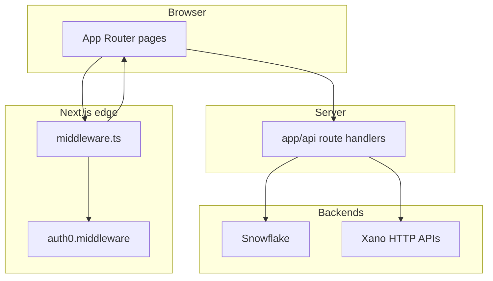

# AssembledView

Web application for **media planning**, **client dashboards**, **campaign pacing**, **finance** views, and related workflows. It is a [Next.js](https://nextjs.org/) App Router project with **Auth0** authentication, **Xano** HTTP backends for plans and directory data, and **Snowflake** for pacing and analytics-style workloads.

---

## What's new

### 2026-04-22

- Added **finance receivables** API workflows to complement billing/payables support.
- Expanded **client dashboard** foundations with preview routes, chart primitives, and theme helpers.
- Updated media plan and expert-grid flows to support broader billing/export behaviors.

---

## Tech stack

- **Runtime**: Node.js (see `@types/node` in [package.json](package.json); use a current LTS such as **22.x**)
- **Framework**: Next.js **15**, React **18**, TypeScript
- **UI**: Tailwind CSS, Radix UI primitives, shadcn-style components (`components/ui`)
- **Auth**: `@auth0/nextjs-auth0` v4 ([lib/auth0.ts](lib/auth0.ts), [middleware.ts](middleware.ts))
- **Data**: [snowflake-sdk](https://www.npmjs.com/package/snowflake-sdk) ([lib/snowflake/pool.ts](lib/snowflake/pool.ts)); outbound HTTP to **Xano** API groups ([lib/api.ts](lib/api.ts), [app/api](app/api))

---

## Quick start

1. Install dependencies: `npm install`
2. Copy the environment template to a local file (do not commit secrets):
   - Unix: `cp env.local.example .env.local`
   - Windows (PowerShell): `Copy-Item env.local.example .env.local`
3. Fill in values in `.env.local` (see [Configuration](#configuration)). The template [env.local.example](env.local.example) is the best place to see variable names and comments maintained with the app.
4. Run the dev server: `npm run dev`
5. Open [http://localhost:3000](http://localhost:3000)

Production build: `npm run build` then `npm run start`.

---

## Configuration

### Auth0 (required for the app to boot)

These are validated when [lib/auth0.ts](lib/auth0.ts) loads:

| Variable | Purpose |
|----------|---------|
| `AUTH0_DOMAIN` | Auth0 tenant domain |
| `AUTH0_CLIENT_ID` | Application client ID |
| `AUTH0_CLIENT_SECRET` | Application client secret |
| `AUTH0_SECRET` | Session cookie encryption secret |
| `APP_BASE_URL` | Absolute base URL of this app (e.g. `http://localhost:3000`) |

Recommended / commonly used:

| Variable | Purpose |
|----------|---------|
| `AUTH0_AUDIENCE` | API audience for access tokens; custom claims often depend on your Auth0 Action and API setup |
| `AUTH0_SCOPE` | Defaults to `openid profile email` if unset |
| `AUTH0_BASE_URL` / `NEXT_PUBLIC_AUTH0_BASE_URL` | Used by client helpers and redirects (see [env.local.example](env.local.example)) |

### Auth0 Management API (admin user flows)

Used for invite-style admin operations (e.g. [app/api/admin/users/route.ts](app/api/admin/users/route.ts)) via [lib/api/auth0Management.ts](lib/api/auth0Management.ts):

- `AUTH0_MGMT_CLIENT_ID`, `AUTH0_MGMT_CLIENT_SECRET`, `AUTH0_MGMT_AUDIENCE`
- `AUTH0_MGMT_DOMAIN` (optional; falls back to `AUTH0_DOMAIN`)
- `AUTH0_DB_CONNECTION`, `AUTH0_ROLE_ADMIN_ID`, `AUTH0_ROLE_CLIENT_ID`
- Optional: `AUTH0_INVITE_TTL_SEC`

### RBAC: roles and claims

Application roles include **`admin`**, **`manager`**, and **`client`** ([lib/rbac.ts](lib/rbac.ts)).

Custom claims are read from the Auth0 session user. Supported claim keys (ID token / Action) include both **`.com`** and **`.com.au`** namespaces ([lib/auth0-claims.ts](lib/auth0-claims.ts)):

- Roles: `https://assembledview.com/roles` or `https://assembledview.com.au/roles`
- Client identifier / slugs: `client`, `client_slug`, `client_slugs` under the same domain patterns

You can override the primary namespace with:

- `AUTH0_ROLE_NAMESPACE` / `NEXT_PUBLIC_AUTH0_ROLE_NAMESPACE`
- `AUTH0_CLIENT_NAMESPACE` / `NEXT_PUBLIC_AUTH0_CLIENT_NAMESPACE`
- `AUTH0_CLIENT_SLUG_NAMESPACE` / `NEXT_PUBLIC_AUTH0_CLIENT_SLUG_NAMESPACE`
- `AUTH0_CLIENT_SLUGS_NAMESPACE` / `NEXT_PUBLIC_AUTH0_CLIENT_SLUGS_NAMESPACE`

The code also accepts swapped `.com` / `.com.au` variants so one environment can match production claim URLs.

**Auth0 Post-Login Action (recommended)**  
Add an Action that puts the user’s **roles** on the custom roles claim and the **client identifier** (slug) on the client claim(s) above so the ID token (and thus the session) carries them. **Client** users must resolve to at least one **client slug** for dashboard scoping; otherwise the API returns 401 and the UI may send them to `/unauthorized`.

**Admin user sync**  
The admin user create/update API expects Auth0 Management credentials and, when syncing users to Xano, `XANO_USERS_ENDPOINT` plus `XANO_API_KEY` if that endpoint is secured (see [env.local.example](env.local.example)).

**Admin email allowlist**  
`ADMIN_EMAIL_ALLOWLIST` (comma-separated) is used where server routes enforce staff access.

### Xano

Many routes call Xano REST groups. Typical variables (not exhaustive—grep `process.env.XANO_` for the full set):

- `XANO_API_KEY` — Bearer token for secured Xano APIs
- `XANO_MEDIA_PLANS_BASE_URL` / `XANO_MEDIAPLANS_BASE_URL` — media plan master, versions, line items
- `XANO_CLIENTS_BASE_URL` — clients, finance helpers, some pacing alerts
- `XANO_PUBLISHERS_BASE_URL`, `XANO_MEDIA_CONTAINERS_BASE_URL`, `XANO_MEDIA_DETAILS_BASE_URL`
- `XANO_SCOPES_BASE_URL`, `XANO_SAVE_FILE_BASE_URL`
- `XANO_PACING_BASE_URL`, `XANO_SAVED_VIEWS_BASE_URL` ([lib/xano/config.ts](lib/xano/config.ts))
- `XANO_FINANCE_FORECAST_SNAPSHOTS_BASE_URL` — finance forecast snapshots (optional paths `XANO_FINANCE_FORECAST_SNAPSHOTS_LIST_PATH`, `XANO_FINANCE_FORECAST_SNAPSHOTS_LINES_PATH`)
- Resilience: `XANO_TIMEOUT_MS`, `XANO_MAX_RETRIES`, `XANO_OVERALL_TIMEOUT_MS`

### Snowflake

JWT key-pair auth is used in [lib/snowflake/pool.ts](lib/snowflake/pool.ts). Core variables:

- `SNOWFLAKE_ACCOUNT`, `SNOWFLAKE_USERNAME`, `SNOWFLAKE_ROLE`, `SNOWFLAKE_WAREHOUSE`, `SNOWFLAKE_DATABASE`, `SNOWFLAKE_SCHEMA`
- Private key: `SNOWFLAKE_PRIVATE_KEY` and/or `SNOWFLAKE_PRIVATE_KEY_B64`, or `SNOWFLAKE_PRIVATE_KEY_PATH`
- `SNOWFLAKE_MODE` — `pool` (typical local) vs `serverless` (production default in code)
- Optional tuning: `SNOWFLAKE_POOL_MAX`, `SNOWFLAKE_ACQUIRE_TIMEOUT_MS`, `SNOWFLAKE_EXECUTE_TIMEOUT_MS`, `SNOWFLAKE_CONNECT_TIMEOUT_MS`, `SNOWFLAKE_FORCE_POOL_WARM`, etc. (see pool module comments)

Repo scripts: `npm run snowflake:migrate:pacing`, `npm run pacing:backfill:search-mappings`.

### Other services (optional)

[env.local.example](env.local.example) also documents **OpenAI**, **SendGrid** / **SMTP** for email, and related keys used by specific features.

### Debug

- `NEXT_PUBLIC_DEBUG_AUTH=true` — logs middleware auth decisions ([middleware.ts](middleware.ts))
- `NEXT_PUBLIC_DEBUG_SNOWFLAKE=true` — extra Snowflake pool logging ([lib/snowflake/pool.ts](lib/snowflake/pool.ts))

---

## Authorization behavior (middleware)

[middleware.ts](middleware.ts) runs Auth0 middleware first, then applies route rules:

- **Static / Next internals / `/api/auth/*`**: unchanged.
- **`/api/*` (except auth)**: requires a session; missing session → **401 JSON**. Client users without a resolvable client slug → **401**.
- **Pages**: unauthenticated users may hit **`/`** (marketing / login), **`/learning`**, and **`/forbidden`**. Other pages redirect to login with `returnTo`.
- **Client role**: may only use **`/dashboard/{theirSlug}`** (and subpaths), plus **`/learning`**, **`/forbidden`**, **`/unauthorized`**. Hitting `/` or `/dashboard` redirects into their slug; other app routes redirect back to their dashboard.
- **Admin / manager**: not restricted to a single dashboard slug by middleware (feature-level checks may still apply in layouts or API handlers).

**Important:** middleware enforces **authentication** for APIs broadly; **tenant isolation** for data must still be enforced inside each API handler (see comment in [middleware.ts](middleware.ts)).

---

## Main application areas (UI routes)

Representative pages under [app](app):

| Area | Routes (examples) |
|------|-------------------|
| Mediaplans | `/mediaplans`, `/mediaplans/create`, `/mediaplans/[id]`, `/mediaplans/mba/[mba_number]/edit` |
| Dashboards | `/dashboard`, `/dashboard/[slug]`, `/dashboard/[slug]/[mba_number]` |
| Client dashboard previews | `/client-dashboard/_preview/primitives`, `/client-dashboard/_preview/charts`, `/client-dashboard/mock` |
| Pacing | `/pacing`, portfolio, overview, mappings, settings under `app/pacing` |
| Finance | `/finance`, forecast / variance under `app/finance` |
| Scopes of work | `/scopes-of-work`, create, `[id]/edit` |
| Directory | `/clients`, `/publishers`, `/management`, `/support` |
| Account | `/profile`, `/account` |
| Learning | `/learning` (redirects to definitions), `/learning/[section]` |
| Admin / debug (operators) | `/admin/users/new`, `/admin/auth-debug`, `/debug/auth` |

Internal or demo routes (e.g. `dashboard-demo`, `test-dashboard`) exist for development; treat them as non-production.

---

## HTTP API surface (grouped)

There are many handlers under [app/api](app/api) (on the order of **90+** `route.ts` files). They generally fall into these buckets:

- **Mediaplans & media line items** — CRUD, downloads, PDFs, MBA resolution, version documents
- **Pacing & Snowflake** — line items, portfolio, delivery, mappings, alerts, saved views, bulk operations
- **Finance** — billing, accrual, forecast snapshots, payables, receivables, edits, hub schedules
- **Dashboards & KPIs** — client/publisher/campaign KPIs, global spend aggregates
- **Client dashboard rendering** — reusable visual primitives, chart examples, brand theme helpers
- **Scopes of work** — list/detail, PDF generation, IDs
- **Admin** — users, client hub, slug refresh
- **Integrations** — chat/assistant routes, delivery/meta testing endpoints, etc.

Use the filesystem tree under `app/api` or your editor’s symbol search when wiring a new client.

---

## Architecture (high level)

---

## Learning section data

- Source data lives at `src/data/learning/terms.raw.csv`. Add or edit rows there (headers: `Term,Category,Definition,Formula_or_Notes`). Keep formulas in the fourth column; commas inside formulas are allowed.
- Generate the normalized JSON with `npm run build:learning` (runs `scripts/build-learning-terms.ts`). This script normalizes categories, classifies type (definition/acronym/formula), deduplicates rows, and writes `src/data/learning/terms.json`.
- Known formulas are mapped to calculators via the table in `scripts/build-learning-terms.ts`. Add a mapping there if a formula should get calculator inputs; otherwise the expression will render as read-only.
- Tabs/routes: `/learning/definitions`, `/learning/acronyms`, `/learning/formulas` (top-level `/learning` redirects to definitions).

---

## NPM scripts

| Script | Description |
|--------|-------------|
| `npm run dev` | Next.js development server |
| `npm run build` | Production build |
| `npm run start` | Start production server |
| `npm run lint` | ESLint via Next |
| `npm run build:learning` | Rebuild `src/data/learning/terms.json` from CSV |
| `npm run test:solver` | Learning solver tests |
| `npm run test:weekly-gantt` | Weekly Gantt column tests |
| `npm run test:expert-mappings` | Expert OOH/radio mapping tests |
| `npm run test:expert-paste` | Expert grid paste tests |
| `npm run test:finance-forecast` | Finance forecast / variance engine tests |
| `npm run snowflake:migrate:pacing` | Snowflake pacing migrations |
| `npm run pacing:backfill:search-mappings` | Search mapping backfill |

---

## Verification tips

- **Auth0**: Log in as an **admin** and confirm dashboards and admin links; log in as a **client** and confirm only the correct **`/dashboard/{slug}`** tree is reachable and that another client’s slug redirects home to their own slug.
- **RBAC**: Admin-only routes (e.g. `/admin/users/new`, `/dashboard` for certain configurations) should redirect unauthenticated users to login and block unauthorized roles as implemented in each route/layout.
- **Learning**: After CSV edits, run `npm run build:learning` and reload `/learning/definitions`.

---

## Further reading

- Auth0 RBAC detail: [docs/auth0-rbac.md](docs/auth0-rbac.md)
- Finance forecast snapshots (Xano): [docs/finance-forecast-snapshots-xano.md](docs/finance-forecast-snapshots-xano.md)
- Pacing / Snowflake operations: [docs/pacing/snowflake-deployment.md](docs/pacing/snowflake-deployment.md), [docs/xano/pacing-api.md](docs/xano/pacing-api.md)
