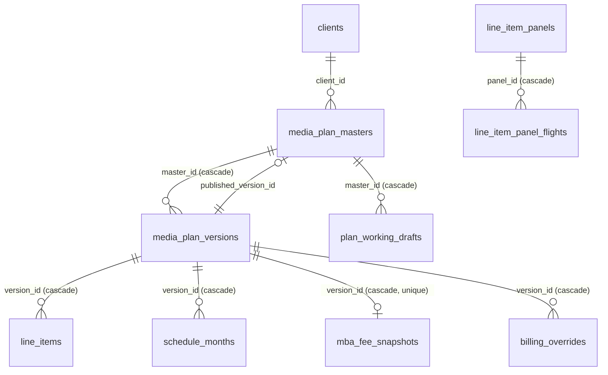
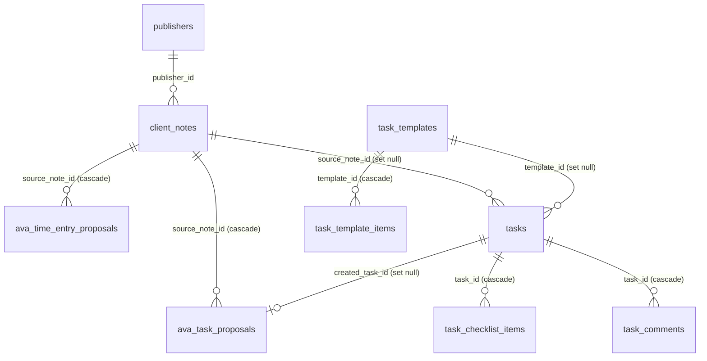

# DATA-MODEL — Supabase Postgres

System of record: **Supabase Postgres, project `slpdibnxtpdlttbbczvg`, region `ap-southeast-2` (Sydney), Postgres 17.**
Verified live 2026-08-27: **78 tables in `public`, RLS enabled on all 78.**

Xano is no longer in the runtime read or write path. `lib/api/xano.ts` is the only file that still reads a `XANO_*` env var, and the historical severance record is `XANO-SEVERANCE-REGISTER.md`. Table and column names that still say "xano" (`MART.XANO_LINE_ITEMS_SNAPSHOT`, `xano-line-item-sync`) are frozen contract names, not live dependencies — do not rename them to tidy up.

## How the app reaches the database

| Path | Used by | Notes |
|---|---|---|
| `db/index.ts` → `getDb()` (Drizzle, pooler port 6543, `prepare:false`) | Everything normal | Lazy proxy; `server-only`; `DATABASE_URL` |
| `sql` tagged templates through the same `getDb()` | Finance periods and runs, notifications, Xero matching, working drafts | These tables **are** mirrored in `db/schema/` (as of `536f0476`) but their callers still use raw SQL. Migrating them to the query builder is a separate decision |
| `db/avaClient.ts` → `AVA_DATABASE_URL` as role `ava_readonly` | AVA only | Fail-closed; explicit per-table `GRANT SELECT` + `CREATE POLICY ava_read`. New tables are excluded by default |
| `DIRECT_URL` (port 5432) | `drizzle-kit` only | Never at runtime |

**Migrations are applied by hand** through the Supabase SQL editor from `db/migrations/00NN_*.sql` (50 applied, `0001`…`0050`; there is no `0047` — the number was minted and abandoned). `0051_finance_billing_records_backfill.sql` and `0052_xero_billing_amounts_ex_gst.sql` are authored, not applied. `db/schema/*.ts` is a hand-kept Drizzle mirror covering all 78 tables. Do not `db:migrate` the drizzle baseline — the tables already exist.

**`db:generate` does not prove the mirror matches the database.** The baseline was regenerated from the TypeScript mirrors, so an empty diff proves only that nobody edited `db/schema/*.ts` without regenerating the snapshot. It compares code to its own snapshot, not code to Postgres. Two columns were missing from the mirror while `db:generate` was clean.

**The real gate is `npm run db:drift`** — a comparison against `information_schema`. Run it before any handover that touches the schema. Never apply the file `generate` produces.

**Backfill rule.** Any migration that backfills existing rows must be guarded by a `migration_markers` key. `WHERE col IS NULL` alone is not a re-run guard: once the feature is live, NULL means a genuine unfilled state and a re-run corrupts it.

### Postgres enum types (9)

`line_channel` (20 values) · `schedule_component` (media, fee, adserving) · `schedule_basis` (billing, delivery) · `schedule_source` (computed, override) · `finance_period_status` (open, pre_run_review, run, review, locked, invoiced, reconciled) · `finance_run_item_status` (pending, approved, adjusted, held, excluded, stale) · `finance_run_source` (media, retainer, sow) · `xero_match_method` (reference, heuristic, manual) · `xero_match_status` (matched, diverged, disputed, written_off)

All declared in `db/schema/enums.ts`. Value order is part of the type — appending is safe, reordering is not.

## The three universal keys

| Key | Shape | Spans |
|---|---|---|
| `mba_number` | text business key, e.g. `PENFOLD016` | masters, versions, line approvals, billing, KPI, panels, insights, tasks, time entries, Xero matches, Snowflake |
| `version_id` / `version_number` | `media_plan_versions.id` (FK) and its ordinal | line items, schedule months, fee snapshots, billing overrides |
| `line_item_id` | `<MBA><CODE><n>`, e.g. `PENFOLD001SE1` — built by `lib/mediaplan/lineItemIds.ts` | plan lines → Snowflake delivery facts → KPI fan-out → billing bursts → trafficking names → OOH panels |

`line_item_id` is a **text join key with no foreign key behind it** in several places (`line_item_panels`, `campaign_kpi`, `schedule_months`, `mba_line_approvals`). That is intentional — panels and KPI predate consolidation — but it means the database will not stop you writing an orphan. Validate in the lib layer.

Two frozen contracts: the **`bursts` jsonb shape** (`serializeBurstsJson.ts` / `formatBurstsForPersist.ts`) and the **`line_item_id` format**. Pacing, billing, finance, dashboards, exports and the Snowflake sync all parse them. Change every consumer or none.

Case traps that are enforced by the database: `campaign_insights.mba_number` and `line_item_panels.mba_number` have `CHECK (col = lower(col))`. Do not add app-side casing that fights them.

## Plan core

| Table | Rows (live) | Key columns | Notes |
|---|---|---|---|
| `media_plan_masters` | 192 | `mba_number` UNIQUE, `client_id`→clients, `published_version_id`→versions, `campaign_budget_cents` | **`published_version_id` is the publication pointer.** Never infer the published version from `max(version_number)` or from `campaign_status` |
| `media_plan_versions` | 1,089 | UNIQUE(`master_id`,`version_number`), `published_at`, `published_by`, `approved_slice` jsonb, `snapshot_checksum`, `mi_resolution` jsonb, `channel_flags`, `legacy_schedules` | `published_at` NULL = unpublished. `approved_slice` is the frozen billing law at publish — **never mutate after write** |
| `line_items` | 16,590 | UNIQUE(`version_id`,`line_item_id`), `channel` enum, `bursts` jsonb, `attrs` jsonb | One table replaces 20 per-channel tables. Common columns are typed; the channel-specific tail lives in `attrs`, validated per channel by zod in `db/schema/lineItemAttrs.ts` (`.passthrough()` for legacy keys) |
| `schedule_months` | 59,324 | UNIQUE(`version_id`,`line_item_id`,`component`,`basis`,`month`), `amount_cents` | The billing and delivery schedule as **rows**, not JSON blobs. `component` = media\|fee\|adserving · `basis` = billing\|delivery · `source` = computed\|override |
| `mba_fee_snapshots` | 74 | `version_id` UNIQUE, `fees` jsonb | Fee state captured at publish |
| `billing_overrides` | 1 | UNIQUE(`version_id`,`line_item_id`,`component`) | Recorded manual overrides — who, when, value. Never inferred from drift |
| `mba_line_approvals` | 0 | UNIQUE(`mba_number`,`media_plan_version`,`line_item_id`,`media_type`) | **Absence of a row means approved.** Postgres-authoritative; skipped by ETL |
| `plan_working_drafts` | 5 | `master_id`, `base_version_id` | Autosave. Flag `NEXT_PUBLIC_PLAN_DRAFTS`; off does not delete rows. Callers use raw `sql` |

**Channel enum** (`line_channel`, 20 values): `television radio cinema newspaper magazines ooh prog_display prog_video prog_audio prog_bvod prog_ooh digi_display digi_video digi_audio digi_bvod social search influencers integrations production`

**Bursts field name quirk:** `cinema`, `radio` and `production` carry bursts under `bursts`; every other channel used `bursts_json`. The consolidated column is always `bursts`; `lib/data/planShapes.ts` (`BURSTS_FIELD_AS_BURSTS`) re-splits it on the way back out to legacy consumers.

## Clients and publishers

| Table | Rows | Notes |
|---|---|---|
| `clients` | 46 | ~90 columns. `slug` (unique on `lower(btrim())`) is tenant identity. `mbaidentifier` seeds MBA numbers. Per-channel `fee*` and `adserv*` rates. `client_brain` text + `client_brain_updated_at`. `m365_is_anchor` partial-unique per `mbaidentifier` group. `client_name_aliases` jsonb for Fireflies title matching |
| `client_domains` | 56 | email domain → client, for meeting attribution |
| `clientdashboard` | 1 | per-platform dashboard ids |
| `publishers` | 77 | ~100 columns: `pub_*` channel flags, `*_comms` commission rates, per-family CPM/CPC/CPV/CTR/VTR/frequency defaults, `best_practice` jsonb, `publisher_colour` |
| `publisher_profiles` | 4 | Schedule-ingest parsing config. `detect_signature`, `column_map`, `grid_semantics` (status_matrix\|count\|currency), `line_granularity` (per_row\|grouped), `legend_map`, `sheet_rules` — all jsonb on the row, not TypeScript |
| `publisher_specs` / `spec_runs` | 20 / 0 | Material specs and deadline days. Joined on `publishers.id`, never on display name |
| `spec_deadline_overrides` | 0 | Explicit manual deadline override: who, when, value |
| `publisher_domains` | 1 | Learned on manual Fireflies assign. **Never seed vendor domains** |
| `ingest_stages` → `ingest_runs` | 0 / 0 | Staged review package (uuid `stage_id`, `expires_at` NULL = retained), then accepted-run history |
| `line_item_panels` / `line_item_panel_flights` | 0 / 0 | OOH panel and pack detail + per-period presence. **No money columns** — spend stays on the burst. `buy_granularity` panel (1:1) or pack (1:N) |

## Media reference (dropdown data)

`tv_stations` (7) · `radio_stations` (56) · `newspapers` (20) · `newspaper_adsizes` (6) · `magazines` (6) · `magazines_adsizes` (1) · `audio_site` (9) · `bvod_site` (6) · `display_site` (36) · `video_site` (12) · `media_container_best_practice` (12, jsonb per container, edited at `/admin/media-container-best-practice`)

## KPI

Three tiers, most specific wins.

`campaign_kpi` (9,732) keyed by `mba_number` + `version_number` + `line_item_id` → `client_kpi` (0) keyed by `mp_client_name` → `publisher_kpi` (901) keyed by publisher + `bid_strategy` + `media_type`.

Metrics on all three: `ctr`, `cpv`, `conversion_rate`, `vtr`, `frequency`. `client_kpi` is currently empty — the cascade falls through it to publisher defaults.

## Finance

| Table | Rows | Notes |
|---|---|---|
| `finance_periods` | 0 | Month status via `finance_period_status`, `amended_after_lock`, sheet blob pointer. Unique on `period_month` |
| `finance_run_items` | 0 | The billing run. Five FKs: `period_id`→periods (cascade), `client_id`→clients, `version_id`→versions, plus self-references `linked_variance_from_item_id` and `rolled_from_item_id`. `sow_id` has **no** FK. Unique on (period_id, source, natural_key) |
| `finance_billing_records` | 480 | `invoice_key` UNIQUE, `billed_amount_cents`, `billed_lines_hash`. App writes via `writeFinance.ts` (never `xero:`); Xero ingest owns `xero:` keys and stores `sub_total` (ex-GST), not Xero Total |
| `finance_billing_line_items` | 1 | child of records; `line_status`, `received_amount` |
| `finance_edits` | 677 | before/after audit of billing edits |
| `finance_forecast_snapshots` / `_lines` | 0 / 0 | Immutable snapshots, hash-deduped, cascade delete |
| `revenue_forecast_lines` | 0 | UNIQUE(`clients_id`,`fy`,`line_key`,`month`) |
| `revenue_line_catalog` | 10 | `line_key` UNIQUE, `fee_pct`, `booked_mapping` |
| `finance_saved_views` | 0 | note: column is `user_id` (`user` is reserved) |
| `app_notifications` | 902 | Cross-cutting anomaly log, keyed by `audience` + `kind`. Partial index on unread. Dominated by `billing_overrides_publish_carry` (884) |

`fy` means the Australian financial year **ending** year. AVA speaks AUD.

## Xero

`xero_ar_invoices` (1,433) · `xero_ap_bills` (2,180) · `xero_contacts` (223) · `xero_sync_exceptions` (1,381) · `xero_sync_log` (12) · `xero_client_aliases` (0, manual normalised-name → `clients.id`) · `xero_contact_links` (0) · `xero_invoice_matches` (0, → `finance_run_items`) · `xero_match_month_metrics` (0)

The last three are mirrored but their callers use raw `sql`. Sync is a daily cron at 00:15 UTC. Resume watermark is the newest `xero_sync_log` row; `runXeroSync` writes that row fail-open. Ops-health "Xero sync freshness" is green when the newest `run_started_at` is within 36 hours. AR `mba_number` is filled from the Xero Reference by `matchMba.ts` (MBA token, then `scope_of_work.scope_id`); a scope hit does not write `mba_number`. `pdf_file` is Blob-backed `{url, pathname, filename}` on success; ETL left a non-null Xano stub with no `url` key. `sync_pdfs` pending = `IS NULL OR NOT (pdf_file ? 'url')`, FY26+, batch 50 (`XERO_PDF_BATCH_SIZE`).

## Codex — tasks, meetings, time

| Table | Rows | Notes |
|---|---|---|
| `client_notes` | 131 | Fireflies meetings. `fireflies_meeting_id` UNIQUE. `attributed_type` = client\|publisher\|internal\|new_business; **NULL is the unattributed queue**. `matched_by` records how attribution happened |
| `tasks` | 46 | `client_id` has **no FK** to `clients` (deliberate, from the ETL era). `auto_created` + `ava_auto_key` for unique-roster auto-create. Soft delete via `deleted_at` |
| `team_members` | 11 | `email` UNIQUE and `auth0_user_id` UNIQUE — identity is email, never a numeric id. `email_aliases`, `default_client_ids` array. Synced by `auth0-roster-sync` |
| `ava_task_proposals` | 1,352 | proposed → accepted / accepted_edited / rejected / expired, with `decision_diff` for learning |
| `ava_time_entry_proposals` | 26 | UNIQUE(`source_note_id`,`member_email`); blocked_overlap / blocked_structure states |
| `assignment_rules` | 0 | partial unique on `COALESCE(client_id,0)` + category where active |
| `codex_activity` | 797 | entity/action audit log |
| `fireflies_sync_state` | 3 | run log |
| `meeting_title_rules` | 0 | exact match on normalised title |
| `time_entries` / `myhours_links` / `myhours_sync_runs` | 0 / 0 / 0 | MyHours mirror is pull-source-of-truth; the Confirm path is the only intentional write back |

## Everything else

| Table | Rows | Notes |
|---|---|---|
| `creative_asset` | 22 | Row + Vercel Blob file; `blob_url` / `blob_pathname` |
| `scope_of_work` | 9 | jsonb `cost` and `billing_schedule` |
| `planning_audiences` | 1 | saved audience definitions, `client_visible` flag |
| `campaign_insights` | 0 | Append and supersede (`superseded_by` self-FK, paired with `superseded_at` by CHECK). **Never delete.** GIN full-text index on `body`. `mba_number` lowercase by CHECK |
| `pacing_orphan_fixes` | 1 | admin reassignment audit for unmatched platform line items |
| `m365_provisioning_log` | 0 | every Graph provisioning attempt: success / failure / skipped |
| `migration_markers` | 5 | backfill guards |

## Warehouse (Snowflake, read-only)

`ASSEMBLEDVIEW.MART.*` via `lib/snowflake/`:

- `XANO_LINE_ITEMS_SNAPSHOT` — the plan side, MERGEd nightly on `line_item_id`. Name is frozen; source is now Postgres (`syncPgLineItems.ts`)
- `PACING_FACT`, `SEARCH_PACING_FACT`, `SOCIAL_PACING_FACT` — delivery facts (Fivetran-fed)
- `FIXED_COST_LINE_ITEM_FACT`, `FIXED_COST_BURST_FACT`, `FIXED_COST_REPORTED_DAILY_FACT`
- `META_BASIC_AD_SET_TEST`

Pacing joins plan to fact on `line_item_id` and computes bands in TypeScript (`lib/pacing/maths`) mirroring the Snowflake view. Ladder order is a contract.

## Test data in this database

There is **no separate test database.** `npm run test:save-plan` and its siblings connect via `DATABASE_URL`, which is this database. The suites clean up after themselves, but an aborted run does not, and residue exists:

- Eleven orphan masters (`x9seq*`, `x91a*`, `x91b*`, ids 291–301) with no client and no versions, from 2–3 Aug.
- `krusty001` and client 53 "Krusty Krab" — the cutover stress-test campaign, 596 line items, draft, no billing.

Both are harmless to money but they appear in the client picker and the campaign list. Point the test suites at a Supabase branch before adding more.

## Confidence notes

- Table list, row counts, RLS state, every foreign key, every index and all nine enum types above were read from the live database, not inferred from code.
- `numeric` columns carry precision in three places — `xero_invoice_matches.confidence` is `numeric(5,4)`, `xero_match_month_metrics.reference_hit_rate` is `numeric(7,6)`, `ava_task_proposals.ava_confidence` and `assignment_rules.confidence` are `numeric(4,3)`. Anywhere else, `numeric` is unconstrained.
