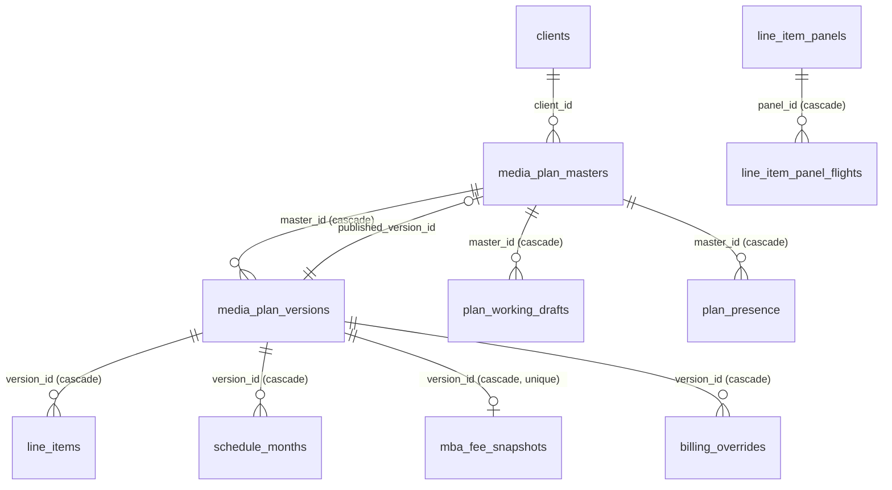
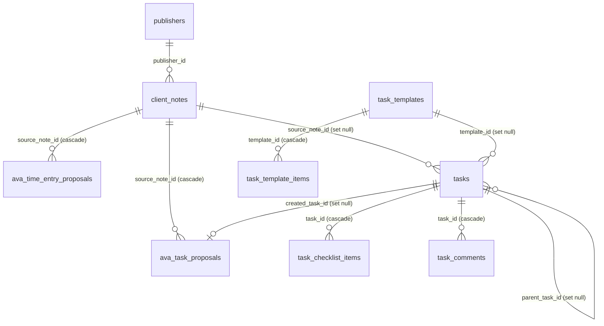

# DATA-MODEL — Supabase Postgres

System of record: **Supabase Postgres, project `slpdibnxtpdlttbbczvg`, region `ap-southeast-2` (Sydney), Postgres 17.**
Verified live 2026-08-27: **78 tables in `public`, RLS enabled on all 78.**

Xano is no longer in the runtime read or write path. `lib/api/xano.ts` is the only file that still reads a `XANO_*` env var, and the historical severance record is `XANO-SEVERANCE-REGISTER.md`. Table and column names that still say "xano" (`MART.XANO_LINE_ITEMS_SNAPSHOT`, `xano-line-item-sync`) are frozen contract names, not live dependencies — do not rename them to tidy up.

## How the app reaches the database

| Path | Used by | Notes |
|---|---|---|
| `db/index.ts` → `getDb()` (Drizzle, pooler port 6543, `prepare:false`) | Everything normal | Lazy proxy; `server-only`; `DATABASE_URL` |
| `sql` tagged templates through the same `getDb()` | Finance periods and runs, notifications, Xero matching, working drafts, plan presence | These tables **are** mirrored in `db/schema/` (as of `536f0476`) but their callers still use raw SQL. Migrating them to the query builder is a separate decision |
| `db/avaClient.ts` → `AVA_DATABASE_URL` as role `ava_readonly` | AVA only | Fail-closed; explicit per-table `GRANT SELECT` + `CREATE POLICY ava_read`. New tables are excluded by default |
| `DIRECT_URL` (port 5432) | `drizzle-kit` only | Never at runtime |

**Migrations are applied by hand** through the Supabase SQL editor from `db/migrations/00NN_*.sql` (50 applied, `0001`…`0050`; there is no `0047` — the number was minted and abandoned). `0055_line_item_panels_unique.sql` is applied. `0051_finance_billing_records_backfill.sql`, `0052_xero_billing_amounts_ex_gst.sql`, `0053_client_billing_lifecycle.sql`, `0058_planning_uploaded_audiences.sql`, `0059_publisher_profile_audit.sql`, `0060_publisher_value_synonyms.sql`, `0061_publisher_profile_field_defaults.sql`, `0062_publisher_profiles_jcd_bought_rate.sql`, `0063_delivery_source_map.sql`, `0064_plan_presence.sql`, `0066_publisher_profiles_money_rules.sql`, `0074_delivery_source_map_channel_factory.sql`, `0075_delivery_source_map_twitch.sql`, `0077_delivery_source_map_prog_ooh.sql`, `0078_tasks_help_request.sql`, `0079_campaign_reads.sql`, `0080_campaign_kpi_target_source.sql`, `0081_pacing_portfolio_snapshots.sql`, `0082_campaign_reads_generating.sql`, `0083_campaign_kpi_dedupe.sql`, `0084_pacing_scenarios.sql`, `0085_delivery_relabels.sql`, and `0086_relabel_drift_snapshots.sql` are authored, not applied. `0065_backfill_published_at_on_pointers.sql` is the record of the live 5 Sep 2026 stamp (`published_at = created_at` on 34 published pointers; `published_by` left NULL; no schema change; re-run is a marker no-op). `0069_published_pointer_must_be_stamped.sql` (VP-1 deferred constraint triggers) and `0070_backfill_vp1_unstamped_pointers.sql` (exactly 12 C-113 rows; `published_at = created_at`, `published_by = backfill:vp-1`) are authored, not applied. `0071_clear_plan_working_drafts.sql` deletes the nine live working-draft rows by master_id (no `campaign_status` update) and is authored, not applied. Required order: R1 live in production, then 0070, then 0069. 0069 does not validate existing rows, so 0070 stamps first. Do not apply 0069 until the stamping writer is live. `db/schema/*.ts` is a hand-kept Drizzle mirror covering all 78 tables (0058 adds two more once applied; 0059 adds `publisher_profile_changes` + `publisher_profiles.updated_by`; 0060 adds `publisher_value_synonyms`; 0061 adds `publisher_profiles.field_defaults`; 0062 merges one JCDecaux `column_map` key and does not change schema; 0063 adds `delivery_source_map`; 0064 adds `plan_presence`; 0066 adds `publisher_profiles.money_rules`). Do not `db:migrate` the drizzle baseline — the tables already exist. Do not promote the 0059 / 0060 / 0061 / 0063 / 0064 / 0066 Drizzle mirrors before applying those migrations (C-76). Do not SELECT `delivery_source_map` until 0063 is applied — runtime is `lib/delivery/deliverySourceMap.ts`. Do not SELECT `plan_presence` until 0064 is applied — runtime is raw `sql` and fail-softs. Do not SELECT `money_rules` until 0066 is applied — `listPublisherProfiles` falls back to seed.

**`db:generate` does not prove the mirror matches the database.** The baseline was regenerated from the TypeScript mirrors, so an empty diff proves only that nobody edited `db/schema/*.ts` without regenerating the snapshot. It compares code to its own snapshot, not code to Postgres. Two columns were missing from the mirror while `db:generate` was clean.

**The real gate is `npm run db:drift`** — a comparison against `information_schema`. Run it before any handover that touches the schema. Never apply the file `generate` produces.

**Backfill rule.** Any migration that backfills existing rows must be guarded by a `migration_markers` key. `WHERE col IS NULL` alone is not a re-run guard: once the feature is live, NULL means a genuine unfilled state and a re-run corrupts it.

### Postgres enum types (9)

`line_channel` (20 values) · `schedule_component` (media, fee, adserving) · `schedule_basis` (billing, delivery) · `schedule_source` (computed, override) · `finance_period_status` (open, pre_run_review, run, review, locked, invoiced, reconciled) · `finance_run_item_status` (pending, approved, adjusted, held, excluded, stale) · `finance_run_source` (media, retainer, sow) · `xero_match_method` (reference, heuristic, manual) · `xero_match_status` (matched, diverged, disputed, written_off)

All declared in `db/schema/enums.ts`. Value order is part of the type — appending is safe, reordering is not.

## The three universal keys

| Key | Shape | Spans |
|---|---|---|
| `mba_number` | text business key, e.g. `PENFOLD016` | masters, versions, line approvals, billing, KPI, panels, insights, campaign reads, tasks, time entries, Xero matches, Snowflake |
| `version_id` / `version_number` | `media_plan_versions.id` (FK) and its ordinal | line items, schedule months, fee snapshots, billing overrides |
| `line_item_id` | `<MBA><CODE><n>`, e.g. `PENFOLD001SE1` — built by `lib/mediaplan/lineItemIds.ts` | plan lines → Snowflake delivery facts → KPI fan-out → billing bursts → trafficking names → OOH panels |

| `line_item_id` is a **text join key with no foreign key behind it** in several places (`line_item_panels`, `campaign_kpi`, `schedule_months`, `mba_line_approvals`). That is intentional — panels and KPI predate consolidation — but it means the database will not stop you writing an orphan. Validate in the lib layer. Ingest panels are uniquely keyed `(line_item_id, source_row_ref) WHERE source_row_ref IS NOT NULL` (`0055` applied) — pack rows share a line id; hand-created panels with null `source_row_ref` are not constrained.

Two frozen contracts: the **`bursts` jsonb shape** (`serializeBurstsJson.ts` / `formatBurstsForPersist.ts`) and the **`line_item_id` format**. Pacing, billing, finance, dashboards, exports and the Snowflake sync all parse them. Change every consumer or none.

Case traps that are enforced by the database: `campaign_insights.mba_number` and `line_item_panels.mba_number` have `CHECK (col = lower(col))`. Do not add app-side casing that fights them. `media_plan_masters.mba_number` is mixed-case in production (~36% of the book); in-memory joins use `mbaJoinKey` and must not lowercase stored or displayed values.

## Plan core

| Table | Rows (live) | Key columns | Notes |
|---|---|---|---|
| `media_plan_masters` | 192 | `mba_number` UNIQUE, `client_id`→clients, `published_version_id`→versions, `campaign_budget_cents`, index `idx_media_plan_masters_published_version_id` | **`published_version_id` is the publication pointer.** Never infer the published version from `max(version_number)` or from `campaign_status`. **VP-1 (0069 AUTHOR ONLY):** pointer must be NULL or reference a version with `published_at` set (deferred constraint triggers; 0070 stamps the 12 C-113 rows first because CREATE CONSTRAINT TRIGGER does not scan existing rows). Required order: R1 live, then 0070, then 0069. Readers: `publishedVersionIdFromMaster` / `PUBLISHED_VERSION_JOIN_SQL` (pointer AND stamp). **0072 AUTHOR ONLY:** btree on `published_version_id` covering `fk_masters_published_version` (unindexed FK; finance joins, guard fragment, 0069 reverse lookup). Table is small (~189 pointers); plain `CREATE INDEX`, not `CONCURRENTLY`. |
| `media_plan_versions` | 1,089 | UNIQUE(`master_id`,`version_number`), `published_at`, `published_by`, `approved_slice` jsonb, `mba_scope` jsonb, `snapshot_checksum`, `mi_resolution` jsonb, `channel_flags`, `legacy_schedules`, `mba_pdf_file` / `media_plan_file` / `aa_media_plan_file` jsonb | `published_at` NULL = unpublished. `published_by` is a lowercase email, NULL, or the VP-1 sentinel `backfill:vp-1` (0070 AUTHOR ONLY; 0018 CHECK). Never an Auth0 `sub` — the CHECK is lowercase-only and would accept `auth0|…`. Production R1 does not reset `created_at` when stamping (C-114). `approved_slice` is the frozen billing law at publish — **never mutate after write**. `mba_scope` is `{ lineItemIds, monthYears, partial }`; **null = full scope** (0076 AUTHOR ONLY; no backfill). File jsonb shapes: Blob `{ url, pathname, name, size, mime, uploadedAt, source: "vercel-blob" }` (upload); regenerated `{ …, source: "regenerated", generatedFrom: "persisted" | "explode" }`; ETL Xano Public File `{ path, name, mime }`. File pointers may be written after publish; regenerate never mutates plan content. `savePlanVersion` draft overwrite omits these columns when the save payload does not send them (DOC-1b) |
| `line_items` | 16,590 | UNIQUE(`version_id`,`line_item_id`), `channel` enum, `bursts` jsonb, `attrs` jsonb | One table replaces 20 per-channel tables. Common columns are typed; the channel-specific tail lives in `attrs`, validated per channel by zod in `db/schema/lineItemAttrs.ts` (`.passthrough()` for legacy keys) |
| `schedule_months` | 59,324 | UNIQUE(`version_id`,`line_item_id`,`component`,`basis`,`month`), `amount_cents` | The billing and delivery schedule as **rows**, not JSON blobs. `component` = media\|fee\|adserving · `basis` = billing\|delivery · `source` = computed\|override |
| `mba_fee_snapshots` | 74 | `version_id` UNIQUE, `fees` jsonb | Fee state captured at publish |
| `billing_overrides` | 1 | UNIQUE(`version_id`,`line_item_id`,`component`) | Recorded manual overrides — who, when, value. Never inferred from drift |
| `mba_line_approvals` | 0 | UNIQUE(`mba_number`,`media_plan_version`,`line_item_id`,`media_type`) | **Absence of a row means approved.** Postgres-authoritative; skipped by ETL |
| `plan_working_drafts` | 10 | UNIQUE(`master_id`,`user_id`), `base_version_id` | Autosave, one row per editor. Identity is email else `sub` — never `"unknown"`. Flag `NEXT_PUBLIC_PLAN_DRAFTS`; off does not delete rows. Callers use raw `sql`. **Interim `SAVE_PUBLISHES_IMMEDIATELY`:** save no longer writes these as the save path; matching-base rows still auto-apply and clear on save. **0071 AUTHOR ONLY** deletes eight of these at go-live (no `campaign_status` change) and keeps STRMEA001 (267) and glenda009 (10012553); recovery `exports/working-drafts/plan_working_drafts-2026-09-14T005310965Z.json` |
| `plan_presence` | 0 (0064 not applied) | PK(`master_id`,`user_id`), `page` (`edit`\|`create`), `last_seen_at` | Who else has the campaign open. Identity from `draftIdentity` (email else `sub`) — never `"unknown"`. GET returns others with `last_seen_at` within 90s. Not a lock. RLS on; no `ava_readonly`. Callers use raw `sql` and fail-soft. Do not SELECT until applied (C-76) |

**Channel enum** (`line_channel`, 20 values): `television radio cinema newspaper magazines ooh prog_display prog_video prog_audio prog_bvod prog_ooh digi_display digi_video digi_audio digi_bvod social search influencers integrations production`

**Bursts field name quirk:** `cinema`, `radio` and `production` carry bursts under `bursts`; every other channel used `bursts_json`. The consolidated column is always `bursts`; `lib/data/planShapes.ts` (`BURSTS_FIELD_AS_BURSTS`) re-splits it on the way back out to legacy consumers.

## Clients and publishers

| Table | Rows | Notes |
|---|---|---|
| `clients` | 46 | ~90 columns. `slug` (unique on `lower(btrim())`) is tenant identity. `mbaidentifier` seeds MBA numbers. Per-channel `fee*` and `adserv*` rates. `client_brain` text + `client_brain_updated_at`. `m365_is_anchor` partial-unique per `mbaidentifier` group. `client_name_aliases` jsonb for Fireflies title matching |
| `client_domains` | 56 | email domain → client, for meeting attribution |
| `clientdashboard` | 1 | per-platform dashboard ids |
| `publishers` | 77 | ~100 columns: `pub_*` channel flags, `*_comms` commission rates, per-family CPM/CPC/CPV/CTR/VTR/frequency defaults, `best_practice` jsonb, `publisher_colour` |
| `publisher_profiles` | 4 | Schedule-ingest parsing config. `detect_signature`, `column_map` (header→field; 0062 AUTHOR ONLY jsonb-merges JCDecaux `MEDIA BOUGHT RATE` → `media_rate:bought` without rewriting the rest of that row), `field_defaults` (canonical field→one value for every line; 0061 AUTHOR ONLY), `money_rules` (media amount basis + stated-cell / section / rate-card labels; 0066 AUTHOR ONLY — not `sheet_rules`), `grid_semantics` (status_matrix\|count\|currency), `line_granularity` (per_row\|grouped), `legend_map`, `sheet_rules` — all jsonb on the row, not TypeScript. `updated_by` (0059 AUTHOR ONLY) is the last accepted remap identity. Value-level prose → AV canonical lives in `publisher_value_synonyms`, not on this row |
| `publisher_profile_changes` | 0 (0059 not applied) | Audit of accepted `column_map` and `field_defaults` writes: `header` (column name or field id), `previous_value` / `next_value` (null = key absent / removed), `action` (`map`\|`remap`\|`remove`), `changed_by`, `source` (`ava_card`\|`hub_remap`\|`admin`\|`model_proposed`), optional `stage_id`. Same txn as the profile update. RLS on; no `ava_readonly` grant |
| `publisher_value_synonyms` | 0 (0060 not applied) | Learned publisher prose → AV canonical. `publisher_id` NULL = global suggestion tier (never auto-applied). Unique active scope `(coalesce(publisher_id,0), vocabulary, raw_value)`. Seed nothing — every row is a human value-card answer. RLS on; no `ava_readonly` grant |
| `delivery_source_map` | 0 (0063 not applied) | Programmatic `publisher_key` → `dsp` \| `cm360` \| `partner_file`. PK is the lowercased platform/publisher string. Seed = today's DV360/Taboola allowlist plus both Quantcast keys (`quantcast` and `quantcast - direct`) plus `channel factory` → `partner_file` (`0074`) plus `twitch` → `cm360` / `derive_spend_from_plan` true (`0075`) plus `vistar` / `broadsign` → `partner_file` (`0077` AUTHOR ONLY; app still reads the TS seed, C-76). `derive_spend_from_plan` drives modelled delivered spend on programmatic cm360 lines (`lib/delivery/deriveSpendFromPlanRate.ts`); DSP, Channel Factory, and Vistar/Broadsign stay false. Runtime lookup is the TypeScript seed until applied. RLS on; no `ava_readonly` grant |
| `publisher_specs` / `spec_runs` | 20 / 0 | Material specs and deadline days. Joined on `publishers.id`, never on display name |
| `spec_deadline_overrides` | 0 | Explicit manual deadline override: who, when, value |
| `publisher_domains` | 1 | Learned on manual Fireflies assign. **Never seed vendor domains** |
| `ingest_stages` → `ingest_runs` → `ingest_eval_runs` | 0 / 0 / 0 (0067 not applied) | Staged review package (uuid `stage_id`, `expires_at` NULL = retained; `review_package` jsonb includes nested `line_audit` + `parse_review`; `source_file` jsonb is the private Blob pointer, 0068 AUTHOR ONLY, null when retain failed). Accepted-run history, then weekly parser-accuracy rows (one per publisher). Do not SELECT `source_file` / `ingest_eval_runs` until 0068 / 0067 are applied (C-76) |
| `line_item_panels` / `line_item_panel_flights` | 0 / 0 | OOH panel and pack detail + per-period presence. **No money columns** — spend stays on the burst. `buy_granularity` panel (1:1) or pack (1:N). Partial unique `(line_item_id, source_row_ref) WHERE source_row_ref IS NOT NULL` (`0055` applied) |

## Media reference (dropdown data)

`tv_stations` (7) · `radio_stations` (56) · `newspapers` (20) · `newspaper_adsizes` (6) · `magazines` (6) · `magazines_adsizes` (1) · `audio_site` (9) · `bvod_site` (6) · `display_site` (36) · `video_site` (12) · `media_container_best_practice` (12, jsonb per container, edited at `/admin/media-container-best-practice`)

## KPI

Three tiers, most specific wins.

`campaign_kpi` (9,732) keyed by `lower(mba_number)` + `version_number` + `lower(line_item_id)` → `client_kpi` (0) keyed by `mp_client_name` → `publisher_kpi` (901) keyed by publisher + `bid_strategy` + `media_type`. Writes upsert on that key (`lib/data/writeKpi.ts`); unique index `uq_campaign_kpi_mba_version_line` is 0083 AUTHOR ONLY (dedupes twins, keep newest `created_at` then max `id`). `campaign_kpi.target_source` (`target` \| `benchmark`, default `target`) and `benchmark_ref` are 0080 AUTHOR ONLY — do not SELECT until applied (C-76). Existing rows are `target`. Industry fill is `scripts/kpi/backfill-benchmarks.mjs` (empty/all-zero or missing rows on published live/booked/approved plans only; fail-closed if 0080 is missing or if twins exist for a plan it is about to touch).

Metrics on all three: `ctr`, `cpv`, `conversion_rate`, `vtr`, `frequency`. Campaign writes keep `cpv` null (column stays; leftover values are ignored by the MBA review). `client_kpi` is currently empty — the cascade falls through it to publisher defaults.

## Finance

| Table | Rows | Notes |
|---|---|---|
| `finance_periods` | 0 | Month status via `finance_period_status`, `amended_after_lock`, sheet blob pointer. Unique on `period_month` |
| `finance_run_items` | 0 | The billing run. Five FKs: `period_id`→periods (cascade), `client_id`→clients, `version_id`→versions, plus self-references `linked_variance_from_item_id` and `rolled_from_item_id`. `sow_id` has **no** FK. Unique on (period_id, source, natural_key) |
| `finance_billing_records` | 480 | `invoice_key` UNIQUE, `billed_amount_cents`, `billed_lines_hash`. Lifecycle stamps: `approved_at` / `approved_by` / `approved_by_name` + amount/hash snapshot, `exported_at` / `exported_by` (written by `POST /api/finance/billing/mark-exported` after the approved Excel export), `matched_xero_invoice_id` / `matched_at` / `matched_by` (`auto`\|`manual`). State is derived (`resolveBillingState`) — no `state` column. PATCH-by-id refuses `billed` / `billed_at` / `billed_by` / `total` / billed snapshot / lifecycle stamps (`FIELD_NOT_ALLOWED`). `matched_xero_invoice_id` is `xero_ar_invoices.xero_invoice_id` text, no FK. App writes via `writeFinance.ts` (never `xero:`); Xero ingest owns `xero:` keys and stores `sub_total` (ex-GST), not Xero Total. **Postgres-authoritative** with `finance_billing_line_items` — `db:etl` must not truncate-reload (C-85). `0053` AUTHOR ONLY |
| `finance_billing_line_items` | 1 | child of records; `line_status`, `received_amount`. Postgres-authoritative with parent (C-85) |
| `finance_edits` | 677 | before/after audit of billing edits. App audit inserts via `writeFinanceAuditEdits` (Postgres). `POST /api/finance/edits` still Xano |
| `finance_forecast_snapshots` / `_lines` | 0 / 0 | Immutable snapshots, hash-deduped, cascade delete |
| `revenue_forecast_lines` | 0 | UNIQUE(`clients_id`,`fy`,`line_key`,`month`) |
| `revenue_line_catalog` | 10 | `line_key` UNIQUE, `fee_pct`, `booked_mapping` |
| `finance_saved_views` | 0 | note: column is `user_id` (`user` is reserved) |
| `app_notifications` | 902 | Cross-cutting anomaly log, keyed by `audience` + `kind`. Partial index on unread. Dominated by `billing_overrides_publish_carry` (884) |

`fy` means the Australian financial year **ending** year. AVA speaks AUD.

## Xero

`xero_ar_invoices` (1,433) · `xero_ap_bills` (2,180) · `xero_contacts` (223) · `xero_sync_exceptions` (1,381) · `xero_sync_log` (12) · `xero_client_aliases` (0, manual normalised-name → `clients.id`) · `xero_contact_links` (0 until `0054_seed_xero_contact_links` is applied; AR identity keys on `xero_contacts.xero_contact_id`; PC6 reassign still writes normalised-name keys) · `xero_invoice_matches` (0, → `finance_run_items`) · `xero_match_month_metrics` (0)

All nine are **postgres-authoritative**: `db:etl` must not truncate-reload them (`POSTGRES_AUTHORITATIVE_TABLES` in `scripts/migration/_etlTables.ts`). Recon reports Xano vs Supabase counts but never fails on mismatch. The five ingest tables (`xero_ar_invoices`, `xero_ap_bills`, `xero_contacts`, `xero_sync_exceptions`, `xero_sync_log`) still have a 10 Jul Xano snapshot twin — that snapshot is stale; live state is written by `lib/xero/**`. The matcher/alias four (`xero_invoice_matches`, `xero_match_month_metrics`, `xero_contact_links`, `xero_client_aliases`) have no Xano twin.

The last three are mirrored but their callers use raw `sql`. Sync is a daily cron at 00:15 UTC. Resume watermark is the newest `xero_sync_log` row; `runXeroSync` writes that row fail-open. Ops-health "Xero sync freshness" is green when the newest `run_started_at` is within 36 hours. AR `mba_number` is filled from the Xero Reference by `matchMba.ts` (MBA token, then `scope_of_work.scope_id`); a scope hit does not write `mba_number`. `pdf_file` is Blob-backed `{url, pathname, filename}` on success; ETL left a non-null Xano stub with no `url` key. `sync_pdfs` pending = `IS NULL OR NOT (pdf_file ? 'url')`, FY26+, batch 50 (`XERO_PDF_BATCH_SIZE`).

## Codex — tasks, meetings, time

| Table | Rows | Notes |
|---|---|---|
| `client_notes` | 131 | Fireflies meetings. `fireflies_meeting_id` UNIQUE. `attributed_type` = client\|publisher\|internal\|new_business; **NULL is the unattributed queue**. `matched_by` records how attribution happened |
| `tasks` | 46 | `client_id` has **no FK** to `clients` (deliberate, from the ETL era). `auto_created` + `ava_auto_key` for unique-roster auto-create. Soft delete via `deleted_at`. Help children: `parent_task_id` bigint → `tasks(id)` ON DELETE SET NULL, plus `help_requested_by_email` / `help_prior_status` (0078 AUTHOR ONLY) |
| `team_members` | 11 | `email` UNIQUE and `auth0_user_id` UNIQUE — identity is email, never a numeric id. `email_aliases`, `default_client_ids` array. Synced by `auth0-roster-sync` |
| `ava_task_proposals` | 1,352 | proposed → accepted / accepted_edited / rejected / expired, with `decision_diff` for learning |
| `ava_time_entry_proposals` | 26 | UNIQUE(`source_note_id`,`member_email`); blocked_overlap / blocked_structure states |
| `assignment_rules` | 0 | partial unique on `COALESCE(client_id,0)` + category where active |
| `codex_activity` | 797 | entity/action audit log |
| `fireflies_sync_state` | 3 | run log |
| `meeting_title_rules` | 0 | exact match on normalised title |
| `time_entries` / `myhours_links` / `myhours_sync_runs` | 0 / 0 / 0 | MyHours mirror is pull-source-of-truth; the Confirm path is the only intentional write back |

## Everything else

| Table | Rows | Notes |
|---|---|---|
| `creative_asset` | 22 | Row + Vercel Blob file; `blob_url` / `blob_pathname` |
| `scope_of_work` | 9 | jsonb `cost` and `billing_schedule` |
| `planning_audiences` | 1 | saved audience definitions, `client_visible` flag; `definition_json` additive upload provenance (`source` + file/wave/filter) |
| `planning_audience_uploads` | 0 (0058 not applied) | staged Roy Morgan workbook parse (`parse_json` jsonb); 48h TTL (`expires_at` NULL = retained); `blob_url` stores a private Blob pathname, never a public URL |
| `planning_uploaded_audiences` | 0 (0058 not applied) | saved uploaded audiences; `segment_key` = `upl_<id>` (`AudienceDraft.segmentId`); `channels_json` is server-mapped `RmMappedChannel[]`; rebuild uses `audience_wc` / `unweighted_n` / `universe_wc` / `suppressed_cells` on the row, not parent `parse_json` |
| `campaign_insights` | 0 | Append and supersede (`superseded_by` self-FK, paired with `superseded_at` by CHECK). **Never delete.** GIN full-text index on `body`. `mba_number` lowercase by CHECK |
| `campaign_reads` | 0 (0079/0082 not applied) | Dashboard six-beat campaign read. One row per generation. `status` draft\|published\|generating\|failed. `error_message` is set on failed. Publish unpublishes earlier published rows for the same mba+version. `body_markdown` is derived from `beats`. RLS on; no `ava_readonly` grant. Do not SELECT until 0079+0082 are applied (C-76) |
| `pacing_portfolio_snapshots` | 0 (0081 not applied) | Daily campaign-level portfolio. Unique `(as_of_date, scope_key, live_only)`. `scope_key` is `pacingScopeKey` (`all` or sorted slugs). `rows` / `counts` jsonb. Served by `GET /api/pacing/portfolio`; written by `/api/cron/pacing-portfolio` and admin miss/refresh. RLS on; no `ava_readonly` grant. Do not SELECT until 0081 is applied (C-76) |
| `pacing_scenarios` | 0 (0084 not applied) | Saved scenario planner runs. `mba_number`, `version_number`, `name`, `levers` jsonb, `result` jsonb, `created_by_email`. Index `(mba_number, created_at desc)`. Served by `GET|POST /api/pacing/scenarios`. RLS on; no `ava_readonly` grant. Do not SELECT until 0084 is applied (C-76) |
| `delivery_relabels` | 0 (0085 not applied) | Delivery relabel apply/revert/block audit. `channel`, `platform_entity_id`, `entity_name`, from/to `line_item_id`, `mba_number`, optional date window, `reason`, `actor_email`, `status` applied\|reverted\|blocked, `before_state` jsonb, `apply_result` jsonb. Indexes `(mba_number, created_at desc)` and `(channel, platform_entity_id, created_at desc)`. Written by `lib/pacing/relabel`. RLS on; no `ava_readonly` grant. Do not SELECT until 0085 is applied (C-76) |
| `delivery_relabel_log` | 0 (0085 not applied) | Per-action payload for `delivery_relabels` (`action` preview\|apply\|warn_ack\|block\|revert, `payload` jsonb). FK `relabel_id` nullable for preview. RLS on; no `ava_readonly` grant. Do not SELECT until 0085 is applied (C-76) |
| `relabel_drift_snapshots` | 0 (0086 not applied) | Nightly LABEL_MAP vs applied `delivery_relabels`. Unique `as_of_date`. `findings` jsonb; `legacy_count` / `drift_count`. Written by `/api/cron/relabel-drift`; read by the 7am digest and the relabels Log tab. RLS on; no `ava_readonly` grant. Do not SELECT until 0086 is applied (C-76) |
| `pacing_orphan_fixes` | 1 | admin reassignment audit for unmatched platform line items |
| `m365_provisioning_log` | 0 | every Graph provisioning attempt: success / failure / skipped |
| `migration_markers` | 5 | backfill guards |

## Warehouse (Snowflake)

`ASSEMBLEDVIEW.MART.*` via `lib/snowflake/` is the delivery-fact read path. Captures live under `sql/snowflake/`.

- `XANO_LINE_ITEMS_SNAPSHOT` — the plan side, MERGEd nightly on `line_item_id`. Name is frozen; source is now Postgres (`syncPgLineItems.ts`)
- `PACING_FACT` — programmatic + ad-serving delivery. MERGE from `VW_PACING_DV360` ∪ `VW_PACING_TABOOLA` ∪ `VW_PACING_CM360` ∪ `VW_PACING_PARTNER_FILE` ∪ `VW_PACING_PARTNER_OOH` (`TSK_REFRESH_PACING_FACT`)
- `SEARCH_PACING_FACT`, `SOCIAL_PACING_FACT` — search / social delivery (Fivetran-fed). `SOCIAL_PACING_FACT` is filled by `TSK_REFRESH_SOCIAL_PACING_FACT` from `VW_PACING_TIKTOK`, `VW_PACING_META`, and `VW_PACING_REDDIT`
- `META_BASIC_AD_SET_TEST`

Pacing joins plan to fact on `line_item_id` and computes bands in TypeScript (`lib/pacing/maths`) mirroring the Snowflake view. Ladder order is a contract.

### MART.VW_PACING_PARTNER_FILE

Channel Factory. Reads `RAW.PARTNER_DELIVERY_DAILY` where `SOURCE = 'Channel Factory'` and `AV_LINE_ITEM_ID IS NOT NULL`. `AMOUNT_SPENT` is always 0 (zero-$ law; CF reports no platform cost). Dual-writes `SUM(COMPLETED_VIEWS)` into `VIDEO_3S_VIEWS` because `SP_REFRESH_FIXED_COST_REPORTED_DAILY` still reads that column for CPV. Capture: `sql/snowflake/mart/views/vw_pacing_partner_file.sql`. Vistar / prog OOH is the sibling view `VW_PACING_PARTNER_OOH`.

| Column | Notes |
|---|---|
| `CHANNEL` | `'Programmatic - Video'` |
| `DATE_DAY` | `REPORT_DATE` |
| `LINE_ITEM_NAME` | `MAX(PARTNER_LINE_ITEM_NAME)` |
| `LINE_ITEM_ID` | `LOWER(TRIM(AV_LINE_ITEM_ID))` — plan code |
| `ENTITY_NAME` | `MAX(PARTNER_CAMPAIGN_NAME)` |
| `ENTITY_ID` | `LOWER(TRIM(PARTNER_LINE_ITEM_NAME))` — PACING_FACT merge key |
| `CAMPAIGN_NAME` | `MAX(PARTNER_CAMPAIGN_NAME)` |
| `AMOUNT_SPENT` | `0` |
| `IMPRESSIONS` / `CLICKS` | sums |
| `RESULTS` | NULL |
| `VIDEO_3S_VIEWS` | `SUM(COMPLETED_VIEWS)` (temporary dual-write) |
| `MAX_FIVETRAN_SYNCED_AT` | `MAX(LOADED_AT)` |

### MART.VW_PACING_PARTNER_OOH

Vistar exchange reports (`SOURCE = 'Vistar'`). Resolves `line_item_id` at read time from a `{mba}P[VO]{n}` code on the file or `RAW.PARTNER_LINE_MAP` (`SOURCE_SLUG = 'vistar'`, `IS_ACTIVE`), joined through a `GROUP BY (SOURCE_SLUG, PARTNER_CAMPAIGN_ID)` subquery so duplicate map rows cannot fan out the delivery figures (C-126). Unmapped rows stay in RAW. `AMOUNT_SPENT` is Vistar Revenue (client cost). **`RESULTS` = plays on this channel only** (`SUM(PLAYS)`); campaign delivery CPM booked unit is `IMPRESSIONS`. Capture: `sql/snowflake/mart/views/vw_pacing_partner_ooh.sql`. Channel `'Programmatic - OOH'` (19 chars) fits `PACING_FACT.CHANNEL VARCHAR(22)`.

| Column | Notes |
|---|---|
| `CHANNEL` | `'Programmatic - OOH'` |
| `DATE_DAY` | `REPORT_DATE` |
| `LINE_ITEM_NAME` | `MAX(PARTNER_CAMPAIGN_NAME)` |
| `LINE_ITEM_ID` | resolved plan code (lowercase) |
| `ENTITY_NAME` | `MAX(PARTNER_CAMPAIGN_NAME)` |
| `ENTITY_ID` | `LOWER(TRIM(PARTNER_CAMPAIGN_ID))` — PACING_FACT merge key |
| `CAMPAIGN_NAME` | `MAX(PARTNER_CAMPAIGN_NAME)` |
| `AMOUNT_SPENT` | `SUM(AMOUNT_SPENT)` (Vistar Revenue) |
| `IMPRESSIONS` | `ROUND(SUM(IMPRESSIONS))` |
| `CLICKS` | `0` |
| `RESULTS` | `SUM(PLAYS)` — plays, this channel only |
| `VIDEO_3S_VIEWS` | `0` |
| `MAX_FIVETRAN_SYNCED_AT` | `MAX(LOADED_AT)` |

### MART.VW_PACING_REDDIT

Same column list as `VW_PACING_TIKTOK` (`CHANNEL` = `'Social - Reddit'`). Capture: `sql/snowflake/mart/views/vw_pacing_reddit.sql` (rev 2, live). Reads `REDDIT_ADS.AD_GROUP_REPORT` (spend ÷ 1e6, `video_watched_3_seconds`) joined to `AD_GROUP` / `CAMPAIGN` and `AD_REPORTING_STAGING.REDDIT_ADS__AD_GROUP_REPORT` for conversions. Feeds `SOCIAL_PACING_FACT` via `TSK_REFRESH_SOCIAL_PACING_FACT`.

### MART.FIXED_COST_* (filled by `SP_REFRESH_FIXED_COST_REPORTED_DAILY`)

Capture: `sql/snowflake/mart/tables/fixed_cost_facts.sql`. Per-table June files in the same folder match this DDL.

`FIXED_COST_REPORTED_DAILY_FACT` — grain `(LINE_ITEM_ID, BURST_INDEX, DATE_DAY)`, cluster by the same. Nightly: 3-day rolling recalculation for all lines; older days locked except partner-file / direct-digital lines, which `SP_REFRESH_FIXED_COST_NIGHTLY` then backfills so late files do not leave locked zeros. Columns: `LINE_ITEM_ID`, `BURST_INDEX`, `DATE_DAY`, `REPORTED_SPEND`, `ACTUAL_PLATFORM_SPEND`, `ACTUAL_DELIVERABLES`, `EXPECTED_DAILY_DELIVERABLES`, `BURST_BUDGET`, `BURST_START_DATE`, `BURST_END_DATE`, `BUY_TYPE`, `BUY_AMOUNT`, `SHARE_TODAY`, `CAP_APPLIED`, `IS_SQUAREUP_DAY`, `IS_LOCKED`, `CALCULATED_AT`. App money for Channel Factory is `REPORTED_SPEND`. Campaign delivery overlays the same `REPORTED_SPEND` onto `fixedCostMedia` Direct Booked Digital (display/video/audio/BVOD) via the Direct `queryDailyFacts` reader. `SP_REFRESH_FIXED_COST_REPORTED_DAILY` routes `prog_*` and `media_plan_digi_{bvod,video,display,audio}` to `PACING_FACT`; CALL with lowercase ids.

`FIXED_COST_BURST_FACT` — grain `(LINE_ITEM_ID, BURST_INDEX)`. Columns: `LINE_ITEM_ID`, `BURST_INDEX`, `BURST_START_DATE`, `BURST_END_DATE`, `BURST_BUDGET`, `BURST_EXPECTED_DELIVERABLES`, `BURST_ACTUAL_DELIVERABLES`, `BURST_DELIVERY_RATIO`, `BURST_REPORTED_SPEND`, `BURST_ACTUAL_PLATFORM_SPEND`, `BURST_VARIANCE`, `BURST_STATUS`, `LAST_CALCULATED_AT`. Drives `/pacing` variance display.

`FIXED_COST_LINE_ITEM_FACT` — grain `LINE_ITEM_ID`. Columns: `LINE_ITEM_ID`, `MBA_NUMBER`, `LINE_ITEM_NAME`, `IS_CURRENTLY_FIXED_COST`, `WAS_EVER_FIXED_COST` (sticky once true), `LINE_ITEM_TOTAL_BUDGET`, `LINE_ITEM_TOTAL_REPORTED`, `LINE_ITEM_TOTAL_ACTUAL`, `LINE_ITEM_VARIANCE`, `BURST_COUNT`, `BURSTS_DELIVERED_OVER`, `BURSTS_DELIVERED_UNDER`, `LAST_CALCULATED_AT`.

### ASSEMBLEDVIEW.RAW.PARTNER_*

Capture: `sql/snowflake/raw/partner_ingest_tables.sql` (tables), `sql/snowflake/raw/partner_line_map.sql` (map + 48-row seed), `sql/snowflake/raw/partner_delivery_daily_2026-09-15_alter.sql` (seven Vistar columns). Writer is cron `/api/cron/partner-ingest` (`lib/partner-ingest/`). `AV_APP_WRITE_ROLE` has USAGE on RAW, SELECT/INSERT/DELETE on `PARTNER_DELIVERY_DAILY`, SELECT/INSERT on `PARTNER_FILE_LINES` and `PARTNER_FILE_INGEST_LOG`, SELECT on `PARTNER_SOURCE_MAP`, and **no UPDATE**. `PARTNER_LINE_MAP` SELECT is granted to `CLAUDE_RW` and `AV_APP_WRITE_ROLE`. Fully qualify every RAW object.

`PARTNER_SOURCE_MAP` — sender+subject → slug. Columns: `SENDER_DOMAIN`, `SUBJECT_PATTERN`, `SOURCE_SLUG`, `SOURCE_LABEL`, `IS_ACTIVE`, `EXPECTED_HEADER`, `HEADER_ROW_HINT`, `MAX_STALE_DAYS`, `LOAD_MODE` (default `range_replace`), `NOTES`, `UPDATED_AT`. Vistar row (`SOURCE_SLUG = 'vistar'`, `SOURCE_LABEL = 'Vistar'`, `SUBJECT_PATTERN = '%exchange%'` until the scheduled subject lands) is captured as a commented example in `partner_ingest_tables.sql`.

`PARTNER_LINE_MAP` — grain `(SOURCE_SLUG, PARTNER_CAMPAIGN_ID)` (declared PK, **not enforced** — Snowflake never enforces one; the seed is not idempotent, so readers aggregate before joining, C-126). Columns: `SOURCE_SLUG`, `PARTNER_CAMPAIGN_ID`, `PARTNER_CAMPAIGN_NAME`, `AV_LINE_ITEM_ID` (lowercase `{mba}po{n}`; NULL = unmapped, excluded from MART), `IS_ACTIVE`, `NOTES`, `UPDATED_AT`. Resolves partner campaign → plan line at read time; RAW delivery rows are never rewritten to attach a line.

`PARTNER_DELIVERY_DAILY` — grain `(REPORT_DATE, PARTNER_ADVERTISER_ID, PARTNER_CAMPAIGN_NAME, PARTNER_LINE_ITEM_NAME)`. Columns: `SOURCE`, `REPORT_DATE`, `PARTNER_ADVERTISER_ID`, `PARTNER_CAMPAIGN_NAME`, `PARTNER_LINE_ITEM_NAME`, `AV_LINE_ITEM_ID` (lowercased plan code or NULL), `IMPRESSIONS`, `CLICKS`, `VIDEO_VIEWS`, `VIDEO_Q25` / `VIDEO_Q50` / `VIDEO_Q75`, `COMPLETED_VIEWS`, `RATE_Q25` / `RATE_Q50` / `RATE_Q75` / `RATE_FULLY_PLAYED`, `SOURCE_FILE`, `LOADED_AT`, plus (2026-09-15) `AMOUNT_SPENT`, `PLAYS`, `VENUE_TYPE`, `METRO_AREA`, `STATE`, `PARTNER_CAMPAIGN_ID`, `PARTNER_CREATIVE_ID` — written by Vistar only; Channel Factory binds them NULL. `IMPRESSIONS` is `NUMBER(38,0)`, so the fractional exchange figures are rounded once, in `deliveryInsertBinds`. Uncoded rows (`AV_LINE_ITEM_ID` NULL) stay in RAW.

`PARTNER_FILE_INGEST_LOG` — one row per attachment attempt. Columns: `SOURCE_SLUG`, `INTERNET_MESSAGE_ID`, `ATTACHMENT_NAME`, `ATTACHMENT_SHA256`, `SOURCE_FILE`, `SENDER_ADDRESS`, `RECEIVED_AT`, `BYTES`, `LINE_COUNT`, `PARSED_ROW_COUNT`, `STATUS`, `ERROR_TEXT`, `INGESTED_AT`.

`PARTNER_FILE_LINES` — raw dump before parse. Columns: `SOURCE_FILE`, `FILE_ROW`, `RAW_LINE`, `LOADED_AT`.

## Test data in this database

There is **no separate test database.** `npm run test:save-plan` and its siblings connect via `DATABASE_URL`, which is this database. The suites clean up after themselves, but an aborted run does not, and residue exists:

- Eleven orphan masters (`x9seq*`, `x91a*`, `x91b*`, ids 291–301) with no client and no versions, from 2–3 Aug.
- `krusty001` and client 53 "Krusty Krab" — the cutover stress-test campaign, 596 line items, draft, no billing.

Both are harmless to money but they appear in the client picker and the campaign list. Point the test suites at a Supabase branch before adding more.

## ETL families (`npm run db:etl`)

`scripts/migration/etl-xano-to-supabase.ts` truncate-reloads Xano snapshot families into Postgres. Two independent lists in `scripts/migration/_etlTables.ts`: `POSTGRES_AUTHORITATIVE_TABLES` is the ETL skip list (neither truncated nor reloaded; the SKIPPED path `continue`s past `readJsonl` / insert); `POSTGRES_AUTHORITATIVE_RECON_TABLES` is the recon informational list (`scripts/migration/recon.ts` reports counts and never fails on those mismatches). A table needs adding to both. ETL-only leaves recon failing on a deliberate Xano↔Postgres delta (the FIN-ETL-1 billing gap). Billing lifecycle is now on both, same shape as T0-9 Xero.

Authoritative today: `mba_line_approvals`; `revenue_forecast_lines` / `revenue_line_catalog`; the seven Codex tables (`tasks*`, `client_notes`, `client_domains`); the nine Xero tables (`xero_ar_invoices`, `xero_ap_bills`, `xero_contacts`, `xero_sync_exceptions`, `xero_sync_log`, `xero_invoice_matches`, `xero_match_month_metrics`, `xero_contact_links`, `xero_client_aliases`); `finance_billing_records` / `finance_billing_line_items` (CB-0..CB-8 lifecycle stamps — Xano snapshot has none of `approved_*` / `matched_*`). The kpi_finance_tasks_xero family still lists those names for the skip log only.

## Confidence notes

- Table list, row counts, RLS state, every foreign key, every index and all nine enum types above were read from the live database, not inferred from code.
- `numeric` columns carry precision in three places — `xero_invoice_matches.confidence` is `numeric(5,4)`, `xero_match_month_metrics.reference_hit_rate` is `numeric(7,6)`, `ava_task_proposals.ava_confidence` and `assignment_rules.confidence` are `numeric(4,3)`. Anywhere else, `numeric` is unconstrained.
