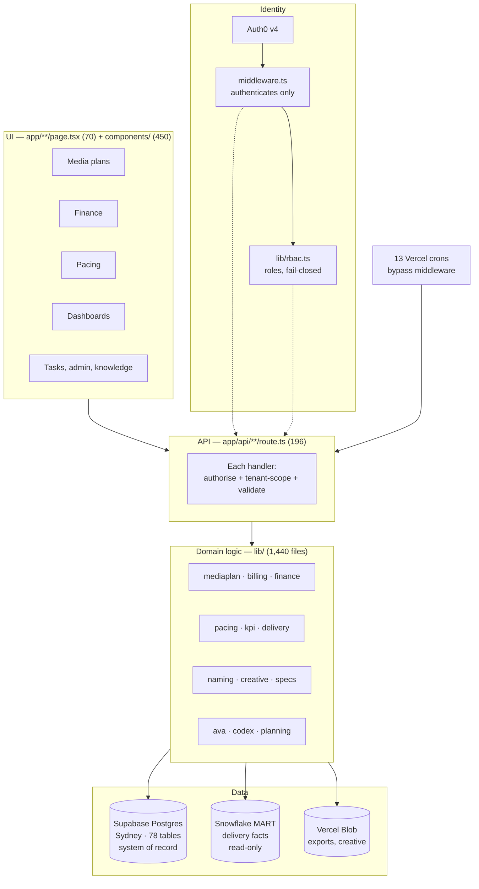

# 02 — How it fits together

## The shape

The direction of that graph is a rule, not a description. A page never talks to the database. A page calls an API route or a server helper, the route calls a `lib/` function, the `lib/` function calls `db/`. Every shortcut through that chain has eventually become a bug.

## Where business logic lives

In `lib/`. All of it.

This is the single most important convention in the repo. A fee calculation, a date rule, a naming format, a pacing band — it belongs in a `lib/<domain>/` module, imported by whoever needs it. A calculation written inline in a component is a defect even when the numbers are right, because the next surface that needs the same number will re-derive it slightly differently.

The largest domain libraries: `finance` (225 files), `mediaplan` (200), `billing` (85), `ava` (79), `pacing` (71), `data` (57).

## Security model

Two layers, and it matters that you understand what each one does **not** do.

**`middleware.ts`** rolls the Auth0 session and answers one question: are you logged in? If not, `/api/*` returns 401 JSON and pages redirect to login. It also confines client-role users to their own dashboard path and sends role-less sessions to `/unauthorized`.

It does **not** check whether you may see this particular client's campaign.

**Each route handler** does that. It calls `requireAdmin`, `requireFinanceAdmin` or `requireRole`, then — for anything a client can reach — scopes the query with `checkClientMbaAccess` or `resolveClientMbaScope`. Only `admin` is unscoped. A non-admin whose accessible MBA set is empty gets a 403, never everything.

Crons bypass middleware entirely. `/api/cron/*` is protected only by a shared secret checked inside each handler.

Everything in the database has row-level security enabled. The app connects server-side as the owner over the pooled connection, so RLS does not gate normal reads — it is there so that the anon and REST keys are useless, by design. AVA is the exception: it connects as `ava_readonly` with per-table grants and policies, and fails closed on anything not explicitly allowed.

## The three keys that hold the system together

**`mba_number`** — the campaign's business identity. `PENFOLD016`. Spans plans, billing, KPIs, tasks, insights, Xero matching and the warehouse.

**`version_id`** — which cut of the plan. Line items, schedule months, fee snapshots and billing overrides all hang off it with cascading deletes.

**`line_item_id`** — `PENFOLD001SE1`. One plan line, everywhere. Generated once, then carried into the warehouse, the KPI targets, the billing lines, the platform naming conventions and the OOH panel detail. It is a text key with no foreign key behind it in several tables, which means the database will not catch an orphan. The `lib/` layer has to.

Two frozen contracts sit alongside them: the **shape of the `bursts` JSON** on every plan line, and the **format of `line_item_id`**. A dozen domains parse both. Changing either means changing every consumer in the same commit, or none.

## How data moves

**Plan in.** Create or edit page → `POST /api/plans/save` → `lib/data/savePlan.ts` → one transaction writing the version, its line items, its schedule months and its fee snapshot. Because it is one transaction, a half-saved plan is no longer possible. Under the old backend it was, and it happened.

**Plan out to the warehouse.** A nightly cron at 19:00 UTC merges every line item into `MART.XANO_LINE_ITEMS_SNAPSHOT` on `line_item_id`. That is how Snowflake knows what was planned.

**Delivery in.** Fivetran loads platform data into Snowflake fact tables. Pacing pages join those facts to the plan on `line_item_id`, compute bands in TypeScript that mirror a Snowflake view, and cache the result for four hours.

**Plan to finance.** The billing and delivery schedules are rows in `schedule_months` — one per line item, component, basis and month, in integer cents. Finance derives from those rows; status is overlaid from the billing records.

**Everything to AVA.** Pages publish their context to a browser-side bridge; the chat endpoint runs a tool loop over that context plus its read-only database role.

## What runs on a schedule

| When (UTC) | Job |
|---|---|
| 19:00 daily | Push plan line items to Snowflake |
| 19:00 and 20:00 daily | Finance pre-run and run |
| 19:30 daily | Recurring task generation |
| 22:00 daily | Ops health check; sweeps expired ingest stages |
| 00:15 daily | Xero sync |
| Every 6 h | Fireflies meetings, MyHours time, Auth0 roster |
| Hourly | Creative upload digest |
| Mon and Thu 22:30 | Pacing digest email |
| Mon 03:00 | Snapshot checksum |
| 12:59 and 13:59 daily | Finance period lock |

## Deployment

`localhost` is the working trunk. `main` is cherry-pick only and auto-deploys to Vercel. Nothing else exists — no feature branches, no direct commits to main, no force-push.

One hard-won detail: on this project a Vercel environment variable set after a build does not reach that build. **Redeploy is the promote.** A production outage was caused by exactly this.
