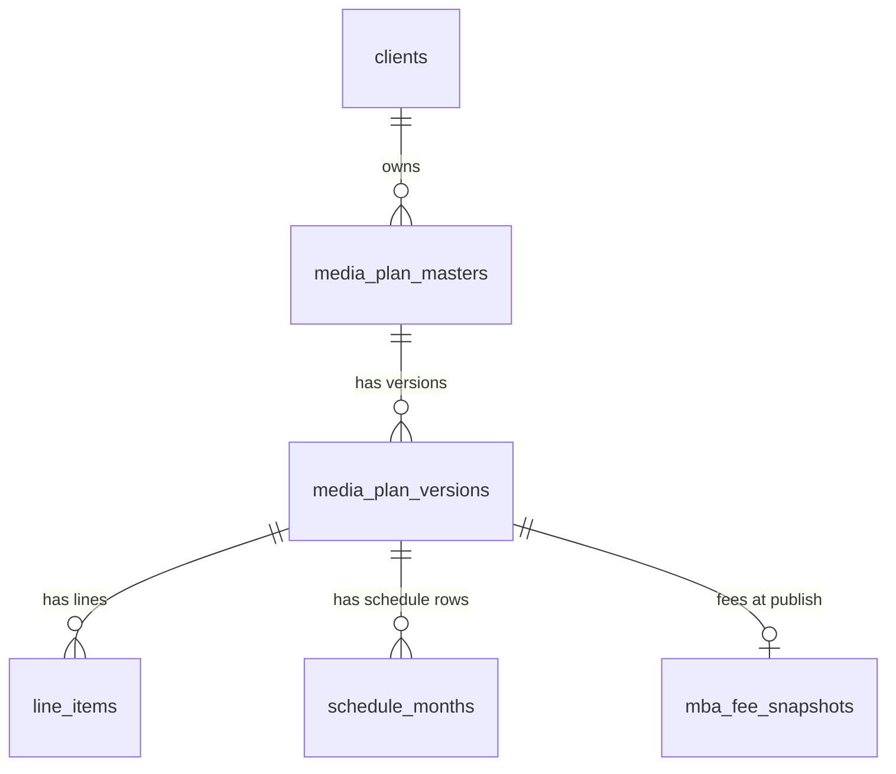
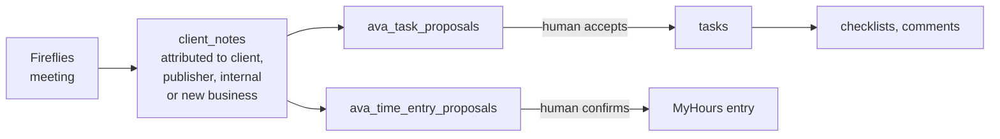

# 03 — The data model

Seventy-eight tables in one Postgres database in Sydney. This page explains the shape; `docs/brain/DATA-MODEL.md` is the reference with every column note.

## The plan family

Five tables carry almost all the value in the system.

**`media_plan_masters`** — one row per campaign, 192 live. Holds the MBA number, the client, the campaign dates and budget, and a pointer to whichever version is published.

**`media_plan_versions`** — 1,089 live. Every save cuts one. Carries the campaign detail, the channel flags, the publication timestamp and who published it, a frozen copy of the approved billing law, and a checksum. Unique on master plus version number.

**`line_items`** — 16,590 live. **One table for all twenty channels.** The columns every channel shares (market, buying demo, buy type, publisher, platform, bid strategy, the four boolean flags) are real typed columns. Everything channel-specific — station, network, site, placement, format, size, duration, daypart, objective, creative — lives in a JSON `attrs` column, validated per channel by a schema that tolerates legacy keys. Bursts are a JSON array on the row.

This is the single biggest structural improvement of the 2026 migration. It used to be twenty separate tables, which is why saving a plan was twenty writes with no transaction around them.

**`schedule_months`** — 59,324 live, the largest table. One row per line item, per component (media, fee or ad-serving), per basis (billing or delivery), per month, in integer cents, marked as computed or overridden. Unique on that combination.

Previously this was a JSON blob on the version and finance parsed it live. Making it rows is what allows the finance hub to be queried rather than recomputed.

**`mba_fee_snapshots`** — the fee position captured at publish, so a later fee change on the client record cannot retroactively alter a published plan.

Alongside them: `billing_overrides` (recorded manual overrides — who, when, what value, never inferred), `mba_line_approvals` (where the absence of a row means approved), and `plan_working_drafts` (autosave).

## Reference data

**`clients`** is the widest table in the system, around ninety columns: identity and contacts, per-channel fee percentages, per-channel ad-serving rates, platform account IDs for a dozen ad platforms, brand colour and logo, the client brain that AVA reads, the slug that is their tenant identity, their Microsoft 365 site and Teams identity, and title aliases used to attribute meetings.

**`publishers`** is nearly as wide: which channels each publisher sells, commission rates per channel, and default CPM, CPC, CPV, CTR, VTR and frequency benchmarks per media family — the values that seed KPI targets when nothing more specific exists.

Around those sit small lookup tables for TV stations, radio stations, newspapers, magazines, their ad sizes, and the site lists for digital audio, video, display and BVOD.

## The publisher ingest and specs family

Three related stores, all joined on the publisher's numeric ID and never on their display name — because display names drift and joining on them silently produced wrong data.

- **`publisher_profiles`** describes how to read a publisher's schedule spreadsheet: how to detect it, how to map its columns, what the grid means, how granular a line is. All of that is configuration on the row rather than code per publisher, so adding a publisher is a data change.
- **`publisher_specs`** and **`spec_runs`** hold material specifications and deadline rules, with a separate table for explicit manual deadline overrides.
- **`ingest_stages`** and **`ingest_runs`** are the upload pipeline: a staged review package a human accepts or cancels, then the history of what was accepted. Out-of-home panel detail lands in `line_item_panels` and its per-period flights, which deliberately carry **no money columns** — spend stays on the burst.

## KPI

Three tiers, most specific wins: a target set on the campaign line, falling back to a client-level default, falling back to the publisher benchmark for that bid strategy and media type. Currently the middle tier is empty, so most lookups fall through from campaign to publisher.

## Finance

Eleven tables. The monthly cycle is `finance_periods` (open, ran, locked, and a flag for anything amended after lock) and `finance_run_items` (the run itself, with self-references for roll-forward and variance links). Around those sit the billing records and their line items, an edit audit trail, forecast snapshots that are immutable once taken, and a revenue forecast keyed by financial year.

One detail worth knowing: **seven of these tables are queried with raw SQL rather than through the query builder** — finance periods, run items, notifications, three Xero matching tables and plan working drafts. They do have TypeScript definitions like everything else, so the types are available; it is only the calling style that differs. Moving those callers across is a decision nobody has needed to make yet.

## Xero

Nine tables mirroring invoices, bills, contacts and the sync log, plus a manual alias map from normalised Xero contact names to clients, and the matching tables that connect a Xero invoice back to a finance run item. Synced daily with a watermark.

## Codex — tasks, meetings and time

The flow runs left to right:

A meeting transcript becomes a note. The note is attributed — to a client, a publisher, internally, or to new business — and an unattributed note sits in a queue for a human. AVA proposes tasks and time entries from notes; a human accepts, edits or rejects, and the difference between what was proposed and what was accepted is stored, so the proposals improve.

Identity throughout this family is **email**, not a numeric user ID. The team roster syncs from Auth0 every six hours.

## Everything else

Creative assets (a row plus a file in blob storage), scopes of work, saved planning audiences, campaign insights (appended and superseded, never deleted, with full-text search), the pacing orphan fix log, the Microsoft 365 provisioning log, and the migration markers that stop a backfill running twice.

## Rules the database enforces for you

- Line items are unique per version and line item ID.
- Schedule months are unique per version, line, component, basis and month.
- Versions are unique per master and version number.
- Deleting a version cascades to its lines, schedule, fees and overrides.
- MBA numbers on insights and OOH panels must be lowercase — enforced by a check constraint, so do not add app-side casing that fights it.
- A client slug is unique case- and whitespace-insensitively.
- Exactly one client per MBA-identifier group may be the Microsoft 365 anchor.

And one it does **not** enforce: `line_item_id` is a plain text column in several tables with no foreign key behind it. Nothing stops an orphan being written. The application layer has to.
